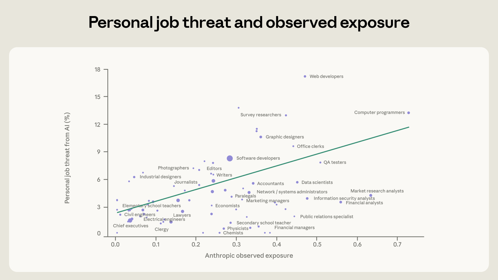
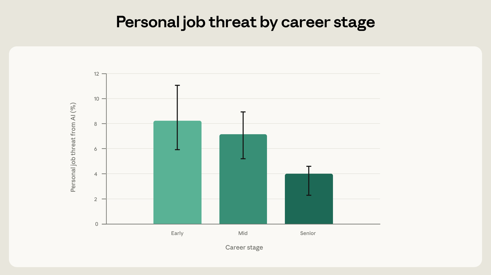
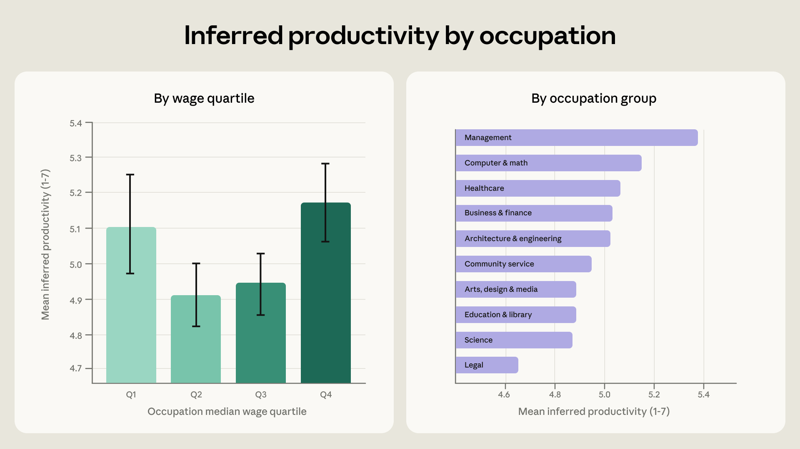
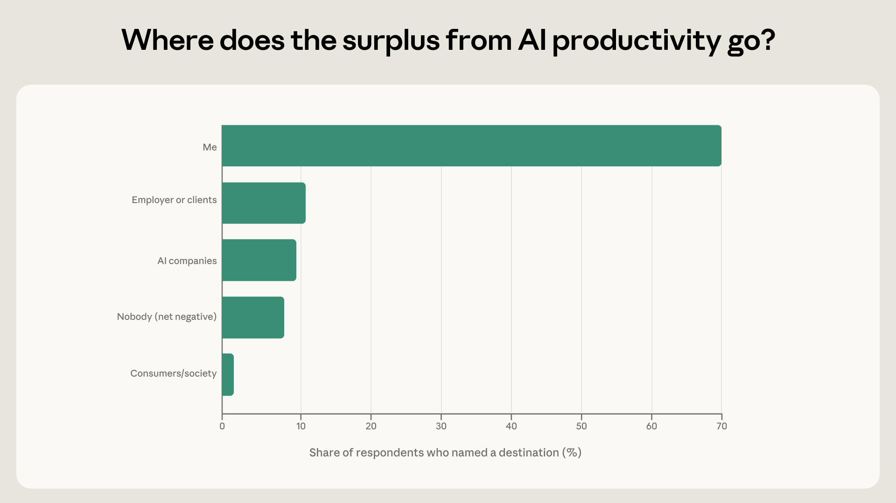
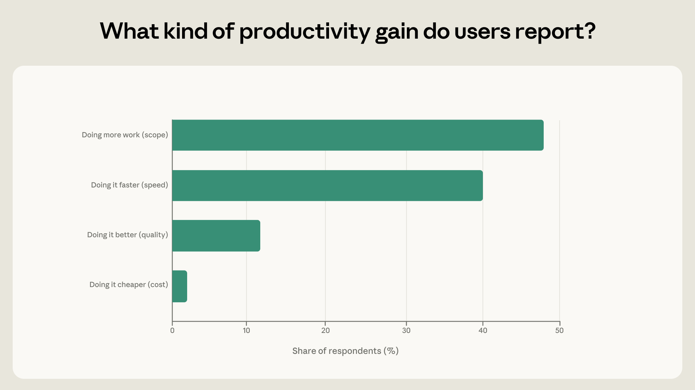
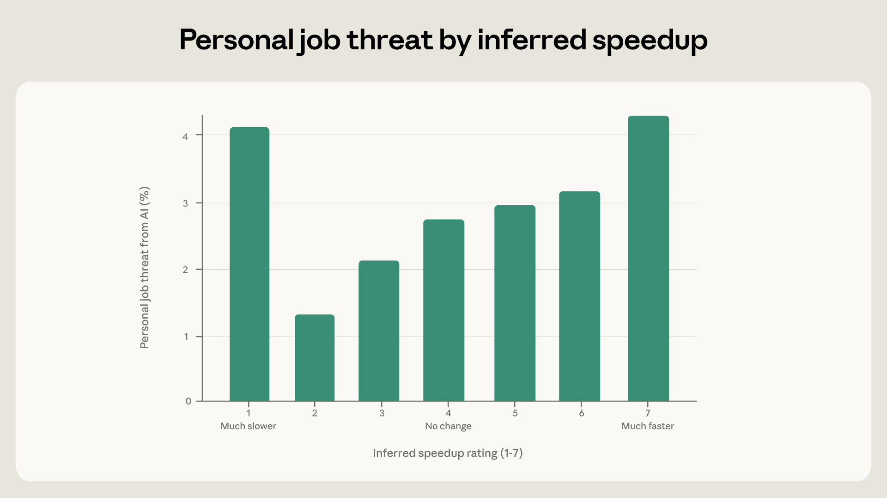

> 原文：[What 81,000 people told us about the economics of AI](https://www.anthropic.com/research/81k-economics)
> 作者：Anthropic（Maxim Massenkoff 主笔）
> 日期：2026-04-22

---

### 核心发现：

- *我们最近对 81,000 名 Claude 用户的调查显示，从事 AI 暴露度（exposure）更高的岗位的人，对 AI 驱动的岗位替代有更多担忧。早期职业阶段的受访者也更为焦虑。*
- *最高薪和最低薪职业的从业者报告了最大的生产力提升，最常见的形式是能力范围扩展（scope）——即能做以前做不了的事。*
- *报告因 AI 而获得最大加速效果的受访者，对岗位替代的担忧也更高。*

为了向公众展示我们观察到的 AI 带来的经济变化，我们的[经济指数（Economic Index）](https://www.anthropic.com/research/economic-index-march-2026-report)公布了人们要求 Claude 完成哪些工作，以及在哪些岗位中 Claude 承担了最大比例的任务。然而，到目前为止，我们缺乏这些使用模式如何映射到人们对 AI 的想法和印象上的信息。

我们最近[对 81,000 名 Claude 用户的调查研究](https://www.anthropic.com/features/81k-interviews)提供了一种方法，将人们的经济担忧与我们在 Claude 流量中量化的数据联系起来。

调查询问了人们对 AI 发展的愿景和恐惧。许多受访者分享的想法涉及经济话题。我们了解到，许多人担心岗位替代——尽管他们也觉得自己在工作中更有生产力、更有能力。在某些情况下，AI 使他们得以创业，或为他们腾出时间做更重要的事；在另一些情况下，AI 让人感到压抑，或被雇主强加于身。

调查结果提供了初步证据，表明[观测暴露度（observed exposure）](https://www.anthropic.com/research/labor-market-impacts)——我们衡量 AI 替代风险的指标——与人们对 AI 的经济担忧相关。在高暴露度职业中的人——按 Claude 被观察到执行的任务来定义——对经济替代更加紧张。这与人们对 AI 扩散及其潜在影响有广泛认知的判断一致。我们在下文展开讨论。

## 谁在担忧岗位替代？

*"嗯，就像如今每个白领一样，我百分之百地担忧，几乎每时每刻都在担心最终会因为 AI 而失去工作。"——软件工程师。[^1]*

我们调查中有五分之一的受访者表达了对经济替代的担忧。有些人是抽象地担忧：一位软件开发者警告"AI 以目前的状态被用来取代初级岗位的可能性"。其他人则感叹自己的工作或工作的某些方面正在被自动化。一位市场研究员说："在提升我的能力方面，这毫无疑问。但未来 AI 可能会取代我的工作。"在某些岗位上，人们觉得 AI 让工作更难了。一位软件开发者观察到："AI 出现后，项目经理开始分配越来越难的工单和 bug 给我解决。"

在整篇报告中，我们使用 Claude 驱动的分类器（classifier）从受访者的回答中推断其属性和情感。例如，许多参与者在回答中顺带提到了自己的职业或给出了关于工作生活的详细信息，使我们能够推断其职业。类似地，我们通过提示 Claude 识别和解读受访者明确表示自身角色面临 AI 驱动替代风险的直接引语，来量化对失业的担忧。我们在[附录](https://cdn.sanity.io/files/4zrzovbb/website/3a8d990bc90098038eabd77b0d12ff636ed58d50.pdf)中给出了示例提示词。

受访者感知到的 AI 威胁与我们[自己的观测暴露度指标](https://www.anthropic.com/research/labor-market-impacts)相关，后者反映了某个岗位中 Claude 被用于执行的任务比例。当某位受访者对应的观测暴露度越高，他对 AI 的担忧也越强。小学教师比软件工程师更少担心自己被替代，这与 Claude 的使用偏向编程任务的事实一致。

我们在下面的图 1 中展示了这一点。纵轴是某一职业中表示 AI 已经在替代其角色或可能很快会这样做的受访者比例。横轴是观测暴露度。图表显示，平均而言，暴露度更高的职业中的人更倾向于表达对工作被自动化的担忧。观测暴露度每增加 10 个百分点，感知到的岗位威胁增加 1.3 个百分点。暴露度排名前 25% 的人提及这种担忧的频率是后 25% 的三倍。

**图 1：AI 带来的感知岗位威胁与观测暴露度。** 表示受到一定程度岗位威胁的受访者比例 vs. [Massenkoff and McCrory (2026)](https://www.anthropic.com/research/labor-market-impacts) 的观测暴露度指标。如果受访者表示其角色已经被替代或大幅缩减，或此类变化在近期内可能发生（由 Claude 编码），则被编码为表示存在岗位威胁。绿色线条显示简单线性拟合。

> **Q：** "暴露度每增加 10 个百分点，感知威胁增加 1.3 个百分点"——这个相关性强吗？
>
> **A：** 从散点图来看，这个关系存在但相当嘈杂。1.3 个百分点的斜率意味着即使在 AI 暴露度最高的职业中，也只有约 25-30% 的人主动提及岗位威胁。更值得注意的或许是"前 25% 是后 25% 的三倍"这个对比——相对差异比绝对水平更能说明问题。但这里有一个方法论上的微妙之处：感知威胁是从开放式回答中推断的（而非直接询问），因此实际担忧的人数几乎必然被低估了。

另一个重要的劳动者特征是职业阶段。在此前的研究中，我们报告了[初步迹象](https://cdn.sanity.io/files/4zrzovbb/website/a42bc3fc08283562f08fd8bdee8f6f9a3d506e87.pdf)，表明美国应届毕业生和早期职业劳动者的招聘正在放缓。在本次调查中，我们能够从大约一半受访者的回答中推断出职业阶段。[^2] 我们发现，早期职业受访者表达对岗位替代的担忧的可能性远高于资深工作者。

**图 2：不同职业阶段对经济替代的担忧。** 表示受到一定程度 AI 岗位威胁的受访者比例，按职业阶段分类。两个字段均从自由格式回答中使用 Claude 驱动的分类器推断得出。

## 谁从 AI 中受益？

我们使用 Claude 评估调查回答，在 1-7 的量表上评定了人们自我报告的 AI 生产力提升程度，其中 1 表示"生产力下降"，2 表示"没有变化"，后续每一级表示更大的提升。获评 7 分的回答包括这样的表述："以前做一个网站要几个月，现在只需要 4-5 天"；Claude 给出 5 分的表述如："可能需要四小时的工作在一半时间内完成了"；给出 2 分的表述如："就我个人而言，我让 AI 帮我修了一个网站的代码。但经过多次来回才得到想要的结果。"[^3]

总体而言，人们报告了有意义的生产力提升。平均生产力评分为 5.1，对应"显著提高了生产力"。当然，我们的受访者是活跃的 Claude 用户且愿意参与调查，这可能使他们比普通用户更倾向于报告生产力收益。约 3% 的人报告了负面或中性影响，42% 的人没有给出明确的生产力指示。

这在收入维度上有所分化。图 3 的左侧面板显示，从事高薪工作的人（如软件开发者）表达了最大的 AI 生产力提升。这一结果不仅仅由编程驱动；即使排除计算机和数学职业，结论仍然成立。这呼应了此前[经济指数的发现](https://www-cdn.anthropic.com/096d94c1a91c6480806d8f24b2344c7e2a4bc666.pdf)——该发现同样有利于高薪劳动者：在需要更高教育水平的任务中，Claude 倾向于将完成任务所需时间（相对于不使用 AI）缩短更大的百分比。

一些最低薪的劳动者也描述了很高的生产力提升。包括一位客服代表，他"使用 AI 在基于另一个回复创建响应时节省了大量时间"。在某些情况下，低薪岗位的人正在利用 AI 做技术方面的副业项目。例如，一位送货司机正在使用 Claude 创办电商业务，一位园艺工人正在构建音乐应用。

**图 3：按职业推断的生产力提升。** 左侧面板显示了按 BLS 职业中位薪资四分位数划分的、推断的 AI 生产力收益均值（使用 Claude 驱动的分类器推断）。右侧面板显示了相同的结果，按主要职业类别拆分。误差棒显示 95% 置信区间。

> **Q：** 高薪和低薪职业都报告了高生产力提升，那中间薪资层呢？这个"U 型"模式意味着什么？
>
> **A：** 这暗示了一种"两极化"效应：高薪知识工作者用 AI 加速专业任务，低薪劳动者用 AI 突破技能壁垒（如送货员用 Claude 开发电商网站）。中间层——如行政、销售——可能既没有足够复杂的任务让 AI 大幅加速，又没有足够的技能鸿沟让 AI 产生"从无到有"的赋能。但要注意：低薪群体的高分可能部分来自他们在非本职工作上使用 AI（副业项目），这和"AI 提升了你的本职工作效率"是不同的命题。

我们深入观察图 3 的右侧面板，展示了按主要职业类别划分的推断生产力提升。排在首位的是管理类职业，这些受访者大多是使用 Claude 来创建业务的创业者。[^4] 其次是计算机和数学类，包括软件开发者。生产力改善最温和的两个群体是科学和法律专业人士。一些律师担心 AI 遵循精确指令的能力。例如："我给出了非常具体的规则，告诉它什么东西在哪里、如何阅读法律文件、我想让它做什么……但它每次都会偏离。"

随着 AI 在经济中扩散，一个关键问题是收益将归于谁——是劳动者、他们的管理者、消费者，还是企业。在大约四分之一的访谈中，受访者指出了这些收益的去向。总体而言，这些人中大多数提到的收益归于自身，通过更快的任务、扩大的能力范围和释放出来的时间。[^5] 但 10% 的指出了收益归属的受访者表示，雇主或客户正在要求并获得更多工作。较小比例的人提到收益归于 AI 公司，更小比例的人认为 AI 总体上是负面的。这与职业阶段相关：只有 60% 的早期职业工作者表示自己从 AI 中受益，而资深专业人士的比例为 80%。

**图 4：AI 生产力的盈余流向何处？** 在指出了 AI 生产力收益归属方的受访者中，各归属方向的占比。

> **Q：** 80% 的资深专业人士说收益归于自己，只有 60% 的早期职业者这么说——这 20 个百分点的差距意味着什么？
>
> **A：** 这可能是整篇文章中最值得警惕的数据点。资深专业人士有自主权来决定如何使用 AI 节省下来的时间（做更有价值的事、接更多项目），而初级员工的效率提升更可能被雇主直接"收割"——要么是分配更多工作，要么是减少招聘。文中脚注也承认，这项调查只覆盖了个人账户用户，企业用户的回答可能更多地指向收益归雇主。换言之，这个 80% 的数字本身可能就是高估的。

## 能力范围与速度

受访者还分享了他们在哪些方面获得了生产力提升。我们将其分为能力范围（scope）、速度（speed）、质量（quality）和成本（cost）。例如，许多将 AI 用于编程任务的人说过这样的话："我不是技术人员，但现在我是全栈开发者了。"这是能力范围的扩展——AI 为他们解锁了新能力。相比之下，有些用户加速了他们已经在做的任务，比如这位会计师说："我构建了一个工具，帮我在 15 分钟内完成了过去需要 2 小时的融资任务。"质量提升通常来自对代码、合同和其他文书更彻底的检查。还有一小部分受访者提到了使用 AI 的低成本："如果我雇一个社交媒体经理，那就超出了我的预算。"

我们发现，最常见的生产力提升形式是能力范围扩展，在明确提到生产力效果的用户中有 48% 提及。40% 提到生产力的用户强调的是速度。

**图 5：用户报告了什么类型的生产力提升？** 描述各类生产力收益的受访者占比。

人们使用 Claude 的体验也可能塑造他们对 AI 的担忧。为了评估这一点，我们测量了受访者报告的加速程度，提取他们的工作是否变得慢了很多（编码为 1）、没有速度变化（4）、还是变得快了很多（7）。

我们发现，加速程度与感知岗位威胁之间的关系呈 U 型（见图 6）。最左边的柱形显示的是报告 AI 让他们变慢的受访者。这些受访者更可能表示 AI 对其生计构成重大威胁。例如，一些创意工作者，如美术师和作家，发现 AI 太僵化、太死板，无法帮助他们完成自己的工作。与此同时，他们担心 AI 向创意领域的扩散会让他们更难找到工作。

**图 6：AI 带来的岗位威胁与加速程度。** 表示岗位替代已经发生或近期可能发生的受访者比例，按推断的加速程度分类。

对于其余受访者，感知到的岗位威胁随其回答所暗示的加速程度持续增加。这在经济学上有一定道理：如果完成自身任务所需的时间正在迅速缩短，那么对这一角色未来可行性的不确定性可能就越大。

> **Q：** 速度提升最大的人反而最焦虑——这是不是一种理性反应？
>
> **A：** 表面上看这是悖论：AI 帮你最多，你反而最怕它。但仔细想，这恰恰是理性的。如果你亲眼目睹 AI 把你两小时的工作压缩到 15 分钟，你获得的不只是效率，还有一个清晰的信号：这项工作的人力需求正在坍缩。这位会计不需要读任何经济学论文就能预见，当所有会计都有了这个工具，市场对会计的需求量会下降。切身体验比抽象论证更有说服力。

## 讨论

经济指数揭示了人们用 AI 做什么。但理解 AI 经济影响的另一个关键输入是直接听取人们的体验。这里探讨的回答表明，人们的直觉与使用数据相吻合：他们在 Claude 执行最多工作的岗位中最担心 AI 的影响。我们还发现早期职业工作者的经济焦虑水平更高，这与过去的研究一致。

也有迹象表明 Claude 赋能了其用户。人们最倾向于谈论收益流向自身，而非雇主或 AI 公司。高薪劳动者对 AI 的生产力影响最为热情，但低薪岗位和较低教育水平的人也报告了大幅生产力提升。大多数受访者报告 Claude 以拓宽工作范围或加速工作的形式增强了他们的能力。但体验到最大加速效果的用户也对 AI 的岗位影响最为紧张。

我们的分析存在重要的局限性，源于数据的性质。首先，我们的调查仅限于 Claude.ai 个人账户用户中选择回应的人。在其他潜在偏差之外，这些用户可能更倾向于认为收益流向自身。其次，用户没有被直接询问这里的许多衍生变量，因此我们从上下文线索中推断职业、职业阶段等变量可能存在误差。相关地，由于调查是开放式的，我们的指标基于受访者碰巧提到的内容；这些发现应该在直接询问这些话题的结构化调查中得到确认。

尽管如此，这些访谈揭示了人们围绕 AI 经济学的真实感受，展示了定性数据如何产生定量假设。而与经济相关的担忧占据如此大的比例，本身就是一个强烈的信号。

### 附录

见[链接 PDF](https://cdn.sanity.io/files/4zrzovbb/website/3a8d990bc90098038eabd77b0d12ff636ed58d50.pdf) 的最后一节。

### 致谢

感谢 80,508 位分享了自己故事的 Claude 用户。

Maxim Massenkoff 主导了分析并撰写了博文。Saffron Huang 主导了访谈项目并全程提供指导。

Zoe Hitzig 和 Eva Lyubich 提供了关键反馈和方法论指导。Keir Bradwell 和 Rebecca Hiscott 提供了编辑支持。Hanah Ho 和 Kim Withee 负责设计工作。Grace Yun、AJ Alt 和 Thomas Millar 在 Claude.ai 中实现了 Anthropic Interviewer。Chelsea Larsson、Jane Leibrock 和 Matt Gallivan 参与了调查和体验设计。Theodore Sumers 参与了数据处理和聚类基础设施的建设。Peter McCrory、Deep Ganguli 和 Jack Clark 提供了关键反馈、方向指引和组织支持。

此外，我们感谢 Miriam Chaum、Ankur Rathi、Santi Ruiz 和 David Saunders 的讨论、反馈和支持。

---

## 译者说明

### 术语对照表

| 英文 | 中文翻译 |
|---|---|
| observed exposure | 观测暴露度 |
| job displacement | 岗位替代 |
| perceived job threat | 感知岗位威胁 |
| productivity gain | 生产力提升 |
| scope | 能力范围（扩展） |
| speedup | 加速（程度） |
| career stage | 职业阶段 |
| Economic Index | 经济指数 |
| classifier | 分类器 |
| Likert scale | Likert 量表 |

### 翻译说明

- "exposure" 在劳动经济学中通常译为"暴露度"或"敞口"，本文取"暴露度"以贴合原文的技术含义——衡量一个岗位的任务中有多大比例可以被 AI 执行。
- "scope" 在原文中指用户能力范围的扩展（能做以前做不了的事），不是项目管理中的"范围"。译为"能力范围"以区分。
- 原文大量使用 Claude 自身作为分析工具（用 Claude 对 Claude 用户的回答进行分类和评分），这种"自我参照"的方法论特征在翻译中保留了原样。

[^1]: 我们使用调查的第一个问题（"你最近一次使用 AI 聊天机器人做了什么？"）或在其他回答中给出的信息来推断受访者的职业。
[^2]: 这来自书面回答中的各种线索。例如，一些用户提到使用 Claude 做作业，这将他们归入早期职业组。许多人提到经营自己的企业和参与招聘决策，这将他们归入资深组。
[^3]: 量表没有居中，因为大多数人对生产力的评价是正面的，在原始的 Likert 量表上几乎全是 6 和 7。我们使用的量表从 1 = 生产力下降，2 = 没有变化，3 = 略有提高，4 = 适度提高，5 = 显著提高，6 = 大幅提高，到 7 = 变革性提高——AI 从根本上改变了他们能生产什么或生产多少。
[^4]: 移除这些"个体创业者"后，管理类仍与计算机和数学类并列，表现出最高的生产力收益。
[^5]: 但一个重要的局限是，这项调查发放给的是拥有个人 Claude 账户的人。更具代表性的画面还应包括企业用户，他们可能更倾向于说价值归于雇主。
