> 原文：[DeepSeek-V4: Towards Highly Efficient Million-Token Context Intelligence](https://huggingface.co/deepseek-ai/DeepSeek-V4-Pro/blob/main/DeepSeek_V4.pdf)
> 作者：DeepSeek-AI
> 模型下载：[https://huggingface.co/collections/deepseek-ai/deepseek-v4](https://huggingface.co/collections/deepseek-ai/deepseek-v4)
> 开源实现：[https://huggingface.co/deepseek-ai/DeepSeek-V4-Pro/tree/main/inference](https://huggingface.co/deepseek-ai/DeepSeek-V4-Pro/tree/main/inference)

---

# 1. 引言

推理模型（reasoning models）的出现 (DeepSeek-AI, 2025; OpenAI, 2024c) 开创了测试时扩展（test-time scaling）的新范式，为大语言模型（Large Language Models, LLMs）带来了显著的性能提升。然而，这一扩展范式从根本上受制于原始注意力机制（vanilla attention mechanism）的二次方计算复杂度 (Vaswani et al., 2017)，这为超长上下文和推理过程带来了难以逾越的瓶颈。与此同时，长程场景和任务的涌现——从复杂的智能体工作流（agentic workflows）到大规模跨文档分析——也使得对超长上下文的高效支持成为未来发展的关键需求。虽然近期的开源工作 (Bai et al., 2025a; DeepSeek-AI, 2024; MiniMax, 2025; Qwen, 2025) 在通用能力方面取得了进步，但在处理超长序列方面的核心架构低效问题仍然是一大阻碍，限制了测试时扩展的进一步收益，也阻碍了对长程场景和任务的深入探索。

为了突破超长上下文中的效率瓶颈，我们开发了 DeepSeek-V4 系列模型，包括预览版本 DeepSeek-V4-Pro（1.6T 参数，49B 激活）和 DeepSeek-V4-Flash（284B 参数，13B 激活）。通过架构创新，DeepSeek-V4 系列在处理超长序列的计算效率方面实现了质的飞跃。这一突破使得高效支持一百万 token 的上下文长度成为可能，开启了下一代大语言模型百万级上下文的新时代。我们相信，高效处理超长序列的能力将解锁测试时扩展的下一个前沿，为长程任务的深入研究铺平道路，并为探索在线学习（online learning）等未来范式奠定必要的基础。

与 DeepSeek-V3 架构 (DeepSeek-AI, 2024) 相比，DeepSeek-V4 系列保留了 DeepSeekMoE 框架 (Dai et al., 2024) 和多 token 预测（Multi-Token Prediction, MTP）策略，同时在架构和优化方面引入了若干关键创新。为增强长上下文效率，我们设计了一种混合注意力机制，结合了压缩稀疏注意力（Compressed Sparse Attention, CSA）和重度压缩注意力（Heavily Compressed Attention, HCA）。CSA 沿序列维度压缩键值缓存（KV caches），然后执行 DeepSeek 稀疏注意力（DeepSeek Sparse Attention, DSA）(DeepSeek-AI, 2025)；而 HCA 则对键值缓存施加更激进的压缩，但保持稠密注意力。为增强建模能力，我们引入了流形约束超连接（Manifold-Constrained Hyper-Connections, $m$HC）(Xie et al., 2026)，以升级传统的残差连接。此外，我们引入了 Muon 优化器 (Jordan et al., 2024; Liu et al., 2025)，用于 DeepSeek-V4 系列的训练，以实现更快的收敛和更高的训练稳定性。

为了实现 DeepSeek-V4 系列的高效训练与推理以及高效的开发流程，我们引入了若干基础设施优化。首先，我们为 MoE 模块设计并实现了一个统一的融合算子（fused kernel），完全重叠计算、通信和内存访问。其次，我们采用了 TileLang (Wang et al., 2026)，一种领域特定语言（Domain-Specific Language, DSL），以平衡开发效率和运行时性能。第三，我们提供了高效的批次不变（batch-invariant）和确定性（deterministic）算子库，以确保训练和推理之间的逐位可复现性（bitwise reproducibility）。第四，我们将 FP4 量化感知训练（quantization-aware training）应用于 MoE 专家权重和索引器 QK 路径，以减少内存和计算开销。第五，在训练框架方面，我们通过张量级检查点（tensor-level checkpointing）扩展了自动微分（autograd）框架，以实现细粒度的重计算控制；并通过混合 ZeRO 策略提升训练效率，以支持 Muon 优化器和低成本的 $m$HC 实现（通过重计算和融合算子）、以及两阶段上下文并行（two-stage contextual parallelism）来管理压缩注意力。最后，在推理框架方面，我们设计了一种异构键值缓存（heterogeneous KV cache）结构，配合基于磁盘的存储策略，以实现高效的共享前缀复用（shared-prefix reuse）。

通过采用混合 CSA 和 HCA 以及计算和存储方面的精度优化，DeepSeek-V4 系列在推理浮点运算量（FLOPs）和键值缓存大小方面均较 DeepSeek-V3.2 实现了显著降低，尤其是在长上下文场景下。图 1 的右半部分展示了 DeepSeek-V3.2 和 DeepSeek-V4 系列的估计单 token 推理浮点运算量和累计键值缓存大小。在 1M token 上下文的场景下，即使拥有更多激活参数的 DeepSeek-V4-Pro，其单 token 浮点运算量（以等效 FP8 FLOPs 计算）仅为 DeepSeek-V3.2 的 27%，键值缓存大小仅为其 10%。此外，拥有更少激活参数的 DeepSeek-V4-Flash 将效率推向了更高水平：在 1M token 上下文场景下，其单 token 浮点运算量仅为 DeepSeek-V3.2 的 10%，键值缓存大小仅为其 7%。此外，对于 DeepSeek-V4 系列，被路由的专家参数采用 FP4 精度。虽然目前 FP4 $\times$ FP8 运算的峰值浮点运算量与 FP8 $\times$ FP8 在现有硬件上相同，但理论上在未来硬件上可以实现 1/3 的更高效率，这将进一步提升 DeepSeek-V4 系列的效率。

在预训练阶段，我们在 32T token 上训练 DeepSeek-V4-Flash，在 33T token 上训练 DeepSeek-V4-Pro。预训练完成后，这两个模型可以原生且高效地支持 1M 长度的上下文。在我们的内部评估中，DeepSeek-V4-Flash-Base 凭借其更高参数效率的设计，在大多数基准测试中已超越 DeepSeek-V3.2-Base。DeepSeek-V4-Pro-Base 进一步扩大了这一优势，在 DeepSeek 基座模型中树立了新的性能标杆，在推理、编码、长上下文和世界知识任务上展现出全面的优越性。

DeepSeek-V4 系列的后训练流程采用两阶段范式：先独立培养领域专家（domain-specific experts），再通过在策略蒸馏（on-policy distillation）进行统一模型整合。具体而言，对于每个目标领域——如数学、编码、智能体和指令遵循——各自独立训练一个专家模型。基座模型首先在高质量的领域特定数据上进行监督微调（Supervised Fine-Tuning, SFT），以建立基础能力。随后，应用基于群体相对策略优化（Group Relative Policy Optimization, GRPO）(DeepSeek-AI, 2025) 的强化学习（Reinforcement Learning, RL），通过针对特定成功标准定制的奖励模型进一步优化模型的领域对齐行为。这一阶段产生了一组多样化的专业专家，每个专家在各自领域表现卓越。最后，为了整合这些独立的专长，通过在策略蒸馏训练一个统一模型，其中统一模型作为学生，学习优化反向 KL 散度损失（reverse KL loss）。

**核心评估结果摘要**

- **知识**：在广泛世界知识的评估中，DeepSeek-V4-Pro-Max（DeepSeek-V4-Pro 的最大推理力度模式）在 SimpleQA (OpenAI, 2024d) 和 Chinese-SimpleQA (He et al., 2024) 基准测试上显著优于领先的开源模型。在教育知识方面——通过 MMLU-Pro (Wang et al., 2024b)、HLE (Phan et al., 2025) 和 GPQA (Rein et al., 2023) 评估——DeepSeek-V4-Pro-Max 相较其开源同类模型展现出微弱的领先优势。DeepSeek-V4-Pro-Max 已大幅缩小了与领先闭源模型 Gemini-3.1-Pro 之间的差距，尽管在这些基于知识的评估中仍略有落后。

- **推理**：通过扩展推理 token，DeepSeek-V4-Pro-Max 在标准推理基准测试上展现出优于 GPT-5.2 和 Gemini-3.0-Pro 的性能。然而，其表现与 GPT-5.4 和 Gemini-3.1-Pro 相比仍有微小差距，表明其发展轨迹大约落后于最先进的前沿模型 3 到 6 个月。此外，DeepSeek-V4-Flash-Max 取得了与 GPT-5.2 和 Gemini-3.0-Pro 相当的表现，确立了其作为高性价比复杂推理架构的地位。

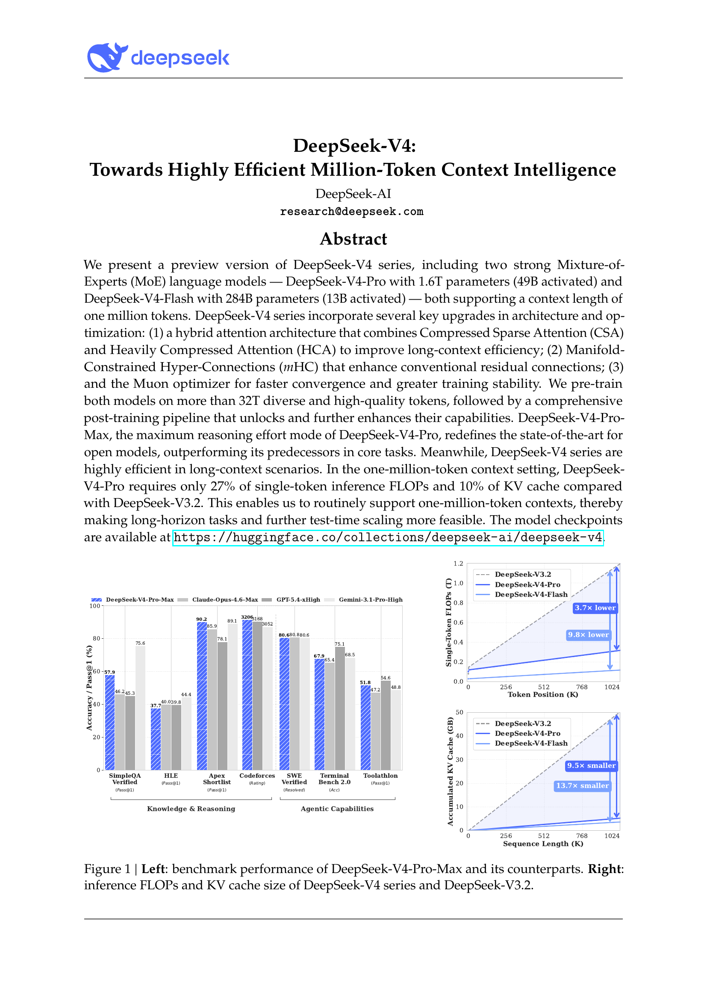

- **智能体**：在公开基准测试上，DeepSeek-V4-Pro-Max 与领先的开源模型（如 Kimi-K2.6 和 GLM-5.1）表现相当，但略逊于前沿闭源模型。在我们的内部评估中，DeepSeek-V4-Pro-Max 超越了 Claude Sonnet 4.5，接近 Opus 4.5 的水平。

- **长上下文**：DeepSeek-V4-Pro-Max 在百万 token 上下文窗口下，于合成和实际用例中均取得了出色的结果，在学术基准测试上甚至超越了 Gemini-3.1-Pro。

- **DeepSeek-V4-Pro 与 DeepSeek-V4-Flash 的对比**：DeepSeek-V4-Flash-Max 在知识评估中因参数规模较小而表现略低。然而，在分配更大思考预算时，其在推理任务上能取得可比的结果。在智能体评估中，虽然 DeepSeek-V4-Flash-Max 在若干基准测试上与 DeepSeek-V4-Pro-Max 表现相当，但在更复杂、更高难度的任务上仍落后于后者。

# 2. 架构

总体而言，DeepSeek-V4 系列保留了 Transformer (Vaswani et al., 2017) 架构和多 token 预测（Multi-Token Prediction, MTP）模块 (DeepSeek-AI, 2024; Gloeckle et al., 2024)，同时相比 DeepSeek-V3 引入了若干关键升级：(1) 首先，我们引入流形约束超连接（Manifold-Constrained Hyper-Connections, $m$HC）(Xie et al., 2026) 以增强传统残差连接；(2) 其次，我们设计了一种混合注意力架构，通过压缩稀疏注意力（Compressed Sparse Attention）和重度压缩注意力（Heavily Compressed Attention）大幅提升长上下文效率；(3) 第三，我们采用 Muon (Jordan et al., 2024; Liu et al., 2025) 作为优化器。对于混合专家（Mixture-of-Experts, MoE）组件，我们仍然沿用 DeepSeekMoE (Dai et al., 2024) 架构，仅做了少量调整。多 token 预测（MTP）(DeepSeek-AI, 2024; Gloeckle et al., 2024; Li et al., 2024; Qi et al., 2020) 的配置与 DeepSeek-V3 中建立的设置保持一致。所有其他未明确说明的细节均遵循 DeepSeek-V3 (DeepSeek-AI, 2024) 中的设定。图 2 展示了 DeepSeek-V4 的整体架构，具体细节如下所述。

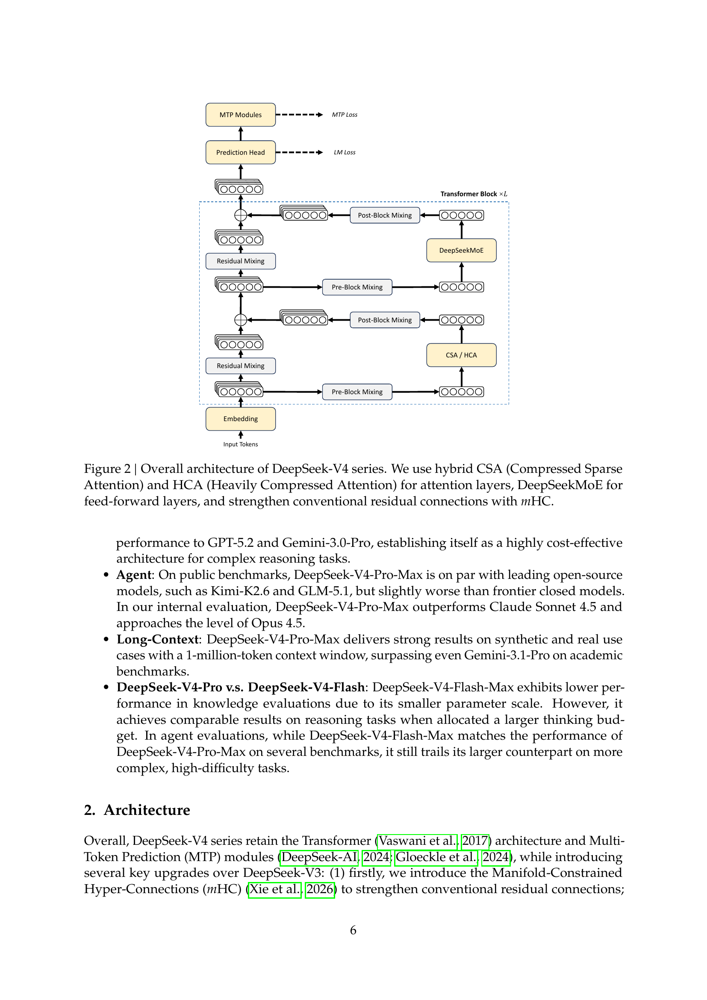

## 2.1. 继承自 DeepSeek-V3 的设计

**混合专家（Mixture-of-Experts）。** 与此前的 DeepSeek 系列模型 (DeepSeek-AI, 2024; DeepSeek-AI, 2024) 一样，DeepSeek-V4 系列同样采用 DeepSeekMoE 范式 (Dai et al., 2024) 构建前馈网络（Feed-Forward Networks, FFNs），该范式设置了细粒度的路由专家和共享专家。与 DeepSeek-V3 不同的是，我们将计算亲和力分数（affinity scores）的激活函数从 Sigmoid($\cdot$) 改为 Sqrt(Softplus($\cdot$))。在负载均衡方面，我们同样采用无辅助损失（auxiliary-loss-free）策略 (DeepSeek-AI, 2024; Wang et al., 2024a)，并辅以轻量的序列级平衡损失（sequence-wise balance loss），以防止单个序列内出现极端不平衡。对于 DeepSeek-V4，我们移除了对路由目标节点数量的约束，并精心重新设计了并行策略以保持训练效率。此外，与 DeepSeek-V3 相比，我们将最初若干 Transformer 块中的稠密前馈网络（dense FFN）层替换为采用哈希路由（Hash routing）(Roller et al., 2021) 的 MoE 层。哈希路由策略根据预定义的哈希函数，依据输入 token ID 为每个 token 确定目标专家。

**多 token 预测（Multi-Token Prediction）。** 与 DeepSeek-V3 一样，DeepSeek-V4 系列也设置了 MTP 模块和目标。鉴于 MTP 策略已在 DeepSeek-V3 中得到验证，我们在 DeepSeek-V4 系列中沿用了相同的策略，未做修改。

## 2.2. 流形约束超连接

如图 2 所示，DeepSeek-V4 系列引入了流形约束超连接（Manifold-Constrained Hyper-Connections, $m$HC）(Xie et al., 2026)，以增强相邻 Transformer 块之间的传统残差连接。与朴素超连接（naive Hyper-Connections, HC）(Zhu et al., 2025) 相比，$m$HC 的核心思想是将残差映射约束到一个特定流形上，从而增强跨层信号传播的稳定性，同时保持模型的表达能力。本小节将简要介绍标准 HC，并描述我们如何设计 $m$HC 以实现稳定训练。

**标准超连接（Standard Hyper-Connections）。** 标准 HC 将残差流的宽度按 $n_{\text{hc}}$ 倍扩展。具体而言，残差流的形状从 $\mathbb{R}^d$ 扩展到 $\mathbb{R}^{n_{\text{hc}} \times d}$，其中 $d$ 是实际层输入的隐藏维度大小。令 $X_l = [\mathbf{x}_{l,1}; \ldots; \mathbf{x}_{l,n_{\text{hc}}}]^T \in \mathbb{R}^{n_{\text{hc}} \times d}$ 为第 $l$ 层之前的残差状态。HC 引入三个线性映射：输入映射 $A_l \in \mathbb{R}^{1 \times n_{\text{hc}}}$、残差变换 $B_l \in \mathbb{R}^{n_{\text{hc}} \times n_{\text{hc}}}$，以及输出映射 $C_l \in \mathbb{R}^{n_{\text{hc}} \times 1}$。残差状态的更新公式如下：

$$X_{l+1} = B_l X_l + C_l \mathcal{F}_l(A_l X_l), \tag{1}$$

其中 $\mathcal{F}_l$ 表示第 $l$ 层（例如 MoE 层），其输入和输出形状均为 $\mathbb{R}^d$。注意实际的层输入 $A_l X_l \in \mathbb{R}^d$ 也是 $d$ 维的，因此扩展的残差宽度不影响内部层的设计。HC 将残差宽度与实际隐藏大小解耦，以最小的计算开销提供了一个互补的缩放轴，因为 $n_{\text{hc}}$ 通常远小于隐藏大小 $d$。然而，尽管 HC 已展现出提升模型性能的潜力，我们发现在堆叠多层时训练会频繁出现数值不稳定现象，这阻碍了 HC 的扩展。

> **译注：公式 (1) 的直觉理解**
>
> 对比标准 Transformer 的残差连接 $x_{l+1} = x_l + \mathcal{F}_l(x_l)$，HC 做了三件事：(a) 将残差流从一条"管道"扩展为 $n_{\text{hc}}$ 条并行管道（DeepSeek-V4 中 $n_{\text{hc}}=4$）；(b) 用矩阵 $A_l$ 将多条管道加权混合为一条，送入实际的层计算；(c) 层的输出通过 $C_l$ 分配回各管道，再加上残差流经 $B_l$ 的线性变换。可以把它想象成一条四车道高速公路：车辆（信息）在四条车道间通过 $B_l$ 换道和混合，而匝道（$A_l$ 和 $C_l$）连接高速公路和每一层的"服务区"（$\mathcal{F}_l$）。问题在于：如果 $B_l$ 的谱范数大于 1，信号在逐层传播时会指数级放大——经过 61 层后可能爆炸；小于 1 则会消失。这就是为什么需要 $m$HC 来约束 $B_l$。

**流形约束残差映射（Manifold-Constrained Residual Mapping）。** $m$HC 的核心创新在于将残差映射矩阵 $B_l$ 约束到双随机矩阵（doubly stochastic matrices）的流形上（即 Birkhoff 多胞形，Birkhoff polytope）$\mathcal{M}$，从而增强跨层信号传播的稳定性：

$$B_l \in \mathcal{M} \coloneqq \{M \in \mathbb{R}^{n \times n} \mid M\mathbf{1}_n = \mathbf{1}_n,\ \mathbf{1}_n^T M = \mathbf{1}_n^T,\ M \geqslant 0\}. \tag{2}$$

> **译注：双随机矩阵约束的直觉**
>
> 双随机矩阵是什么？它是一个每行之和 = 1、每列之和 = 1、且所有元素 ≥ 0 的方阵。最简单的例子就是单位矩阵 $I$——它是一个双随机矩阵。置换矩阵（交换行的矩阵）也是。事实上，所有双随机矩阵都是置换矩阵的凸组合（这就是 Birkhoff 定理）。
>
> 为什么这个约束能稳定训练？关键性质是：双随机矩阵的谱范数（最大奇异值）恰好 ≤ 1。这意味着 $B_l$ 作为线性变换**永远不会放大信号**。考虑一个极端的例子：如果 $B_l$ 的谱范数是 1.01，经过 61 层后信号被放大 $1.01^{61} \approx 1.83$ 倍；如果是 1.1，则放大 $1.1^{61} \approx 339$ 倍——这就是训练不稳定的根源。约束到双随机矩阵后，$\|B_l\|_2 \leq 1$ 被数学保证，信号永远不会爆炸。更妙的是，双随机矩阵在乘法下封闭（两个双随机矩阵的乘积仍然是双随机矩阵），所以无论堆叠多少层，$B_{61} B_{60} \cdots B_1$ 仍然是非扩张的。

该约束确保映射矩阵 $\|B_l\|_2$ 的谱范数不超过 1，因此残差变换是非扩张的（non-expansive），这增强了前向传播和反向传播过程中的数值稳定性。此外，集合 $\mathcal{M}$ 在乘法下封闭，这保证了深层 $m$HC 堆叠场景下的稳定性。另外，输入变换 $A_l$ 和输出变换 $C_l$ 也通过 Sigmoid 函数约束为非负且有界的，以避免信号抵消的风险。

**动态参数化（Dynamic Parameterization）。** 三个线性映射的参数是动态生成的，被分解为一个动态（输入依赖）分量和一个静态（输入无关）分量。给定输入 $X_l \in \mathbb{R}^{n_{\text{hc}} \times d}$，首先将其展平并归一化：$\hat{X}_l = \text{RMSNorm}(\text{vec}(X_l)) \in \mathbb{R}^{1 \times n_{\text{hc}} d}$。然后，遵循传统 HC 的方式，生成无约束的原始参数 $\tilde{A}_l \in \mathbb{R}^{1 \times n_{\text{hc}}}$、$\tilde{B}_l \in \mathbb{R}^{n_{\text{hc}} \times n_{\text{hc}}}$ 和 $\tilde{C}_l \in \mathbb{R}^{n_{\text{hc}} \times 1}$：

$$\tilde{A}_l = \alpha_l^{\text{pre}} \cdot (\hat{X}_l W_l^{\text{pre}}) + S_l^{\text{pre}}, \tag{3}$$

$$\tilde{B}_l = \alpha_l^{\text{res}} \cdot \text{Mat}(\hat{X}_l W_l^{\text{res}}) + S_l^{\text{res}}, \tag{4}$$

$$\tilde{C}_l = \alpha_l^{\text{post}} \cdot (\hat{X}_l W_l^{\text{post}})^T + S_l^{\text{post}}, \tag{5}$$

其中 $W_l^{\text{pre}}, W_l^{\text{post}} \in \mathbb{R}^{n_{\text{hc}} d \times n_{\text{hc}}}$，$W_l^{\text{res}} \in \mathbb{R}^{n_{\text{hc}} d \times n_{\text{hc}}^2}$ 是用于生成动态分量的可学习参数；$\text{Mat}(\cdot)$ 将大小为 $1 \times n_{\text{hc}}^2$ 的向量重塑为大小为 $n_{\text{hc}} \times n_{\text{hc}}$ 的矩阵；$S_l^{\text{pre}} \in \mathbb{R}^{1 \times n_{\text{hc}}}$、$S_l^{\text{post}} \in \mathbb{R}^{n_{\text{hc}} \times 1}$、$S_l^{\text{res}} \in \mathbb{R}^{n_{\text{hc}} \times n_{\text{hc}}}$ 是可学习的静态偏置；$\alpha_l^{\text{pre}}, \alpha_l^{\text{res}}, \alpha_l^{\text{post}} \in \mathbb{R}$ 是初始化为小值的可学习门控因子。

**施加参数约束（Applying Parameter Constraints）。** 在获得无约束的原始参数 $\tilde{A}_l, \tilde{B}_l, \tilde{C}_l$ 后，我们对其施加前述约束以增强数值稳定性。具体而言，对于输入和输出映射，我们使用 Sigmoid 函数 $\sigma(\cdot)$ 以确保其非负性和有界性：

$$A_l = \sigma(\tilde{A}_l), \tag{6}$$

$$C_l = 2\sigma(\tilde{C}_l). \tag{7}$$

对于残差映射 $\tilde{B}_l$，我们将其投影到双随机矩阵流形 $\mathcal{M}$ 上。这通过 Sinkhorn-Knopp 算法实现，该算法首先对 $\tilde{B}_l$ 施加指数函数以确保正性，得到 $M^{(0)} = \exp(\tilde{B}_l)$，然后交替进行列归一化和行归一化：

$$M^{(t)} = \mathcal{T}_r(\mathcal{T}_c(M^{(t-1)})), \tag{8}$$

其中 $\mathcal{T}_r$ 和 $\mathcal{T}_c$ 分别表示行归一化和列归一化。该迭代收敛至一个约束双随机矩阵 $B_l = M^{(t_{\max})}$。我们选择 $t_{\max} = 20$ 作为实际值。

> **译注：Sinkhorn-Knopp 算法的直觉**
>
> 如何把一个任意的正矩阵"投影"到双随机矩阵？Sinkhorn-Knopp 算法非常简单：交替做行归一化和列归一化。想象你有一个 4×4 的正矩阵（因为 $n_{\text{hc}}=4$）：(1) 先把每一行除以该行的和，使每行之和 = 1；(2) 再把每一列除以该列的和，使每列之和 = 1；(3) 此时行和可能不再等于 1 了，所以再做一次行归一化... 如此交替进行。Sinkhorn (1964) 证明了这个过程一定收敛到一个双随机矩阵。DeepSeek 选择迭代 20 次——对于 4×4 矩阵来说，这已经足够收敛到很高精度了。注意在反向传播时，梯度需要穿过这 20 次迭代，但由于矩阵很小（4×4），计算开销可以忽略。

## 2.3. 基于 CSA 和 HCA 的混合注意力

当上下文长度达到极端规模时，注意力机制成为模型中主要的计算瓶颈。为此，DeepSeek-V4 设计了两种高效注意力架构——压缩稀疏注意力（Compressed Sparse Attention, CSA）和重度压缩注意力（Heavily Compressed Attention, HCA）——并采用交错混合配置，大幅降低了长文本场景下注意力的计算开销。CSA 整合了压缩和稀疏两种注意力策略：它首先将每 $m$ 个 token 的键值（Key-Value, KV）缓存压缩为一个条目，然后应用 DeepSeek 稀疏注意力（DeepSeek Sparse Attention, DSA）(DeepSeek-AI, 2025)，使每个查询 token 仅关注 $k$ 个压缩后的键值条目。HCA 旨在通过将每 $m'$（$\gg m$）个 token 的键值缓存合并为一个条目来实现极致压缩。CSA 和 HCA 的混合架构显著提升了 DeepSeek-V4 系列的长上下文效率，使百万 token 上下文在实践中变得可行。本小节描述了我们混合注意力架构的核心技术，我们还提供了一个开源实现$^1$以便明确地说明细节。

### 2.3.1. 压缩稀疏注意力

CSA 的核心架构如图 3 所示，它首先将每 $m$ 个 token 的键值缓存压缩为一个条目，然后应用 DeepSeek 稀疏注意力进一步加速。

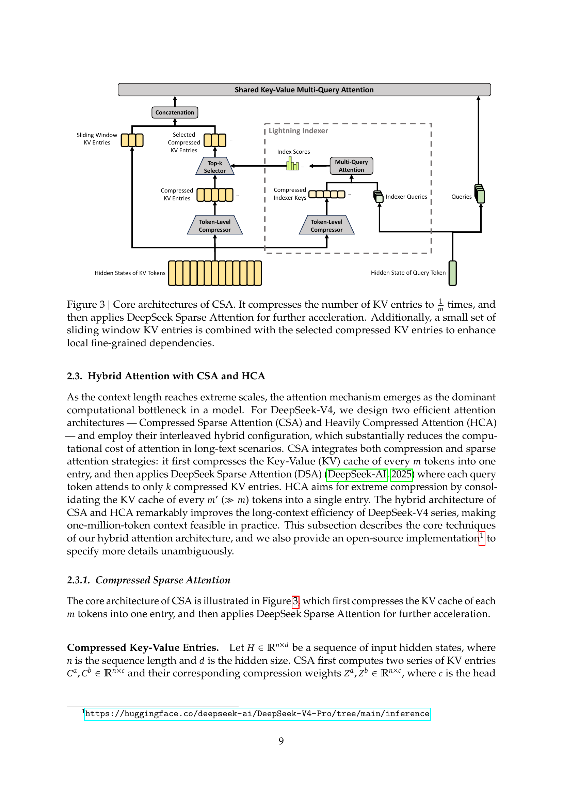

**压缩键值条目（Compressed Key-Value Entries）。** 令 $H \in \mathbb{R}^{n \times d}$ 为输入隐藏状态序列，其中 $n$ 为序列长度，$d$ 为隐藏维度大小。CSA 首先计算两组键值条目 $C^a, C^b \in \mathbb{R}^{n \times c}$ 及其对应的压缩权重 $Z^a, Z^b \in \mathbb{R}^{n \times c}$，其中 $c$ 是注意力头维度：

$$C^a = H \cdot W^{aKV}, \quad C^b = H \cdot W^{bKV}, \tag{9}$$

$$Z^a = H \cdot W^{aZ}, \quad Z^b = H \cdot W^{bZ}, \tag{10}$$

其中 $W^{aKV}, W^{bKV}, W^{aZ}, W^{bZ} \in \mathbb{R}^{d \times c}$ 是可训练参数。接下来，$C^a$ 和 $C^b$ 中每 $m$ 个键值条目将根据其压缩权重和可学习的位置偏置 $B^a, B^b \in \mathbb{R}^{m \times c}$ 被压缩为一个条目，生成 $C^{\text{Comp}} \in \mathbb{R}^{\frac{n}{m} \times c}$。每个压缩条目 $C_i^{\text{Comp}} \in \mathbb{R}^c$ 的计算如下：

$$[S^a_{m:m(i+1)-1}; S^b_{m(i-1):mi-1}] = \text{Softmax}_{\text{row}}([Z^a_{m:m(i+1)-1} + B^a; Z^b_{m(i-1):mi-1} + B^b]), \tag{11}$$

$$C_i^{\text{Comp}} = \sum_{j=mi}^{m(i+1)-1} S_j^a \odot C_j^a + \sum_{j=m(i-1)}^{mi-1} S_j^b \odot C_j^b, \tag{12}$$

其中 $\odot$ 表示 Hadamard 积；$\text{Softmax}_{\text{row}}(\cdot)$ 表示沿行维度的 softmax 操作，对来自 $Z^a$ 和 $Z^b$ 的共 $2m$ 个元素进行归一化。当 $i = 0$ 时，$Z^b_{m(i-1):mi-1}$ 填充负无穷，$C^b_{m(i-1):mi-1}$ 填充零。注意每个 $C_i^{\text{Comp}}$ 来自 $2m$ 个键值条目，但用于 $C_i^{\text{Comp}}$ 的 $C^b$ 的索引与用于 $C_{i-1}^{\text{Comp}}$ 的 $C^a$ 的索引是重叠的。因此，CSA 实际上将序列长度压缩为 $\frac{1}{m}$ 倍。

> **译注：KV 压缩机制的直觉理解**
>
> 想象你有一本 1000 页的书（1000 个 token）。CSA 的压缩（$m=4$）相当于每 4 页做一个"摘要卡片"——但不是简单取平均，而是用学到的权重 $Z$ 做加权求和，让模型自己决定每页的重要性。关键的"重叠"设计是：第 $i$ 张卡片不仅看第 $4i$ 到 $4i+3$ 页（$C^a$ 部分），还看前一组的第 $4i-4$ 到 $4i-1$ 页（$C^b$ 部分）。这种重叠保证了相邻压缩块之间有信息交叉，不会在块边界处丢失上下文。最终 1000 个 KV 条目变成 250 个——序列长度压缩 4 倍。
>
> 然后闪电索引器再从这 250 个压缩条目中用 top-k 选择最相关的 $k$ 个（如 512 个），进一步降低注意力的计算量。这就是"压缩 + 稀疏"双重优化的含义。

**用于稀疏选择的闪电索引器（Lightning Indexer for Sparse Selection）。** 在获得压缩后的键值条目 $C^{\text{Comp}}$ 后，CSA 应用 DSA 策略选择 top-k 个压缩键值条目进行核心注意力计算。首先，CSA 对 $C^{\text{Comp}}$ 执行与上述相同的压缩操作，得到压缩后的索引器键（indexer keys）$K^{\text{IComp}} \in \mathbb{R}^{\frac{n}{m} \times c^I}$，其中 $c^I$ 是索引器头维度。然后，对于查询 token $t$，以低秩方式生成索引器查询 $\{\mathbf{q}^I_{t,1}; \mathbf{q}^I_{t,2}; \ldots; \mathbf{q}^I_{t,n^I_h}\}$：

$$\mathbf{c}_t^Q = \mathbf{h}_t \cdot W^{DQ}, \tag{13}$$

$$[\mathbf{q}^I_{t,1}; \mathbf{q}^I_{t,2}; \ldots; \mathbf{q}^I_{t,n^I_h}] = \mathbf{q}_t^I = \mathbf{c}_t^Q \cdot W^{IUQ}, \tag{14}$$

其中 $\mathbf{h}_t \in \mathbb{R}^d$ 是查询 token $t$ 的输入隐藏状态；$\mathbf{c}_t^Q \in \mathbb{R}^{d_c}$ 是查询的压缩潜向量；$d_c$ 是查询压缩维度；$n^I_h$ 是索引器查询头的数量；$W^{DQ} \in \mathbb{R}^{d \times d_c}$ 和 $W^{IUQ} \in \mathbb{R}^{d_c \times c^I n^I_h}$ 分别是索引器查询的下投影和上投影矩阵。接下来，查询 token $t$ 与其前方的压缩块 $s$（$s < \text{Floor}(\frac{t}{m})$）之间的索引分数 $I_{t,s} \in \mathbb{R}$ 计算如下：

$$[w^I_{t,1}; w^I_{t,2}; \ldots; w^I_{t,n^I_h}] = \mathbf{w}_t^I = \mathbf{h}_t \cdot W^w, \tag{15}$$

$$I_{t,s} = \sum_{h=1}^{n^I_h} w^I_{t,h} \cdot \text{ReLU}\left(\mathbf{q}^I_{t,h} \cdot K_s^{\text{IComp}}\right), \tag{16}$$

其中 $W^w \in \mathbb{R}^{d \times n^I_h}$ 是可学习矩阵；$w^I_{t,h} \in \mathbb{R}$ 是第 $h$ 个索引器头的权重。对于查询 token $t$，给定其索引分数 $I_{t,:}$，我们使用 top-k 选择器有选择性地保留压缩键值条目的一个子集 $C_t^{\text{SprsComp}}$，用于后续的核心注意力计算：

$$C_t^{\text{SprsComp}} = \left\{C_s^{\text{Comp}} \mid I_{t,s} \in \text{Top-k}(I_{t,:})\right\}. \tag{17}$$

**共享键值多查询注意力（Shared Key-Value MQA）。** 在选择稀疏键值条目之后，CSA 以多查询注意力（Multi-Query Attention, MQA）(Shazeer, 2019) 的方式执行核心注意力，其中 $C_t^{\text{SprsComp}}$ 中的每个压缩键值条目同时充当注意力键和值。具体而言，对于查询 token $t$，我们首先从压缩潜向量 $\mathbf{c}_t^Q$ 生成注意力查询 $\{\mathbf{q}_{t,1}; \mathbf{q}_{t,2}; \ldots; \mathbf{q}_{t,n_h}\}$：

$$[\mathbf{q}_{t,1}; \mathbf{q}_{t,2}; \ldots; \mathbf{q}_{t,n_h}] = \mathbf{q}_t = \mathbf{c}_t^Q \cdot W^{UQ}, \tag{18}$$

其中 $n_h$ 表示查询头的数量；$W^{UQ} \in \mathbb{R}^{d_c \times cn_h}$ 是查询的上投影矩阵。注意潜向量 $\mathbf{c}_t^Q$ 与用于索引器查询的潜向量是共享的。接下来，我们在 $\{\mathbf{q}_{t,i}\}$ 和 $C_t^{\text{SprsComp}}$ 上执行 MQA：

$$\mathbf{o}_{t,i} = \text{CoreAttn}\left(\text{query}=\mathbf{q}_{t,i},\ \text{key}=C_t^{\text{SprsComp}},\ \text{value}=C_t^{\text{SprsComp}}\right), \tag{19}$$

其中 $\mathbf{o}_{t,i} \in \mathbb{R}^c$ 是第 $t$ 个 token 第 $i$ 个头的核心注意力输出；$\text{CoreAttn}(\cdot)$ 表示核心注意力操作。

**分组输出投影（Grouped Output Projection）。** 在 DeepSeek-V4 的配置中，$cn_h$ 的值相当大。因此，直接将核心注意力操作的输出 $[\mathbf{o}_{t,1}; \mathbf{o}_{t,2}; \ldots; \mathbf{o}_{t,n_h}] = \mathbf{o}_t \in \mathbb{R}^{cn_h}$ 投影为 $d$ 维隐藏状态将产生巨大的计算负担。为缓解这一问题，我们设计了一种分组输出投影策略。具体而言，我们首先将 $n_h$ 个输出分为 $g$ 组，然后将每组输出 $\mathbf{o}_{t,i}^G \in \mathbb{R}^{c\frac{n_h}{g}}$ 投影为 $d_g$ 维的中间输出 $\mathbf{o}_{t,i}^{G'} \in \mathbb{R}^{d_g}$，其中 $d_g < c\frac{n_h}{g}$。最后，我们将中间输出 $[\mathbf{o}_{t,1}^{G'}; \mathbf{o}_{t,2}^{G'}; \ldots; \mathbf{o}_{t,g}^{G'}] \in \mathbb{R}^{d_g g}$ 投影为最终的注意力输出 $\hat{\mathbf{o}}_t \in \mathbb{R}^d$。

### 2.3.2. 重度压缩注意力

HCA 的核心架构如图 4 所示，它以更大的力度压缩键值缓存，但不采用稀疏注意力。

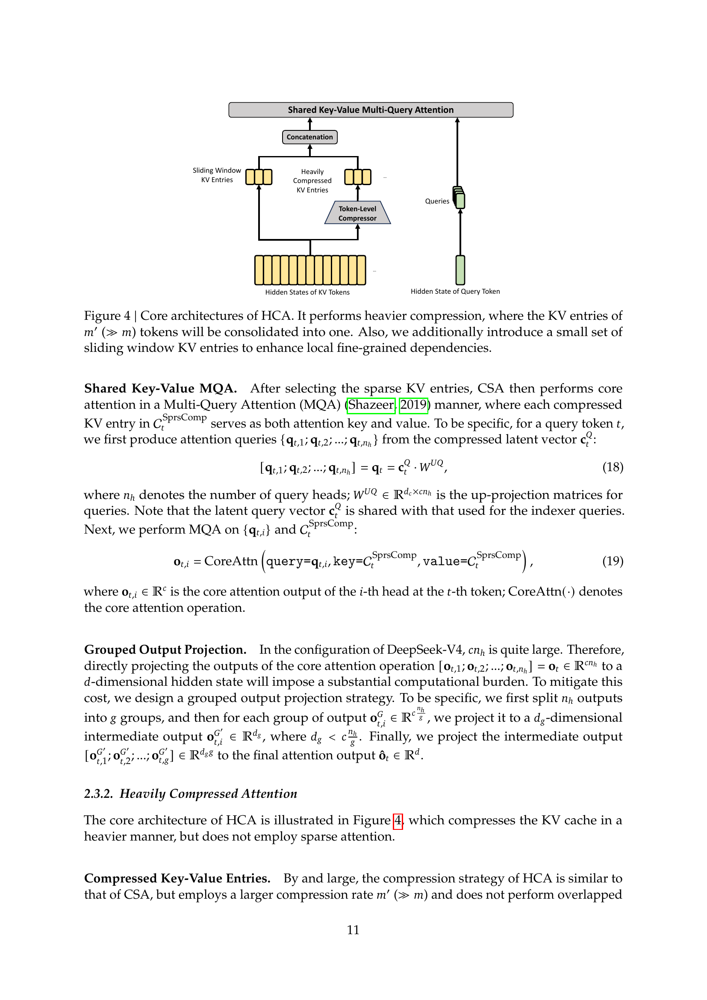

**压缩键值条目（Compressed Key-Value Entries）。** 总体而言，HCA 的压缩策略与 CSA 类似，但采用了更大的压缩率 $m'$（$\gg m$），并且不执行重叠压缩。令 $H \in \mathbb{R}^{n \times d}$ 为输入隐藏状态序列，HCA 首先计算原始键值条目 $C \in \mathbb{R}^{n \times c}$ 及其对应的压缩权重 $Z \in \mathbb{R}^{n \times c}$：

$$C = H \cdot W^{KV}, \tag{20}$$

$$Z = H \cdot W^Z, \tag{21}$$

其中 $W^{KV}, W^Z \in \mathbb{R}^{d \times c}$ 是可训练参数。接下来，$C$ 中每 $m'$ 个键值条目将根据压缩权重和可学习的位置偏置 $B \in \mathbb{R}^{m' \times c}$ 被压缩为一个条目，生成 $C^{\text{Comp}} \in \mathbb{R}^{\frac{n}{m'} \times c}$。每个压缩条目 $C_i^{\text{Comp}} \in \mathbb{R}^c$ 的计算如下：

$$S_{m'i:m'(i+1)-1} = \text{Softmax}_{\text{row}}(Z_{m'i:m'(i+1)-1} + B), \tag{22}$$

$$C_i^{\text{Comp}} = \sum_{j=m'i}^{m'(i+1)-1} S_j \odot C_j. \tag{23}$$

通过该压缩操作，HCA 将序列长度压缩为 $\frac{1}{m'}$ 倍。

**共享键值多查询注意力与分组输出投影（Shared Key-Value MQA and Grouped Output Projection）。** HCA 同样采用与 CSA 相同的共享键值 MQA 和分组输出投影策略。在键值压缩之后，对于查询 token $t$，HCA 首先以低秩方式生成注意力查询 $\{\mathbf{q}_{t,1}; \mathbf{q}_{t,2}; \ldots; \mathbf{q}_{t,n_h}\}$：

$$\mathbf{c}_t^Q = \mathbf{h}_t \cdot W^{DQ}, \tag{24}$$

$$[\mathbf{q}_{t,1}; \mathbf{q}_{t,2}; \ldots; \mathbf{q}_{t,n_h}] = \mathbf{q}_t = \mathbf{c}_t^Q \cdot W^{UQ}, \tag{25}$$

其中 $\mathbf{h}_t \in \mathbb{R}^d$ 是查询 token $t$ 的输入隐藏状态；$n_h$ 表示查询头的数量；$W^{DQ} \in \mathbb{R}^{d \times d_c}$ 和 $W^{UQ} \in \mathbb{R}^{d_c \times cn_h}$ 分别是查询的下投影和上投影矩阵。接下来，在 $\{\mathbf{q}_{t,i}\}$ 和 $C^{\text{Comp}}$ 上执行 MQA：

$$\mathbf{o}_{t,i} = \text{CoreAttn}\left(\text{query}=\mathbf{q}_{t,i},\ \text{key}=C^{\text{Comp}},\ \text{value}=C^{\text{Comp}}\right), \tag{26}$$

其中 $\mathbf{o}_{t,i} \in \mathbb{R}^c$ 是第 $t$ 个 token 第 $i$ 个头的核心注意力输出。接下来，与 CSA 一样，HCA 将 $n_h$ 个输出分为 $g$ 组，对每组输出 $\mathbf{o}_{t,i}^G \in \mathbb{R}^{c\frac{n_h}{g}}$ 投影为 $d_g$ 维的中间输出 $\mathbf{o}_{t,i}^{G'} \in \mathbb{R}^{d_g}$，其中 $d_g < c\frac{n_h}{g}$。最后，HCA 将中间输出 $[\mathbf{o}_{t,1}^{G'}; \mathbf{o}_{t,2}^{G'}; \ldots; \mathbf{o}_{t,g}^{G'}] \in \mathbb{R}^{d_g g}$ 投影为最终的注意力输出 $\hat{\mathbf{o}}_t \in \mathbb{R}^d$。

### 2.3.3. 其他细节

除了上述 CSA 和 HCA 的核心架构之外，我们的混合注意力还包含若干其他技术。为行文清晰，我们在前面的介绍中省略了这些额外技术，将在本小节中进行简要描述。此外，本小节仅聚焦于这些技术的核心思想，可能会为简洁起见省略一些细微细节。我们鼓励读者参考我们的开源实现以获取明确的细节。

**查询与键值条目归一化（Query and Key-Value Entry Normalization）。** 对于 CSA 和 HCA，我们在核心注意力操作之前，对查询的每个头和压缩键值条目的唯一头执行额外的 RMSNorm 操作。这种归一化避免了注意力 logits 爆炸，并可能提升训练稳定性。

**部分旋转位置编码（Partial Rotary Positional Embedding）。** 对于 CSA 和 HCA，我们对注意力查询、键值条目和核心注意力输出部分地应用旋转位置编码（Rotary Positional Embedding, RoPE）(Su et al., 2024)。具体而言，对于 CSA 和 HCA 中使用的每个查询向量和键值条目向量，我们将 RoPE 应用到其最后 64 个维度。由于键值条目同时充当注意力键和值，原始的核心注意力输出 $\{\mathbf{o}_{t,i}\}$ 将携带绝对位置编码（因为它们来自键值条目的加权和）。作为一种对策，我们还对每个 $\mathbf{o}_{t,i}$ 的最后 64 个维度应用位置 $-i$ 的 RoPE。这样，核心注意力的输出也将携带相对位置编码——每个键值条目对核心注意力输出的贡献也将与查询和键值条目之间的距离相关。

**滑动窗口注意力的附加分支（Additional Branch of Sliding Window Attention）。** 为了在 CSA 和 HCA 中严格保持因果性，每个查询只能关注其前方的压缩键值块。因此，查询无法访问自身所在压缩块内其他 token 的信息。同时，在语言建模中，近期的 token 通常与当前查询 token 有更强的相关性。出于这些原因，我们为 CSA 和 HCA 都引入了一个补充的滑动窗口注意力分支，以更好地建模局部依赖关系。具体而言，对于每个查询 token，我们额外生成 $n_{\text{win}}$ 个未压缩的键值条目，对应最近的 $n_{\text{win}}$ 个 token。在 CSA 和 HCA 的核心注意力中，这些滑动窗口中的键值条目将与压缩键值条目一起使用。

**注意力汇聚（Attention Sink）。** 在 CSA 和 HCA 的核心注意力中，我们采用了注意力汇聚（attention sink）技巧 (OpenAI, 2025; Xiao et al., 2024)。具体而言，我们设置一组可学习的汇聚 logits $\{z'_1, z'_2, \ldots, z'_{n_h}\}$。对于第 $h$ 个注意力头，$\text{Exp}(z'_h)$ 将被加到注意力分数的分母中：

$$s_{h,i,j} = \frac{\text{Exp}(z_{h,i,j})}{\sum_k \text{Exp}(z_{h,i,k}) + \text{Exp}(z'_h)}, \tag{27}$$

其中 $s_{h,i,j}, z_{h,i,j} \in \mathbb{R}$ 分别表示第 $h$ 个注意力头在第 $i$ 个查询 token 和第 $j$ 个前驱 token 或压缩块之间的注意力分数和注意力 logit。这一技巧允许每个查询头将其总注意力分数调整为不等于 1，甚至可以接近 0。

### 2.3.4. 效率讨论

由于采用了混合 CSA 和 HCA 以及低精度计算和存储，DeepSeek-V4 系列的注意力模块在注意力浮点运算量和键值缓存大小两方面均实现了卓越的效率，尤其是在长上下文场景下。首先，我们为键值条目采用混合存储格式：旋转位置编码（RoPE）维度使用 BF16 精度，其余维度使用 FP8 精度。这种混合表示方式使键值缓存大小相比纯 BF16 存储减少了近一半。其次，闪电索引器内的注意力计算以 FP4 精度执行，在极长上下文下加速注意力操作。第三，相较于 DeepSeek-V3.2，DeepSeek-V4 系列选择了更小的注意力 top-k 值，从而提升了短文本和中等长度文本的模型效率。最后，也是最重要的一点，压缩注意力和混合注意力技术大幅减少了键值缓存大小和计算浮点运算量。

以 BF16 GQA8 (Ainslie et al., 2023)（头维度 128）作为基线——这是大语言模型注意力的常见配置之一——DeepSeek-V4 系列的键值缓存大小在 1M 上下文场景下可以被大幅降低至该基线的约 2%。此外，即使与 DeepSeek-V3.2 (DeepSeek-AI, 2025)——已经是一个高效的基线——相比，DeepSeek-V4 系列在效率方面仍展现出显著优势。其推理浮点运算量和键值缓存大小的对比见图 1 的右半部分。

## 2.4. Muon 优化器

我们在 DeepSeek-V4 系列的大部分模块中采用 Muon 优化器 (Jordan et al., 2024; Liu et al., 2025)，因为它具有更快的收敛速度和更高的训练稳定性。我们 Muon 优化的完整算法总结在算法 1 中。

> **算法 1** 用于 DeepSeek-V4 的 Muon 优化器
>
> **需要：** 学习率 $\eta$，动量 $\mu$，权重衰减 $\lambda$，更新重缩放因子 $\gamma$
>
> 1: **对于** 每个训练步 $t$ **执行**
> 2: &emsp;**对于** 每个逻辑独立的权重 $W \in \mathbb{R}^{n \times m}$ **执行**
> 3: &emsp;&emsp;$G_t = \nabla_W \mathcal{L}_t(W_{t-1})$ &emsp;&emsp;&emsp;&emsp;&emsp;&emsp;&emsp;&emsp;&emsp; $\triangleright$ 计算梯度
> 4: &emsp;&emsp;$M_t = \mu M_{t-1} + G_t$ &emsp;&emsp;&emsp;&emsp;&emsp;&emsp;&emsp;&emsp; $\triangleright$ 累积动量缓冲区
> 5: &emsp;&emsp;$O'_t = \text{HybridNewtonSchulz}(\mu M_t + G_t)$ &emsp; $\triangleright$ Nesterov 技巧和混合 Newton-Schulz
> 6: &emsp;&emsp;$O_t = O'_t \cdot \sqrt{\max(n, m)} \cdot \gamma$ &emsp;&emsp;&emsp;&emsp;&emsp; $\triangleright$ 重缩放更新 RMS
> 7: &emsp;&emsp;$W_t = W_{t-1} \cdot (1 - \eta\lambda) - \eta O_t$ &emsp;&emsp;&emsp;&emsp; $\triangleright$ 执行权重衰减和更新
> 8: &emsp;**结束**
> 9: **结束**

**基本配置（Basic Configurations）。** 我们对嵌入模块、预测头模块、$m$HC 模块的静态偏置和门控因子，以及所有 RMSNorm 模块的权重保留使用 AdamW 优化器 (Loshchilov and Hutter, 2017)。所有其他模块均使用 Muon 更新。遵循 Liu et al. (2025)，我们还对 Muon 参数应用权重衰减，使用 Nesterov (Jordan et al., 2024; Nesterov, 1983) 技巧，并重缩放更新的均方根（Root Mean Square, RMS）以复用 AdamW 的超参数。与他们不同的是，我们使用混合 Newton-Schulz 迭代进行正交化。

**混合 Newton-Schulz 迭代（Hybrid Newton-Schulz Iterations）。** 对于给定矩阵 $M$，令其奇异值分解（Singular Value Decomposition, SVD）为 $M = U\Sigma V^T$。Newton-Schulz 迭代旨在近似地将 $M$ 正交化为 $UV^T$。通常，$M$ 首先被归一化为 $M_0 = M/||M||_F$ 以确保其最大奇异值不超过 1。然后，每次 Newton-Schulz 迭代执行如下操作：

$$M_k = aM_{k-1} + b(M_{k-1}M_{k-1}^T)M_{k-1} + c(M_{k-1}M_{k-1}^T)^2 M_{k-1}. \tag{28}$$

我们的混合 Newton-Schulz 分两个不同阶段执行 10 次迭代。在前 8 步中，我们使用系数 $(a, b, c) = (3.4445, -4.7750, 2.0315)$ 以驱动快速收敛，将奇异值拉近 1。在最后 2 步中，我们切换为系数 $(a, b, c) = (2, -1.5, 0.5)$，将奇异值精确稳定在 1。

**避免注意力 logits 爆炸（Avoiding Exploding Attention Logits）。** DeepSeek-V4 系列的注意力架构允许我们直接对注意力查询和键值条目应用 RMSNorm，从而有效防止注意力 logits 爆炸。因此，我们在 Muon 优化器中不使用 QK-Clip 技术 (Liu et al., 2025)。
# 3. 通用基础设施（General Infrastructures）

## 3.1. 专家并行中的细粒度通信-计算重叠

混合专家模型（Mixture-of-Experts, MoE）可以通过专家并行（Expert Parallelism, EP）进行加速。然而，EP 需要复杂的跨节点通信，并对互联带宽和延迟提出了很高的要求。为了缓解 EP 中的通信瓶颈，并在更低的互联带宽需求下实现更高的端到端性能，我们提出了一种细粒度的 EP 方案，该方案将通信和计算融合到单一的流水线化内核（pipelined kernel）中，以实现通信-计算重叠（communication-computation overlapping）。

**通信延迟可以被隐藏。** 我们 EP 方案的核心洞察在于，通信延迟可以被有效地隐藏在 MoE 层的计算之下。如图 5 所示，在 DeepSeek-V4 系列中，每个 MoE 层主要可以分解为四个阶段：两个通信密集阶段——分发（Dispatch）和合并（Combine），以及两个计算密集阶段——线性层-1（Linear-1）和线性层-2（Linear-2）。我们的性能分析表明，在单个 MoE 层内，通信的总时间少于计算的总时间。因此，在将通信和计算融合为统一的流水线之后，计算仍然是主要瓶颈，这意味着系统可以容忍较低的互联带宽而不降低端到端性能。

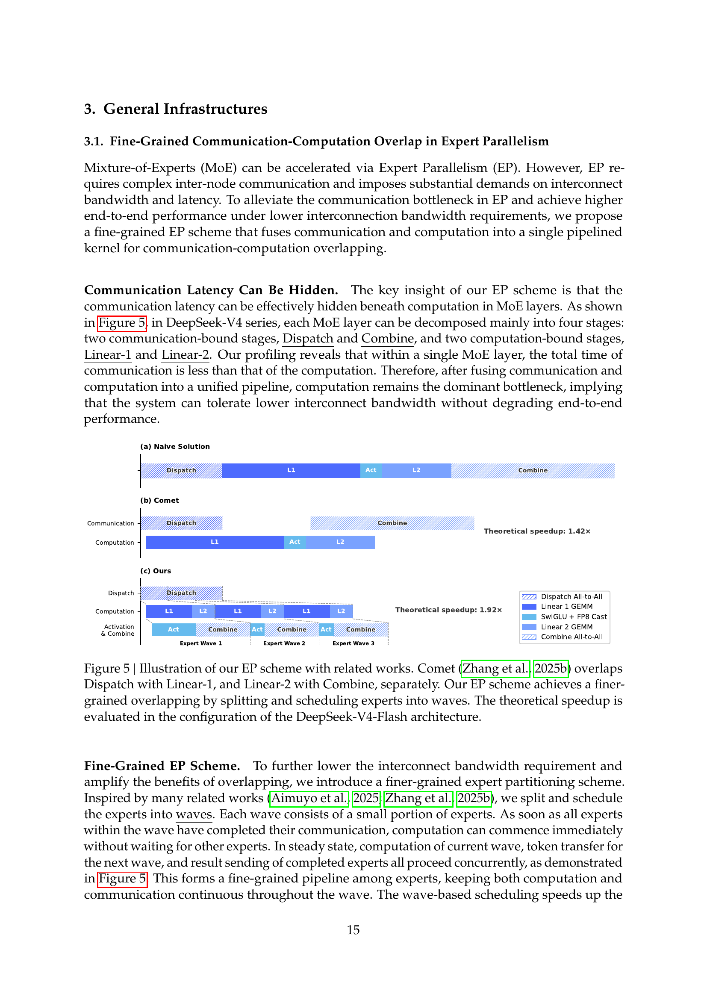

图 5 | 我们的 EP 方案与相关工作的对比示意图。Comet (Zhang et al., 2025b) 将分发（Dispatch）与线性层-1（Linear-1）重叠，将线性层-2（Linear-2）与合并（Combine）重叠。我们的 EP 方案通过将专家拆分并调度为多个波次（wave），实现了更细粒度的重叠。理论加速比是在 DeepSeek-V4-Flash 架构配置下评估的。

**细粒度 EP 方案。** 为了进一步降低互联带宽需求并放大重叠的收益，我们引入了一种更细粒度的专家分区（expert partitioning）方案。受到多项相关工作的启发 (Aimuyo et al., 2025; Zhang et al., 2025b)，我们将专家拆分并调度为多个波次（wave）。每个波次由一小部分专家组成。一旦某个波次内的所有专家完成了通信，计算即可立即开始，无需等待其他专家。在稳态下，当前波次的计算、下一个波次的词元传输以及已完成专家的结果发送都在并行进行，如图 5 所示。这形成了一个专家间的细粒度流水线，使计算和通信在整个波次中持续进行。基于波次的调度将端到端性能提升至接近纯计算时间，尤其在强化学习（Reinforcement Learning, RL）展开（rollout）等极端场景中效果显著，这类场景通常会遇到长尾小批次问题。

**性能与开源大内核。** 我们在 NVIDIA GPU 和华为昇腾（HUAWEI Ascend）NPU 平台上验证了该细粒度 EP 方案。与强基线的非融合实现相比，在通用推理工作负载上实现了 1.50 ~ 1.73 倍的加速，在 RL 展开和高速智能体服务等延迟敏感场景中实现了高达 1.96 倍的加速。我们已将基于 CUDA 的大内核实现开源，命名为 **MegaMoE**，作为 DeepGEMM 的一个组件。

**观察与建议。** 我们分享内核开发中的观察与经验教训，并向硬件厂商提出一些建议，希望有助于高效硬件设计和更好的软硬件协同设计（software-hardware co-design）：

- **计算-通信比（Computation-Communication Ratio）。** 完全的通信-计算重叠取决于计算-通信比，而非仅仅取决于带宽本身。设峰值计算吞吐量为 $C$，互联带宽为 $B$，则当 $C/B \leqslant V_{\text{comp}}/V_{\text{comm}}$ 时，通信可以被完全隐藏，其中 $V_{\text{comp}}$ 表示计算量，$V_{\text{comm}}$ 表示通信量。对于 DeepSeek-V4-Pro，其中每个词元-专家对需要 $6hd$ 次浮点运算（FLOPs）（SwiGLU 的门控、上投影和下投影），但仅需 $3h$ 字节的通信量（FP8 分发 + BF16 合并），这可以简化为：

$$\frac{C}{B} \leqslant 2d = 6144 \text{ FLOPs/Byte.}$$

也就是说，每 GBps 的互联带宽足以隐藏 6.1 TFLOP/s 的计算对应的通信。一旦带宽达到此阈值，它就不再是瓶颈，投入额外的芯片面积来进一步提升带宽将面临收益递减。我们建议未来的硬件设计以这样的平衡点为目标，而非无条件地扩展带宽。

- **功耗预算（Power Budget）。** 极致的内核融合同时驱动计算、内存和网络达到高负载，使得功耗限流（power throttling）成为关键的性能限制因素。我们建议未来的硬件设计为这种完全并发的工作负载提供充足的功耗余量。

- **通信原语（Communication Primitives）。** 我们采用基于拉取（pull-based）的方式，即每个 GPU 主动从远程 GPU 读取数据，以避免细粒度推送（push）所带来的高通知延迟。未来具有更低延迟跨 GPU 信令（signaling）的硬件将使推送模式变得可行，并支持更自然的通信模式。

- **激活函数（Activation Function）。** 我们建议用一种低成本的逐元素（element-wise）激活函数替换 SwiGLU，该函数不涉及指数运算或除法运算。这将减轻 GEMM 后处理的负担，并在相同的参数预算下移除门控投影（gate projection），扩大中间维度 $d$，从而进一步放宽带宽需求。

## 3.2. 使用 TileLang 进行灵活高效的内核开发

在实践中，我们精心设计的模型架构会产生数百个细粒度的 Torch ATen 算子。我们采用 TileLang (Wang et al., 2026) 来开发一组融合内核（fused kernel），以最小的工作量替换其中的绝大多数，同时提供最优的性能。它还允许我们在验证期间快速原型化注意力变体等算子。这些内核在模型架构开发、大规模训练以及最终的推理服务生产部署中发挥着关键作用。作为一种领域特定语言（Domain-Specific Language, DSL），TileLang 在开发生产力和运行时效率之间取得了平衡，在支持同一代码库内的深度迭代优化的同时，实现了快速开发。此外，我们与 TileLang 社区紧密合作，以促进更敏捷、更高效、更稳定的内核开发工作流。

**通过宿主代码生成降低调用开销（Reducing Invocation Overhead with Host Codegen）。** 随着加速器性能的持续增长，CPU 端的编排开销（orchestration overhead）变得日益突出。对于小型、高度优化的内核，固定的宿主端开销很容易限制利用率和吞吐量。这种开销的一个常见来源是宿主端逻辑（如运行时契约检查）通常用 Python 编写，以获得灵活性，但这会产生固定的逐次调用成本。

我们通过宿主代码生成（Host Codegen）来缓解这一开销，将大部分宿主端逻辑移入生成的宿主代码中。具体而言，我们首先协同生成设备内核和一个轻量级的宿主启动器，在中间表示（Intermediate Representation, IR）层嵌入必要的元数据——例如数据类型、秩/形状约束以及步长/布局假设——这些信息从语言前端解析得到。然后，该启动器被降级为基于 TVM-FFI (Chen et al., 2018) 框架的宿主源代码，其紧凑的调用约定和零拷贝张量互操作共同最小化了宿主端开销。在运行时，生成的宿主代码执行验证和参数编组（argument marshaling），将所有逐次调用的检查移出 Python 执行路径。我们的测量表明，CPU 端的验证开销从数十或数百微秒降至每次调用不到一微秒。

**SMT 求解器辅助的形式化整数分析（SMT-Solver-Assisted Formal Integer Analysis）。** TileLang 内核涉及复杂的张量索引运算，需要强大的形式化整数分析能力。在编译过程中，如布局推导（layout inference）、内存冲突检测（memory hazard detection）和边界分析（bound analysis）等阶段，编译器必须验证整数表达式是否满足特定属性，以启用相应的优化。因此，更强的形式化分析能力可以解锁更高级和更复杂的优化机会。

为此，我们将 Z3 SMT 求解器 (De Moura and Bjorner, 2008) 集成到 TileLang 的代数系统中，为张量程序中的大多数整数表达式提供形式化分析能力。我们通过将 TileLang 的整数表达式转换为 Z3 的无量词非线性整数算术（quantifier-free non-linear integer arithmetic, QF_NIA）来在计算开销和形式化表达能力之间取得平衡。基于整数线性规划（Integer Linear Programming, ILP）求解器，QF_NIA 可以无缝地解决内核中常见的标准线性整数表达式。此外，其固有的非线性推理能力有效地应对了诸如可变张量形状上的向量化（vectorization）等高级挑战。在合理的资源限制下，Z3 提升了整体优化性能，同时将编译时间开销限制在仅几秒钟。其影响在多个编译阶段中都很显著，包括向量化、屏障插入（barrier insertion）和代码简化（code simplification）。

**数值精度与逐比特可复现性（Numerical Precision and Bitwise Reproducibility）。** 在生产环境中，数值正确性和可复现性（reproducibility）与原始吞吐量同等重要。因此，我们默认优先保证精度：快速数学优化（fast-math optimizations）在编译器层面被禁用，影响精度的近似运算仅作为显式的、可选择加入的前端算子提供（例如 `T.__exp`、`T.__log` 和 `T.__sin`）。相反，当需要严格的 IEEE-754 语义时，TileLang 提供带有显式舍入模式的 IEEE 兼容内建函数（例如 `T.ieee_fsqrt`、`T.ieee_fdiv` 和 `T.ieee_add`），使开发者能够精确指定数值行为。

我们还以逐比特可复现性为目标，用于验证内核与手写 CUDA 基线的一致性。我们将 TileLang 的代数简化和降级规则与主流 CUDA 工具链（例如 NVCC）对齐，以避免引入非预期的比特级差异。布局注解（Layout annotations）（例如 `T.annotate_layout`）进一步允许用户锁定布局相关的降级决策，保持求值和累加顺序与参考 CUDA 实现一致，从而在需要时实现逐比特一致的输出。

我们的评估表明，这些面向精度和可复现性的设计选择并不牺牲性能：在保守的默认设置下，TileLang 内核仍然具有竞争力，同时提供了可选择性放宽数值约束以获取更高速度的旋钮。

## 3.3. 高性能批次不变和确定性内核库

为了实现高效的训练和推理，我们开发了一套全面的高性能计算内核。除了基本功能和最大化硬件利用率之外，另一个关键设计目标是确保预训练、后训练和推理流水线之间的训练可复现性和逐比特对齐（bitwise alignment）。因此，我们实现了端到端的、逐比特批次不变（bitwise batch-invariant）和确定性（deterministic）的内核，且性能开销极小。这些内核有助于调试、稳定性分析以及一致的后训练行为。

**批次不变性（Batch Invariance）。** 批次不变性确保任何给定词元的输出在比特级别上保持一致，无论其在批次中的位置如何。要实现批次不变性，主要挑战如下：

- **注意力（Attention）。** 为实现批次不变性，我们不能使用 split-KV 方法 (Dao et al., 2023)，该方法将单个序列的注意力计算分布到多个流式多处理器（Stream Multiprocessors, SM）上以平衡负载。然而，放弃这一技术会导致严重的波量化（wave-quantization）问题，从而不利地影响 GPU 利用率。为解决这个问题，我们为批次不变的解码（batch-invariant decoding）开发了一种双内核（dual-kernel）策略。第一个内核在单个 SM 内计算整个序列的注意力输出，确保完全占用的波次具有高吞吐量。第二个内核用于最小化最后一个部分填充波次的延迟，从而缓解波量化问题，它为单个序列使用多个 SM。为了保证这两个内核的逐比特一致性，我们精心设计了第二个内核的计算路径，确保其累加顺序与第一个内核相同。此外，第二个内核利用线程块簇（thread-block cluster）内的分布式共享内存（distributed shared memory），实现跨 SM 的高速数据交换。这种双内核方法有效地将批次不变解码的开销控制在可忽略不计的水平。

- **矩阵乘法（Matrix Multiplication）。** 传统的 cuBLAS 库 (NVIDIA Corporation, 2024) 无法实现批次不变性。因此，我们端到端地替换为 DeepGEMM (Zhao et al., 2025)。此外，对于非常小的批次大小，传统实现通常采用 split-k (Osama et al., 2023) 技术来提升性能。不幸的是，split-k 技术无法保证批次不变性，这是 DeepSeek-V4 的一个关键特性。因此，我们在大多数场景中放弃了 split-k，但这可能会导致性能下降。为解决这个问题，我们引入了一系列优化，使我们的矩阵乘法实现在大多数主要场景中能够匹配甚至超越标准 split-k 的性能。

**确定性（Determinism）。** 确定性训练对于调试硬件或软件问题非常有价值。此外，当训练出现异常（如损失尖峰）时，确定性使研究人员能够更容易地定位数值原因并进一步改进模型设计。训练中的非确定性通常源于非确定性的累加顺序，这往往是由于使用了原子加法（atomic addition）指令。这个问题主要出现在反向传播过程中，具体包括以下几个部分：

- **注意力反向传播（Attention Backward）。** 在稀疏注意力（sparse attention）反向传播的传统实现中，使用 `atomicAdd` 来累加 KV 词元的梯度。这由于浮点加法的非结合性（non-associativity）而引入了非确定性。为解决这个问题，我们为每个 SM 分配独立的累加缓冲区，然后对所有缓冲区进行全局确定性求和。

- **MoE 反向传播（MoE Backward）。** 当来自不同秩（rank）的多个 SM 同时向接收秩上的同一缓冲区写入数据时，协商写入位置同样会引入非确定性。为解决这个问题，我们设计了一种词元顺序预处理机制，在每个单独的秩内进行预处理，并结合跨多个秩的缓冲区隔离。该策略确保了专家并行的发送结果和 MoE 反向传播中累加顺序的确定性。

- **$m$HC 中的矩阵乘法（Matrix Multiplication in $m$HC）。** $m$HC 涉及一个输出维度仅为 24 的矩阵乘法。对于非常小的批次大小，我们不得不使用 split-k (Osama et al., 2023) 算法，但其朴素实现会导致非确定性。为克服这一问题，我们分别输出每个 split 部分，然后在后续内核中执行确定性的归约操作，从而同时保持了性能和确定性。

## 3.4. FP4 量化感知训练

为了在部署时实现推理加速和内存节省，我们在后训练阶段引入了量化感知训练（Quantization-Aware Training, QAT）(Jacob et al., 2018)，使模型适应量化引入的精度下降。我们将 FP4（MXFP4）量化 (Rouhani et al., 2023) 应用于两个组件：(1) MoE 专家权重，它们是 GPU 显存占用的主要来源 (OpenAI, 2025)；(2) CSA 索引器中的查询-键（Query-Key, QK）路径，其中 QK 激活值被缓存、加载并完全以 FP4 进行乘法运算，从而在长上下文场景中加速注意力分数计算。此外，我们在 QAT 过程中将索引分数 $I_{:,:}$ 从 FP32 量化为 BF16。该优化为 top-k 选择器实现了 2 倍加速，同时保持了 99.7% 的 KV 条目召回率。

对于 MoE 专家权重，遵循 QAT 的通常做法，由优化器维护的 FP32 主权重首先被量化到 FP4，然后反量化回 FP8 用于计算。值得注意的是，我们的 FP4 到 FP8 反量化是无损的。这是因为 FP8（E4M3）相比 FP4（E2M1）多了 2 个指数位，提供了更大的动态范围。因此，只要 FP4 量化块（$1 \times 32$ 个瓦片）内子块的最大和最小缩放因子之比在每个 FP8 量化块（$128 \times 128$ 个瓦片）内不超过某个阈值，细粒度的缩放信息就可以被 FP8 的扩展动态范围完全吸收。我们通过实验验证了当前权重满足此条件。这使得整个 QAT 流水线可以完全复用现有的 FP8 训练框架，无需任何修改。在反向传播中，梯度相对于前向传播中使用的相同 FP8 权重计算，并直接传播回 FP32 主权重，等效于通过量化操作应用直通估计器（Straight-Through Estimator, STE）。这也避免了重新量化转置权重的需要。

在 RL 训练的推理和展开阶段（不涉及反向传播），我们直接使用真实的 FP4 量化权重，而非模拟量化。这确保了采样期间的模型行为与在线部署完全一致，同时也减少了内核内存加载，实现了实际的加速并显著降低了内存消耗。CSA 索引器中的 QK 路径也做了类似处理。

## 3.5. 训练框架

我们的训练框架建立在为 DeepSeek-V3 (DeepSeek-AI, 2024) 开发的可扩展且高效的基础设施之上。在训练 DeepSeek-V4 时，我们继承了这一稳健的基础，同时引入了若干关键创新以适应其新颖的架构组件——具体包括 Muon 优化器、$m$HC 以及混合注意力机制——同时保持高训练效率和稳定性。

### 3.5.1. Muon 的高效实现

Muon 优化器需要完整的梯度矩阵来计算参数更新，这在与零冗余优化器（Zero Redundancy Optimizer, ZeRO）(Rajbhandari et al., 2020) 结合时带来了挑战。传统的 ZeRO 针对 AdamW 等逐元素优化器设计，其中单个参数矩阵可以被分区并跨多个秩进行更新。为解决这一冲突，我们为 Muon 设计了一种混合的 ZeRO 桶分配策略。

对于稠密参数（dense parameters），我们限制 ZeRO 并行的最大规模，并采用背包算法（knapsack algorithm）将参数矩阵分配到这些秩上，确保每个秩管理大致均衡的负载。每个秩上的桶被填充到与最大桶大小对齐，以便于高效的 reduce-scatter 操作。在我们的设置中，这种填充通常产生不到 10% 的内存开销，其中每个秩管理不超过五个参数矩阵。当数据并行的总规模超过 ZeRO 的限制时，我们跨额外的数据并行组冗余地计算 Muon 更新，以换取更少的总桶内存。

对于 MoE 参数，我们独立优化每个专家。我们首先将 SwiGLU (Shazeer, 2020) 中所有专家在所有层上的下投影矩阵展平，然后是展平的上投影矩阵和门控矩阵。接着，我们填充展平后的向量，以确保可以在所有秩上均匀分布，且不会拆分任何逻辑上独立的矩阵。鉴于专家数量众多，我们不对 MoE 参数施加 ZeRO 并行的限制，且填充开销也可以忽略不计。

此外，在每个秩上，具有相同形状的连续参数会自动合并，以支持 Newton-Schulz 迭代的批量执行，从而更好地利用硬件。此外，我们观察到 Muon 中的 Newton-Schulz 迭代在使用 BF16 矩阵乘法计算时仍然保持稳定。利用这一点，我们以随机舍入（stochastic rounding）的方式，将 MoE 梯度量化到 BF16 精度后再跨数据并行秩同步，从而将通信量减半。为避免低精度加法器引入的累加误差，我们用两阶段方案替换了传统的基于树或环的 reduce-scatter 集合通信：首先，一个 all-to-all 操作在各秩之间交换本地梯度，然后每个秩以 FP32 进行本地求和。该设计保持了数值稳健性。

### 3.5.2. $m$HC 的高性价比和内存高效实现

$m$HC 的引入增加了流水线阶段之间的激活内存消耗和通信量，相比传统的残差连接而言。为缓解这些开销，我们实施了若干优化策略。

首先，我们为训练和推理精心设计并实现了 $m$HC 的融合内核。其次，我们引入了一种选择性检查点中间张量的重计算策略。具体而言，我们重计算层间的大部分隐藏状态和所有归一化的层输入，同时避免重计算计算密集型操作。这在内存节省和计算开销之间取得了平衡。第三，我们调整了 DualPipe 1F1B 重叠方案，以适应增加的流水线通信并支持 $m$HC 中某些操作的并行执行。

总体而言，这些优化将 $m$HC 的挂钟时间开销限制在重叠 1F1B 流水线阶段的仅 6.7%。更多工程优化的细节可参见专门的 $m$HC 论文 (Xie et al., 2026)。

### 3.5.3. 长上下文注意力的上下文并行

传统的上下文并行（Context Parallelism, CP）沿序列维度进行分区，每个秩维护连续的 $s$ 个词元。这为我们的压缩注意力机制（即 CSA 和 HCA）带来了两个挑战。一方面，训练样本由多个序列打包而成，每个序列以 $m$（或 $m'$）为因子独立压缩，尾部不足 $m$ 个词元的部分被丢弃。因此，压缩后的 KV 长度通常小于 $\frac{s}{m}$ 且在各秩之间存在差异。另一方面，压缩需要 $m$ 个连续的 KV 条目，这可能跨越两个相邻 CP 秩的边界。

为应对这些挑战，我们设计了一种两阶段通信方案。在第一阶段，每个秩 $i$ 将其最后 $m$ 个未压缩的 KV 条目发送给秩 $i+1$。然后秩 $i+1$ 将这些接收到的条目与其本地的 $s$ 个未压缩 KV 条目一起进行压缩，产生固定长度为 $\frac{s}{m}+1$ 的压缩条目（其中可能存在一些填充条目）。在第二阶段，一个 all-gather 操作收集所有 CP 秩上的本地压缩 KV 条目。然后一个融合的选择-填充（select-and-pad）算子将其重组为完整的压缩 KV 条目集合，总长度为 $\text{cp\_size} \cdot \frac{s}{m}$。任何填充条目都被放置在末尾。对于 HCA 和 CSA 中的索引器，每个查询词元可见的压缩 KV 条目范围可通过规则预计算。对于 CSA 中的稀疏注意力，top-$k$ 选择器显式指定每个查询可见的压缩 KV 条目索引。

### 3.5.4. 灵活激活检查点的扩展自动微分

传统的激活检查点（activation checkpointing）实现在整个模块的粒度上操作，决定是保留还是在反向传播期间重计算其输出激活值。这种粗粒度的方式往往导致重计算成本和激活内存占用之间的次优权衡。一种替代方法是手动实现整个层的前向和反向逻辑，显式管理张量检查点状态。虽然这种方法能够实现细粒度控制，但失去了自动微分（automatic differentiation）框架的便利性，大幅增加了开发复杂度。

为了在不牺牲编程效率的情况下实现细粒度控制，我们实现了一种张量级别的激活检查点机制，并支持自动微分。通过这种机制，开发者只需实现前向传播并选择性地标注需要自动检查点和重计算的个别张量。我们的框架利用 TorchFX (Reed et al., 2022) 来追踪完整的计算图。对于每个标注的张量，它执行反向遍历以识别其重计算所需的最小子图。我们将这些最小子图定义为重计算图，并将它们插入到反向逻辑中对应的梯度计算之前。

与手动实现相比，该设计在训练期间不引入额外开销。该框架中的重计算通过直接释放标注张量的 GPU 内存并复用重计算张量的存储指针来实现，无需任何 GPU 内存拷贝。此外，由于图追踪以具体方式执行模型，我们可以追踪每个张量的底层存储指针，从而实现对共享存储的张量（例如 reshape 操作的输入和输出）的自动重计算去重。这使开发者在标注重计算时无需推理底层的内存细节。

## 3.6. 推理框架

我们的推理框架主要继承自 DeepSeek-V3，在 KV 缓存管理方面有一些差异。

### 3.6.1. KV 缓存结构与管理

为了高效管理 DeepSeek-V4 中混合注意力机制产生的异构 KV 缓存（heterogeneous KV cache），我们设计了一种定制化的 KV 缓存布局。该布局如图 6 所示，我们将在下文详细阐述。

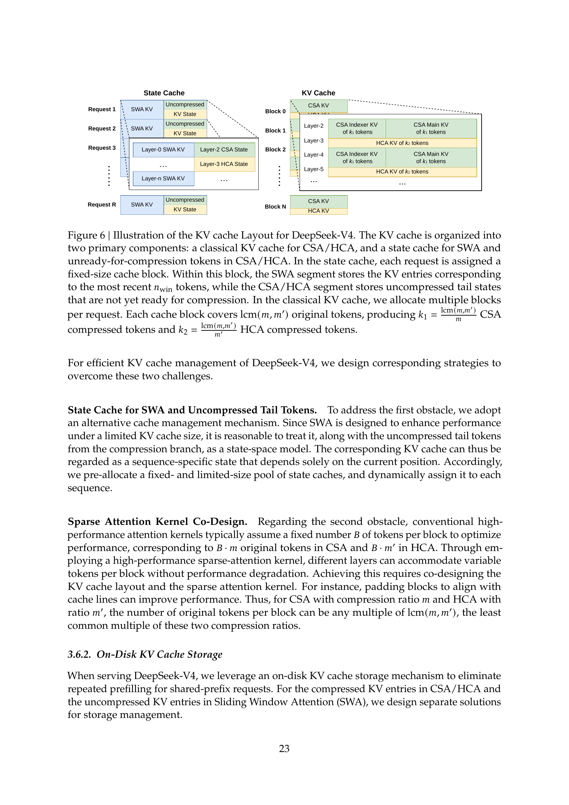

图 6 | DeepSeek-V4 的 KV 缓存布局示意图。KV 缓存被组织为两个主要组成部分：用于 CSA/HCA 的经典 KV 缓存，以及用于 SWA 和 CSA/HCA 中待压缩词元的状态缓存（state cache）。在状态缓存中，每个请求被分配一个固定大小的缓存块。在该块中，SWA 段存储最近 $n_{\text{win}}$ 个词元对应的 KV 条目，而 CSA/HCA 段存储尚未准备好进行压缩的未压缩尾部状态。在经典 KV 缓存中，我们为每个请求分配多个块。每个缓存块覆盖 $\text{lcm}(m, m')$ 个原始词元，产生 $k_1 = \frac{\text{lcm}(m,m')}{m}$ 个 CSA 压缩词元和 $k_2 = \frac{\text{lcm}(m,m')}{m'}$ 个 HCA 压缩词元。

**DeepSeek-V4 中的异构 KV 条目。** DeepSeek-V4 系列的混合注意力机制引入了多种类型的 KV 条目，具有不同的键值（Key-Value, KV）缓存大小和更新规则。用于稀疏选择的闪电索引器（lightning indexer）将额外维度引入 KV 缓存，这些维度的嵌入大小与主注意力（primary attention）中的不同。CSA 和 HCA 采用的压缩技术分别将序列长度缩减了 $\frac{1}{m}$ 和 $\frac{1}{m'}$ 倍，从而降低了整体 KV 缓存大小。因此，KV 缓存大小在不同层之间存在差异。此外，滑动窗口注意力（Sliding Window Attention, SWA）层也以不同的 KV 缓存大小运行，并具有独立的缓存命中和淘汰策略。在压缩分支中，每 $m$ 个词元生成一个 KV 条目。当剩余词元数量不足以进行压缩时，所有待处理的词元及其相关的隐藏状态必须保留在缓冲区中，直到可以执行压缩操作。这些被缓冲的词元代表了一种由位置上下文决定的序列状态，也在 KV 缓存框架内进行管理。

**管理混合注意力 KV 缓存的挑战。** 混合注意力机制违反了 PagedAttention 及其变体背后的基本假设。虽然近期的混合 KV 缓存管理算法（例如 Jenga (Zhang et al., 2025a)、Hymba (Dong et al., 2025)）针对通用混合注意力模型或特定结构，但有两个主要障碍阻止了在 PagedAttention 框架下统一管理所有层的 KV 缓存：

- 多样化的缓存策略，例如滑动窗口注意力中使用的策略。
- 高性能注意力内核施加的约束，包括对齐要求。

为了高效管理 DeepSeek-V4 的 KV 缓存，我们设计了相应的策略来克服这两个挑战。

**SWA 和未压缩尾部词元的状态缓存（State Cache）。** 为应对第一个障碍，我们采用了一种替代的缓存管理机制。由于 SWA 旨在有限的 KV 缓存大小下提升性能，将其连同压缩分支中未压缩的尾部词元一起视为一个状态空间模型（state-space model）是合理的。相应的 KV 缓存因此可以被视为仅取决于当前位置的序列特定状态。相应地，我们预分配一个固定且有限大小的状态缓存池，并将其动态分配给每个序列。

**稀疏注意力内核协同设计（Sparse Attention Kernel Co-Design）。** 关于第二个障碍，传统的高性能注意力内核通常假设每个块有固定数量 $B$ 个词元以优化性能，对应于 CSA 中的 $B \cdot m$ 个原始词元和 HCA 中的 $B \cdot m'$ 个原始词元。通过采用高性能稀疏注意力内核，不同层可以在不降低性能的情况下容纳每个块可变数量的词元。实现这一点需要 KV 缓存布局和稀疏注意力内核的协同设计。例如，将块填充到与缓存行对齐可以提高性能。因此，对于压缩比为 $m$ 的 CSA 和压缩比为 $m'$ 的 HCA，每个块的原始词元数量可以是 $\text{lcm}(m, m')$ 的任意倍数，即这两个压缩比的最小公倍数。

### 3.6.2. 磁盘 KV 缓存存储

在服务 DeepSeek-V4 时，我们利用磁盘 KV 缓存（on-disk KV cache）存储机制来消除共享前缀请求的重复预填充。对于 CSA/HCA 中的压缩 KV 条目和滑动窗口注意力（SWA）中的未压缩 KV 条目，我们设计了不同的存储方案。

对于 CSA 和 HCA，我们简单地将所有压缩 KV 条目存储到磁盘。当请求命中已存储的前缀时，我们读取并复用对应于该前缀的压缩 KV 条目，直到最后一个完整的压缩块。特别地，对于尾部不完整块中的前缀词元，我们仍然需要重计算它们以恢复未压缩的 KV 条目，因为 CSA 和 HCA 中的未压缩 KV 条目不被存储。

对于 SWA 的 KV 条目，由于它们未经压缩且存在于每一层中，其体积大约是压缩后 CSA 和 HCA KV 条目的 8 倍。为高效处理这些大量的 SWA KV 条目，我们提出并实现了三种不同的策略来管理磁盘上的 SWA KV 条目，每种策略在存储开销和计算冗余之间提供不同的权衡：

- **完全 SWA 缓存（Full SWA Caching）。** 该策略存储所有词元的完整 SWA KV 条目，确保零计算冗余。在该策略下，命中前缀的 SWA KV 条目可以通过仅读取磁盘缓存中最后 $n_{\text{win}}$ 个词元对应的条目来重建。尽管计算零冗余，但该策略对于现代基于 SSD 的存储系统而言效率不高——因为存储的 SWA KV 缓存中只有一小部分会被访问，这导致了不平衡的写密集型访问模式。

- **周期性检查点（Periodic Checkpointing）。** 该策略每隔 $p$ 个词元对最后 $n_{\text{win}}$ 个词元的 SWA KV 条目进行检查点保存，其中 $p$ 是一个可调参数。对于命中的前缀，我们加载最近的检查点状态，然后重计算剩余的尾部词元。通过调节 $p$，该策略可以按需在存储和计算之间进行权衡。

- **零 SWA 缓存（Zero SWA Caching）。** 该策略不存储任何 SWA KV 条目。对于命中的前缀，我们需要执行更多的重计算来恢复 SWA KV 条目。具体而言，在每个注意力层中，每个词元的 SWA KV 条目仅依赖于前一层最近 $n_{\text{win}}$ 个词元的 SWA KV 条目。因此，利用已缓存的 CSA 和 HCA KV 条目，重计算最后 $n_{\text{win}} \cdot L$ 个词元就足以恢复一个 $L$ 层模型的最后 $n_{\text{win}}$ 个 SWA KV 条目。

根据具体的部署场景，我们选择最合适的策略来实现存储与计算之间的最佳权衡。
# 4. 预训练（Pre-Training）

## 4.1. 数据构建（Data Construction）

在 DeepSeek-V3 预训练数据的基础上，我们致力于构建一个更加多样化、更高质量、且具有更长有效上下文的训练语料库。我们持续优化数据构建流程。对于网络来源的数据，我们采用过滤策略来去除批量自动生成和模板化的内容，从而降低模型坍缩（model collapse）的风险（Zhu et al., 2024）。数学和编程语料仍然是我们训练数据的核心组成部分，我们还通过在中期训练阶段引入智能体数据（agentic data）来进一步增强 DeepSeek-V4 系列的编程能力。对于多语言数据，我们为 DeepSeek-V4 构建了更大规模的语料库，提升了其对不同文化中长尾知识的捕获能力。对于 DeepSeek-V4，我们特别重视长文档数据的筛选，优先收录科学论文、技术报告以及其他具有独特学术价值的材料。综合以上所有内容，我们的预训练语料库包含超过 32T 个 token，涵盖数学内容、代码、网页、长文档以及其他高质量类别。

对于预训练数据，我们基本沿用了 DeepSeek-V3 的预处理策略。在分词（tokenization）方面，我们在 DeepSeek-V3 分词器的基础上引入了少量特殊 token 用于上下文构建，词表大小仍保持为 128K。我们同样继承了 DeepSeek-V3 的 token 拆分（token-splitting）（DeepSeek-AI, 2024）和中间填充（Fill-in-Middle, FIM）（DeepSeek-AI, 2024）策略。受 Ding et al.（2024）的启发，我们将来自不同来源的文档打包（pack）到合适的序列中，以尽量减少样本截断。与 DeepSeek-V3 不同的是，我们在预训练期间采用了样本级注意力掩码（sample-level attention masking）。

## 4.2. 预训练设置（Pre-Training Setups）

### 4.2.1. 模型设置（Model Setups）

**DeepSeek-V4-Flash。** 我们将 Transformer 层数设为 43，隐藏维度 $d$ 设为 4096。前两层使用纯滑动窗口注意力（pure sliding window attention）。后续各层以交错方式使用 CSA 和 HCA。对于 CSA，我们将压缩率 $m$ 设为 4，索引器查询头数 $n_h^I$ 设为 64，索引器头维度 $c^I$ 设为 128，为稀疏注意力选择的 KV 条目数（即注意力 top-k）设为 512。对于 HCA，我们将压缩率 $m'$ 设为 128。对于 CSA 和 HCA，我们将查询头数 $n_h$ 设为 64，头维度 $c$ 设为 512，查询压缩维度 $d_c$ 设为 1024。输出投影分组数 $g$ 设为 8，每个中间注意力输出 $d_g$ 的维度设为 1024。滑动窗口注意力附加分支的窗口大小 $n_{\text{win}}$ 设为 128。我们在所有 Transformer 块中均使用 MoE 层，但前 3 个 MoE 层使用哈希路由（Hash routing）策略。每个 MoE 层由 1 个共享专家（shared expert）和 256 个路由专家（routed expert）组成，每个专家的中间隐藏维度为 2048。在路由专家中，每个 token 激活 6 个专家。多 token 预测（multi-token prediction）深度设为 1。对于 $m$HC，扩展因子 $n_{\text{hc}}$ 设为 4，Sinkhorn-Knopp 迭代次数 $t_{\max}$ 设为 20。在此配置下，DeepSeek-V4-Flash 共有 284B 总参数，其中每个 token 激活 13B 参数。

**DeepSeek-V4-Pro。** 我们将 Transformer 层数设为 61，隐藏维度 $d$ 设为 7168。前两层使用 HCA。后续各层以交错方式使用 CSA 和 HCA。对于 CSA，我们将压缩率 $m$ 设为 4，索引器查询头数 $n_h^I$ 设为 64，索引器头维度 $c^I$ 设为 128，为稀疏注意力选择的 KV 条目数（即注意力 top-k）设为 1024。对于 HCA，我们将压缩率 $m'$ 设为 128。对于 CSA 和 HCA，我们将查询头数 $n_h$ 设为 128，头维度 $c$ 设为 512，查询压缩维度 $d_c$ 设为 1536。输出投影分组数 $g$ 设为 16，每个中间注意力输出 $d_g$ 的维度设为 1024。滑动窗口注意力附加分支的窗口大小 $n_{\text{win}}$ 设为 128。我们在所有 Transformer 块中均使用 MoE 层，但前 3 个 MoE 层使用哈希路由策略。每个 MoE 层由 1 个共享专家和 384 个路由专家组成，每个专家的中间隐藏维度为 3072。在路由专家中，每个 token 激活 6 个专家。多 token 预测深度设为 1。对于 $m$HC，扩展因子 $n_{\text{hc}}$ 设为 4，Sinkhorn-Knopp 迭代次数 $t_{\max}$ 设为 20。在此配置下，DeepSeek-V4-Pro 共有 1.6T 总参数，其中每个 token 激活 49B 参数。

### 4.2.2. 训练设置（Training Setups）

**DeepSeek-V4-Flash。** 我们对大部分参数使用 Muon 优化器（Jordan et al., 2024; Liu et al., 2025），但对嵌入模块（embedding module）、预测头模块（prediction head module）以及所有 RMSNorm 模块的权重使用 AdamW 优化器（Loshchilov and Hutter, 2017）。对于 AdamW，我们将其超参数设为 $\beta_1 = 0.9$，$\beta_2 = 0.95$，$\varepsilon = 10^{-20}$，weight_decay $= 0.1$。对于 Muon，我们将动量设为 0.95，权重衰减设为 0.1，并将每次更新矩阵的 RMS 缩放至 0.18 以重新利用 AdamW 的学习率。我们在 32T 个 token 上训练 DeepSeek-V4-Flash，并与 DeepSeek-V3 一样，采用批量大小调度策略（batch size scheduling strategy），将批量大小（以 token 计）从较小值逐步增加到 75.5M，然后在大部分训练过程中保持在 75.5M。学习率在前 2000 步线性预热，在大部分训练过程中维持在 $2.7 \times 10^{-4}$。在训练接近尾声时，我们按照余弦调度（cosine schedule）将学习率衰减至 $2.7 \times 10^{-5}$。训练从序列长度 4K 开始，逐步扩展至 16K、64K 和 1M。关于稀疏注意力的设置，我们首先使用密集注意力对模型进行预热训练，处理前 1T 个 token，然后在序列长度 64K 时引入稀疏注意力，并在后续训练中保持稀疏注意力。在引入注意力稀疏性时，我们先设置一个短阶段来预热 CSA 中的闪电索引器（lightning indexer），然后在大部分训练过程中使用稀疏注意力训练模型。对于无辅助损失的负载均衡（auxiliary-loss-free load balancing），我们将偏置更新速度（bias update speed）设为 0.001。对于平衡损失（balance loss），我们将其损失权重设为 0.0001，以避免单个序列内出现极端不平衡。MTP 损失权重在大部分训练过程中设为 0.3，并在学习率衰减开始时设为 0.1。

**DeepSeek-V4-Pro。** 除了超参数的具体数值外，DeepSeek-V4-Pro 的训练设置与 DeepSeek-V4-Flash 基本一致。我们对大部分参数使用 Muon 优化器，但对嵌入模块、预测头模块以及所有 RMSNorm 模块的权重使用 AdamW 优化器。AdamW 和 Muon 的超参数与 DeepSeek-V4-Flash 相同。我们在 33T 个 token 上训练 DeepSeek-V4-Pro，同样采用批量大小调度策略，最大批量大小为 94.4M 个 token。学习率调度策略与 DeepSeek-V4-Flash 基本相同，但峰值学习率设为 $2.0 \times 10^{-4}$，末期学习率设为 $2.0 \times 10^{-5}$。训练同样从序列长度 4K 开始，逐步扩展至 16K、64K 和 1M。与 DeepSeek-V4-Flash 相比，DeepSeek-V4-Pro 在密集注意力阶段的持续时间更长，而引入稀疏注意力的策略与 DeepSeek-V4-Flash 相同，均采用两阶段训练方法。对于无辅助损失的负载均衡，我们将偏置更新速度设为 0.001。对于平衡损失，我们将其损失权重设为 0.0001，以避免单个序列内出现极端不平衡。MTP 损失权重在大部分训练过程中设为 0.3，并在学习率衰减开始时设为 0.1。

### 4.2.3. 缓解训练不稳定性（Mitigating Training Instability）

训练万亿参数的 MoE 模型面临巨大的稳定性挑战，DeepSeek-V4 系列也不例外。我们在训练过程中遇到了显著的不稳定性问题。虽然简单的回滚可以暂时恢复训练状态，但它们不足以作为长期解决方案，因为它们无法防止损失尖峰（loss spike）的再次出现。从经验上看，我们发现尖峰的发生始终与 MoE 层中的异常值（outlier）密切相关，而路由机制本身似乎会加剧这些异常值的产生。因此，我们从两个维度着手解决这一问题：打破路由引发的恶性循环，以及直接抑制异常值。幸运的是，我们发现了两种实用技术，能够有效地维持训练稳定性。尽管对其底层机制的全面理论理解仍是一个开放问题，我们仍然公开分享这些技术，以促进社区的进一步探索。

**预见性路由（Anticipatory Routing）。** 我们发现，将主干网络（backbone network）和路由网络（routing network）的同步更新解耦，能够显著提高训练稳定性。具体而言，在第 $t$ 步，我们使用当前网络参数 $\theta_t$ 进行特征计算，但路由索引（routing indices）是基于历史网络参数 $\theta_{t-\Delta t}$ 计算并应用的。在实践中，为了避免两次加载模型参数的开销，我们提前获取第 $t$ 步的数据，在第 $t - \Delta t$ 步"预见性地"计算并缓存路由索引，供第 $t$ 步后续使用，这就是我们将此方法命名为预见性路由的原因。我们还在基础设施层面对此进行了大量优化。首先，由于预计算路由索引仅需一次前向传播，我们精心编排了流水线执行和与专家并行（Expert Parallelism, EP）通信的计算重叠，成功地将预见性路由的额外墙钟时间开销限制在约 20%。其次，我们引入了一种自动检测机制，当损失尖峰发生时触发短暂回滚并仅在此时激活预见性路由；在该模式下运行一段时间后，系统恢复到标准训练。最终，这种动态应用使我们能够在几乎不增加整体训练开销的情况下避免损失尖峰，且不会影响模型性能。

> **译注：预见性路由为什么能稳定训练？**
>
> 这是一个极其精妙的工程发现。在 MoE 训练中存在一个恶性循环：某些 token 产生异常大的激活值 → 这些 token 被路由到特定专家（因为路由决策基于当前激活）→ 该专家的梯度被这些异常值主导 → 专家权重更新后产生更大的异常值 → 更极端的路由分配... 通过使用历史参数 $\theta_{t-\Delta t}$ 计算路由（而非当前步的 $\theta_t$），当前步的异常激活不会立即影响路由决策——这打断了上述恶性循环。
>
> 有趣的是，作者坦言"对其底层机制的全面理论理解仍是一个开放问题"。这在工业级大模型训练中非常典型：先用工程直觉找到有效的解法，理论解释留待后续。

**SwiGLU 截断（SwiGLU Clamping）。** 在此前的文献中（Bello et al., 2017; Riviere et al., 2024），截断（clamping）已被明确用于约束数值范围，从而增强训练稳定性。在我们的实际训练中，我们通过实验发现，对 SwiGLU 应用截断（OpenAI, 2025）能够有效消除异常值，并在很大程度上帮助稳定训练过程，同时不会损害模型性能。在 DeepSeek-V4-Flash 和 DeepSeek-V4-Pro 的整个训练过程中，我们将 SwiGLU 的线性分量截断在 $[-10, 10]$ 的范围内，同时将门控分量的上界截断为 10。

## 4.3. 评估（Evaluations）

### 4.3.1. 评估基准（Evaluation Benchmarks）

对于基座模型（base model）的评估，我们考虑了四个关键维度的基准测试：世界知识、语言理解与推理、编程与数学、以及长上下文处理。

**世界知识**基准测试包括 AGIEval（Zhong et al., 2023）、C-Eval（Huang et al., 2023）、CMMLU（Li et al., 2023）、MMLU（Hendrycks et al., 2020）、MMLU-Redux（Gema et al., 2024）、MMLU-Pro（Wang et al., 2024b）、MMMLU（OpenAI, 2024a）、MultiLoKo（Hupkes and Bogoychev, 2025）、Simple-QA verified（Haas et al., 2025）、SuperGPQA（Du et al., 2025）、FACTS Parametric（Cheng et al., 2025）和 TriviaQA（Joshi et al., 2017）。

**语言理解与推理**基准测试包括 BigBench Hard (BBH)（Suzgun et al., 2022）、DROP（Dua et al., 2019）、HellaSwag（Zellers et al., 2019）、CLUEWSC（Xu et al., 2020）和 WinoGrande（Sakaguchi et al., 2019）。

**编程与数学**基准测试包括 BigCodeBench（Zhuo et al., 2025）、HumanEval（Chen et al., 2021）、GSM8K（Cobbe et al., 2021）、MATH（Hendrycks et al., 2021）、MGSM（Shi et al., 2023）和 CMath（Wei et al., 2023）。

**长上下文**基准测试包括 LongBench-V2（Bai et al., 2025b）。

### 4.3.2. 评估结果（Evaluation Results）

表 1 | DeepSeek-V3.2-Base、DeepSeek-V4-Flash-Base 和 DeepSeek-V4-Pro-Base 的详细对比。所有模型均在我们的统一内部框架下使用相同的评估设置进行评估。差距不超过 0.3 的分数被视为处于同一水平。每行中的最高分以**粗体**标注，第二高分以<u>下划线</u>标注。

| | 基准测试 (指标) | # Shots | DeepSeek-V3.2 Base | DeepSeek-V4-Flash Base | DeepSeek-V4-Pro Base |
|---|---|---|---|---|---|
| | 架构 | - | MoE | MoE | MoE |
| | 激活参数量 | - | 37B | 13B | 49B |
| | 总参数量 | - | 671B | 284B | 1.6T |
| 世界知识 | AGIEval (EM) | 0-shot | 80.1 | 82.6 | **83.1** |
| | MMLU (EM) | 5-shot | 87.8 | 88.7 | **90.1** |
| | MMLU-Redux (EM) | 5-shot | 87.5 | 89.4 | **90.8** |
| | MMLU-Pro (EM) | 5-shot | 65.5 | 68.3 | **73.5** |
| | MMMLU (EM) | 5-shot | 87.9 | 88.8 | **90.3** |
| | C-Eval (EM) | 5-shot | 90.4 | 92.1 | **93.1** |
| | CMMLU (EM) | 5-shot | 88.9 | 90.4 | **90.8** |
| | MultiLoKo (EM) | 5-shot | 38.7 | 42.2 | **51.1** |
| | Simple-QA verified (EM) | 25-shot | 28.3 | 30.1 | **55.2** |
| | SuperGPQA (EM) | 5-shot | 45.0 | 46.5 | **53.9** |
| | FACTS Parametric (EM) | 25-shot | 27.1 | 33.9 | **62.6** |
| | TriviaQA (EM) | 5-shot | 83.3 | 82.8 | **85.6** |
| 语言理解与推理 | BBH (EM) | 3-shot | **87.6** | 86.9 | 87.5 |
| | DROP (F1) | 1-shot | 88.2 | 88.6 | **88.7** |
| | HellaSwag (EM) | 0-shot | 86.4 | 85.7 | **88.0** |
| | WinoGrande (EM) | 0-shot | 78.9 | 79.5 | **81.5** |
| | CLUEWSC (EM) | 5-shot | 83.5 | 82.2 | **85.2** |
| 编程与数学 | BigCodeBench (Pass@1) | 3-shot | **63.9** | 56.8 | 59.2 |
| | HumanEval (Pass@1) | 0-shot | 62.8 | 69.5 | **76.8** |
| | GSM8K (EM) | 8-shot | 91.1 | 90.8 | **92.6** |
| | MATH (EM) | 4-shot | 60.5 | 57.4 | **64.5** |
| | MGSM (EM) | 8-shot | 81.3 | **85.7** | 84.4 |
| | CMath (EM) | 3-shot | 92.6 | **93.6** | 90.9 |
| 长上下文 | LongBench-V2 (EM) | 1-shot | 40.2 | 44.7 | **51.5** |

在表 1 中，我们提供了 DeepSeek-V3.2、DeepSeek-V4-Flash 和 DeepSeek-V4-Pro 三个基座模型的详细对比，所有模型均在统一的内部框架下以严格一致的设置进行评估。

将 DeepSeek-V4-Flash-Base 与 DeepSeek-V3.2-Base 进行比较，揭示了一个令人信服的效率故事。尽管使用了显著更少的激活参数和总参数，DeepSeek-V4-Flash-Base 在大量基准测试中的表现仍然优于 DeepSeek-V3.2-Base。这一优势在世界知识任务和具有挑战性的长上下文场景中尤为明显。这些结果表明，DeepSeek-V4-Flash-Base 中的架构改进、数据质量的提升以及训练优化，在更紧凑的参数预算下实现了更优越的性能，有效超越了更大的 DeepSeek-V3.2-Base，在大多数评估中取得了领先。

此外，DeepSeek-V4-Pro-Base 展现了进一步的、决定性的能力飞跃，在 DeepSeek-V3.2-Base 和 DeepSeek-V4-Flash-Base 之上确立了近乎全面的领先地位。在几乎所有类别上都取得了提升，DeepSeek-V4-Pro-Base 在最具挑战性的基准测试上刷新了 DeepSeek 基座模型的性能新高。在知识密集型评估中，它带来了显著的提升，同时也大幅推进了长上下文理解能力。在大多数推理和代码基准测试中，DeepSeek-V4-Pro-Base 同样超越了之前的两个模型。这一全面的提升确认了 DeepSeek-V4-Pro-Base 作为 DeepSeek 系列中最强基座模型的地位，在知识、推理、编程和长上下文能力的全方位上超越了其前代模型。

# 5. 后训练（Post-Training）

## 5.1. 后训练流程（Post-Training Pipeline）

在预训练之后，我们进行了后训练阶段，以产出 DeepSeek-V4 系列的最终模型。虽然训练流程在很大程度上沿用了 DeepSeek-V3.2 的方案，但做出了一项关键的方法论替换：混合强化学习（Reinforcement Learning, RL）阶段被完全替换为在线策略蒸馏（On-Policy Distillation, OPD）。

### 5.1.1. 专家训练（Specialist Training）

领域专家的开发通过调整 DeepSeek-V3.2 的训练流程来完成。具体而言，每个模型通过初始的微调（fine-tuning）阶段和随后的强化学习（RL）阶段进行顺序优化，这些阶段由领域特定的提示词和奖励信号驱动。在 RL 阶段，我们实现了组相对策略优化（Group Relative Policy Optimization, GRPO）算法，其超参数与我们此前的研究保持高度一致（DeepSeek-AI, 2025; DeepSeek-AI, 2025）。

**推理力度（Reasoning Efforts）。** 众所周知，模型在推理任务上的表现从根本上取决于所消耗的计算力度。因此，我们在不同的 RL 配置下训练了不同的专家模型，以促进开发针对不同推理能力的模型。如表 2 所示，DeepSeek-V4-Pro 和 DeepSeek-V4-Flash 均支持三种特定的推理力度模式。对于每种模式，我们在 RL 训练期间施加不同的长度惩罚和上下文窗口，从而导致不同的输出 token 长度。为了整合这些不同的推理模式，我们使用由 `<think>` 和 `</think>` token 标记的专用响应格式。此外，对于"Think Max"模式，我们在系统提示词的开头添加一条特定指令来引导模型的推理过程，如表 3 所示。

表 2 | 三种推理模式的对比

| 推理模式 | 特征 | 典型使用场景 | 响应格式 |
|---|---|---|---|
| Non-think（无思考） | 快速、直觉式响应，基于习惯或简单规则 | 日常常规任务、紧急反应、低风险决策 | `</think>` 摘要 |
| Think High（高强度思考） | 有意识的逻辑分析，较慢但更准确 | 复杂问题求解、规划、中风险决策 | `<think>` 思考 token `</think>` 摘要 |
| Think Max（最大强度思考） | 将推理能力推向极致。慢但强大 | 探索模型推理能力的边界 | 1. 在开头添加特殊系统提示词。2. `<think>` 思考 token `</think>` 摘要 |

表 3 | 注入"Think Max"模式系统提示词的指令

| 注入的指令 |
|---|
| Reasoning Effort: Absolute maximum with no shortcuts permitted. You MUST be very thorough in your thinking and comprehensively decompose the problem to resolve the root cause, rigorously stress-testing your logic against all potential paths, edge cases, and adversarial scenarios. Explicitly write out your entire deliberation process, documenting every intermediate step, considered alternative, and rejected hypothesis to ensure absolutely no assumption is left unchecked. |

**生成式奖励模型（Generative Reward Model）。** 通常，易于验证的任务可以使用简单的基于规则的验证器或测试用例来有效优化。相比之下，难以验证的任务传统上依赖于基于人类反馈的强化学习（Reinforcement Learning from Human Feedback, RLHF），这需要大量的人工标注来训练一个标量奖励模型。在 DeepSeek-V4 系列的后训练阶段，我们摒弃了这些传统的基于标量的奖励模型。取而代之的是，为了处理难以验证的任务，我们策划了基于评分标准的 RL 数据，并采用生成式奖励模型（Generative Reward Model, GRM）来评估策略轨迹。至关重要的是，我们将 RL 优化直接应用于 GRM 本身。在这一范式中，actor 网络原生地充当 GRM，从而实现了模型评判（judging）能力与标准生成能力的联合优化。通过统一这些角色，模型内部的推理能力被自然地融入到其评判过程中，产生了高度稳健的评分。此外，这种方法仅需少量多样化的人工标注即可实现优越的性能，因为模型利用自身的逻辑在复杂任务中进行泛化。

**工具调用模式与特殊 Token（Tool-Call Schema and Special Token）。** 与我们之前的版本一致，我们使用专用的 `<think></think>` 标签来界定推理路径。在 DeepSeek-V4 系列中，我们引入了一种新的工具调用模式（tool-call schema），该模式使用一个特殊的 `"|DSML|"` token 并采用基于 XML 的格式来进行工具调用，如表 4 所示。我们的实验表明，XML 格式有效地降低了转义失败的概率，减少了工具调用错误，为模型-工具交互提供了更稳健的接口。

表 4 | DeepSeek-V4 系列的工具调用模式

| Tool Call Schema |
|---|
| `## Tools` |
| `You have access to a set of tools to help answer the user's question. You can invoke tools by writing a "<\|DSML\|tool_calls>" block like the following:` |
| `<\|DSML\|tool_calls>` |
| `<\|DSML\|invoke name="$TOOL_NAME">` |
| `<\|DSML\|parameter name="$PARAMETER_NAME" string="true\|false">$PARAMETER_VALUE</\|DSML\|parameter>` |
| `...` |
| `</\|DSML\|invoke>` |
| `<\|DSML\|invoke name="$TOOL_NAME2">` |
| `...` |
| `</\|DSML\|invoke>` |
| `</\|DSML\|tool_calls>` |
| |
| `String parameters should be specified as is and set 'string="true"'. For all other types (numbers, booleans, arrays, objects), pass the value in JSON format and set 'string="false"'.` |
| |
| `If thinking_mode is enabled (triggered by <think>), you MUST output your complete reasoning inside <think>...</think> BEFORE any tool calls or final response.` |
| |
| `Otherwise, output directly after </think> with tool calls or final response.` |
| |
| `### Available Tool Schemas` |
| `{Tool Definition...}` |
| |
| `You MUST strictly follow the above defined tool name and parameter schemas to invoke tool calls.` |

**交错思考（Interleaved Thinking）。** DeepSeek-V3.2 引入了一种上下文管理策略，该策略在跨工具结果轮次中保留推理痕迹，但在新用户消息到达时将其丢弃。虽然这种方法有效，但在复杂的智能体工作流中仍然会造成不必要的 token 浪费——每当新的用户轮次到来，都会清除所有累积的推理内容，迫使模型从头重建其问题求解状态。利用 DeepSeek-V4 系列扩展的 1M token 上下文窗口，我们进一步优化了这一机制，以最大化交错思考在智能体环境中的效果：

- **工具调用场景（Tool-Calling Scenarios）。** 如图 7(a) 所示，所有推理内容在整个对话过程中完整保留。与 DeepSeek-V3.2 在每次新用户轮次时丢弃思考痕迹不同，DeepSeek-V4 系列在所有轮次中保留完整的推理历史，包括跨用户消息边界。这使模型能够在长期智能体任务中维持一条连贯的、累积的思维链。
- **通用对话场景（General Conversational Scenarios）。** 如图 7(b) 所示，原有策略保持不变：当新用户消息到达时，前几轮的推理内容被丢弃，在持久化推理痕迹收益有限的场景中保持上下文简洁。

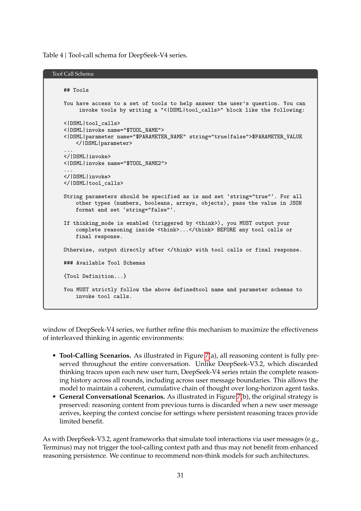

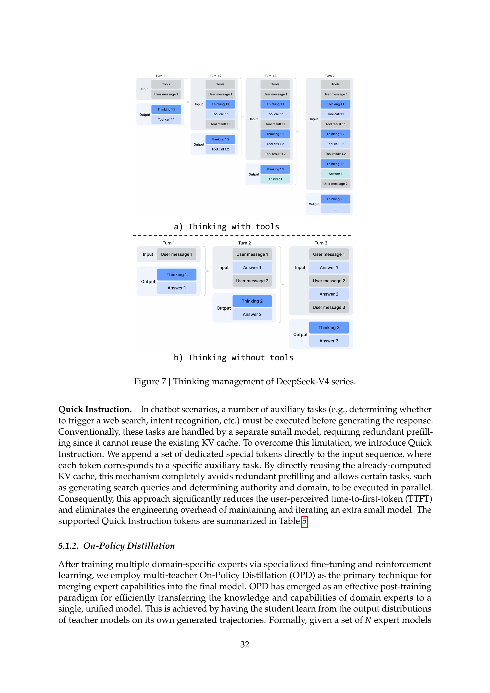

与 DeepSeek-V3.2 一样，通过用户消息模拟工具交互的智能体框架（如 Terminus）可能不会触发工具调用的上下文路径，因此可能无法从增强的推理持久化中获益。我们继续建议此类架构使用 non-think 模型。

**快速指令（Quick Instruction）。** 在聊天机器人场景中，许多辅助任务（如判断是否触发网络搜索、意图识别等）必须在生成响应之前执行。传统上，这些任务由一个独立的小模型处理，需要冗余的预填充（prefilling），因为它无法复用已有的 KV 缓存。为了克服这一局限性，我们引入了快速指令（Quick Instruction）。我们将一组专用的特殊 token 直接附加到输入序列中，每个 token 对应一个特定的辅助任务。通过直接复用已经计算好的 KV 缓存，这一机制完全避免了冗余预填充，并允许某些任务（如生成搜索查询和判断权威性及领域）并行执行。因此，这种方法显著降低了用户感知的首 token 生成延迟（Time-to-First-Token, TTFT），并消除了维护和迭代额外小模型的工程开销。支持的快速指令 token 汇总在表 5 中。

表 5 | 用于辅助任务的快速指令特殊 token

| 特殊 Token | 描述 | 格式 |
|---|---|---|
| `<\|action\|>` | 判断用户提示是否需要网络搜索或可以直接回答 | `...<\|User\|>{prompt}<\|Assistant\|><think><\|action\|>` |
| `<\|title\|>` | 在第一次助手响应后生成简洁的对话标题 | `...<\|Assistant\|>{response}<\|end_of_sentence\|><\|title\|>` |
| `<\|query\|>` | 为用户提示生成搜索查询 | `...<\|User\|>{prompt}<\|query\|>` |
| `<\|authority\|>` | 分类用户提示对来源权威性的需求 | `...<\|User\|>{prompt}<\|authority\|>` |
| `<\|domain\|>` | 识别用户提示所属的领域 | `...<\|User\|>{prompt}<\|domain\|>` |
| `<\|extracted_url\|>` `<\|read_url\|>` | 判断用户提示中的每个 URL 是否应被获取和阅读 | `...<\|User\|>{prompt}<\|extracted_url\|>{url}<\|read_url\|>` |

### 5.1.2. 在线策略蒸馏（On-Policy Distillation）

在通过专门的微调和强化学习训练出多个领域专家后，我们采用多教师在线策略蒸馏（On-Policy Distillation, OPD）作为将专家能力合并到最终模型的主要技术。OPD 已成为一种有效的后训练范式，能够将领域专家的知识和能力高效地迁移到一个统一模型中。这是通过让学生模型在自身生成的轨迹上学习教师模型的输出分布来实现的。形式化地，给定一组 $N$ 个专家模型 $\{\pi_{E_1}, \pi_{E_2}, \ldots, \pi_{E_N}\}$，OPD 目标函数定义为：

$$\mathcal{L}_{\text{OPD}}(\theta) = \sum_{i=1}^{N} w_i \cdot \text{D}_{\text{KL}}\left(\pi_\theta \| \pi_{E_i}\right). \tag{29}$$

> **译注：OPD 公式的直觉理解**
>
> 这个公式说的是：学生模型 $\pi_\theta$ 要同时"模仿"$N$ 个教师专家。$\text{D}_{\text{KL}}(\pi_\theta \| \pi_{E_i})$ 衡量的是学生与第 $i$ 个教师之间的输出分布差异。注意这是**反向 KL 散度**（student ‖ teacher，而非 teacher ‖ student）——这意味着学生倾向于"覆盖"教师认为可能的所有输出，而不是只集中在教师最偏好的输出上。
>
> 关键洞察是"on-policy"——训练数据从学生自己的策略 $\pi_\theta$ 中采样。这意味着当学生面对一道数学题时，它会自己先生成一个答案，然后比较：数学教师会怎么回答？编程教师呢？通过加权 $w_i$，学生自动从最相关的教师那里学习。这比传统的混合 RL（试图用一个 loss 同时优化所有目标）优雅得多——因为不同目标间的梯度干扰被消除了。
>
> 为什么用全词表蒸馏而非 token 级 KL 估计？因为 token 级估计相当于用单个样本估计一个高维分布的 KL 散度——方差极大。全词表蒸馏保留了完整的 128K 词表上的概率分布，梯度估计更稳定，但代价是需要物化完整的 logit——这就是为什么 5.2.2 节需要那么多工程优化。

在此公式中，$w_i$ 表示每个专家被赋予的权重，通常由该专家的相对重要性决定。计算反向 KL 损失 $\text{D}_{\text{KL}}(\pi_\theta \| \pi_{E_i})$ 需要从学生策略 $\pi_\theta$ 中采样训练轨迹，以维持在线策略学习。其底层逻辑确保统一策略 $\pi_\theta$ 选择性地从与当前任务上下文相关的专业专家中学习（例如，对于数学推理任务从数学专家学习，对于编程任务从编程专家学习）。通过这一机制，来自物理上不同的专家权重的知识在 logit 层面被整合到统一的参数空间中，实际上避免了传统权重合并或混合 RL 技术中常见的性能退化。在此阶段，超过十个涵盖各领域的教师模型被用于蒸馏到单个学生模型中。

在处理上述 OPD 目标时，先前的工作通常将全词表 KL 损失简化为每个 token 位置上的 token 级 KL 估计，并复用 RL 框架，将 $\text{sg}\left[\log \frac{\pi_{E_i}(y_t|x, y_{<t})}{\pi_\theta(y_t|x, y_{<t})}\right]$（sg 表示停止梯度操作）替换为策略损失计算中的每 token 优势估计。虽然这种方法在资源使用上是高效的，但它会导致梯度估计的高方差，并经常造成训练不稳定。因此，我们在 OPD 中采用了全词表 logit 蒸馏（full-vocabulary logit distillation）。在计算反向 KL 损失时保留完整的 logit 分布，能够产生更稳定的梯度估计，并确保对教师知识的忠实蒸馏。在下一小节中，我们将描述使全词表 OPD 在大规模场景下可行的工程实践。

## 5.2. RL 与 OPD 基础设施（RL and OPD Infrastructures）

我们的后训练基础设施构建于为 DeepSeek-V3.2 开发的可扩展框架之上。具体而言，我们整合了第 3.5 节描述的分布式训练栈以及先前引入的用于高效自回归采样的 rollout 引擎。在此基础上，我们在本工作中引入了以下主要增强。这些设计实现了超长上下文 RL 和涉及十多个不同教师模型的 OPD 合并任务的高效执行，从而大幅加速了模型发布的迭代周期。

### 5.2.1. FP4 量化集成（FP4 Quantization Integration）

我们应用 FP4 (MXFP4) 量化来加速所有 rollout 和所有仅推理的前向传播，包括教师模型和参考模型的前向传播，从而降低内存占用和采样延迟。如第 3.4 节所述，我们在 rollout 和推理阶段直接使用原生 FP4 权重。对于训练步骤，FP4 量化通过无损的 FP4 转 FP8 反量化步骤进行模拟，从而无缝复用现有的 FP8 混合精度框架和 FP32 主权重，不需要对反向传播流程做任何修改。

### 5.2.2. 高效的全词表 OPD 教师调度（Efficient Teacher Scheduling for Full-Vocabulary OPD）

我们的框架支持全词表在线策略蒸馏（OPD），可有效处理数量不受限制的教师模型，每个教师模型可能包含数万亿参数。为实现这一点，所有教师权重被卸载到集中式分布式存储中，在教师前向传播期间按需加载，并通过类似 ZeRO 的参数分片来缓解 I/O 和 DRAM 压力。此外，对于词表大小 $|V| > 100\text{k}$ 的情况，即使存储到磁盘，直接物化所有教师的 logit 也是不可行的。我们通过在前向传播期间仅缓存最后一层教师隐藏状态到集中式缓冲区来解决这一问题。在训练时，这些缓存的状态被检索并通过相应的预测头模块，在线重建完整的 logit。这种设计在完全避免显式 logit 物化带来的内存负担的同时，仅引入可忽略不计的重计算开销。为了降低教师预测头的 GPU 内存占用，我们在数据调度期间按教师索引对训练样本进行排序。这一安排确保每个不同的教师头在每个 mini-batch 中仅加载一次，且任何时刻设备内存中最多只有一个教师头。所有参数和隐藏状态的加载/卸载操作在后台异步进行，不会阻塞关键路径上的计算。最后，教师和学生 logit 之间的精确 KL 散度使用专门的 TileLang 内核计算，这加速了计算并减少了动态内存分配。

### 5.2.3. 可抢占和容错的 Rollout 服务（Preemptible and Fault-Tolerant Rollout Service）

为了在保障高优先级任务快速获取硬件资源的同时最大化 GPU 资源利用率，我们的 GPU 集群采用了集群级可抢占任务调度器（preemptive task scheduler），任何正在运行的任务都可能在任何时刻被抢占。此外，硬件故障在大规模 GPU 集群中十分常见。为此，我们为 RL/OPD rollout 实现了一个可抢占且容错的 LLM 生成服务。

具体而言，我们为每个生成请求实现了 token 粒度的预写日志（Write-Ahead Log, WAL）。每当为一个请求生成新 token 时，我们立即将其追加到该请求的 WAL 中。在抢占期间，我们暂停推理引擎并将未完成请求的 KV 缓存保存下来。恢复时，我们使用持久化的 WAL 和保存的 KV 缓存继续解码。即使发生致命的硬件错误，我们也可以使用 WAL 中持久化的 token 重新运行预填充阶段来重建 KV 缓存。

重要的是，从头重新生成未完成请求在数学上是不正确的，因为这会引入长度偏差（length bias）。由于较短的响应更容易幸免于中断，从头重新生成会使模型倾向于产生更短的序列。如果推理栈是批次不变（batch-invariant）且确定性的，这一正确性问题也可以通过为采样器使用一致的伪随机数种子来重新生成解决。然而，这种方法仍然会产生重新运行解码阶段的额外成本，使其远不如我们的 token 粒度 WAL 方法高效。

### 5.2.4. 面向百万 Token 上下文的 RL 框架扩展（Scaling RL Framework for Million-Token Context）

我们针对百万 token 序列上的高效 RL 和 OPD 引入了专门的优化。在 rollout 阶段，我们采用了第 5.2.3 节详述的可抢占且容错的 rollout 服务。对于推理和训练阶段，我们将 rollout 数据格式分解为轻量级元数据和重量级的逐 token 字段。在数据调度期间，整个 rollout 数据的元数据可以被加载以执行全局洗牌（global shuffling）和打包布局计算。重量级的逐 token 字段通过共享内存数据加载器加载，以消除节点内数据冗余，并在 mini-batch 粒度上消费后立即释放，从而大幅降低 CPU 和 GPU 内存压力。设备上 mini-batch 的数量根据工作负载动态确定，以实现计算吞吐量与 I/O 重叠之间的高效权衡。

### 5.2.5. 面向智能体 AI 的沙箱基础设施（Sandbox Infrastructure for Agentic AI）

为了满足后训练和评估期间智能体 AI 的多样化执行需求，我们构建了一个生产级沙箱平台——**DeepSeek 弹性计算（DeepSeek Elastic Compute, DSec）**。DSec 由三个 Rust 组件构成——API 网关（`Apiserver`）、每主机代理（`Edge`）和集群监控器（`Watcher`）——它们通过自定义 RPC 协议互联，并在 3FS 分布式文件系统（DeepSeek-AI, 2025）之上水平扩展。在生产环境中，单个 DSec 集群管理数十万个并发沙箱实例。

DSec 的设计源于四个观察：（1）智能体工作负载高度异构，从轻量级函数调用到具有多样化操作系统和安全需求的完整软件工程流水线；（2）环境镜像数量众多且体积庞大，但必须能快速加载并支持迭代式定制；（3）高密度部署要求高效的 CPU 和内存利用；（4）沙箱生命周期必须与 GPU 训练调度协调，包括抢占和基于检查点的恢复。基于这些观察，我们在以下内容中逐一阐述 DSec 的四个核心设计。

**统一接口下的四种执行基底（Four Execution Substrates Behind One Unified Interface）。** DSec 暴露一个统一的 Python SDK（`libdsec`），抽象了四种执行基底。**函数调用（Function Call）** 将无状态调用分派到预热容器池，消除冷启动开销。**容器（Container）** 完全兼容 Docker，并利用 EROFS（Gao et al., 2019）实现按需加载以高效组装镜像。**微型虚拟机（microVM）** 基于 Firecracker（Agache et al., 2020）构建，增加了 VM 级别的隔离，适用于安全敏感的高密度部署。**完整虚拟机（fullVM）** 基于 QEMU（Bellard, 2005）构建，支持任意客户操作系统。这四种基底共享统一的 API 接口——命令执行、文件传输和 TTY 访问——它们之间的切换仅需修改一个参数。

**基于分层存储的快速镜像加载（Fast Image Loading via Layered Storage）。** DSec 通过分层、按需加载来平衡快速启动与大规模且不断增长的环境镜像语料库。对于容器，基础镜像和文件系统提交以 3FS 支持的只读 EROFS 层存储，直接挂载到 overlay `lowerdirs` 中。我们将文件元数据保持在本地磁盘上以便随时访问；同时，数据块按需从 3FS 获取。对于微型虚拟机，DSec 使用 `overlaybd`（Li et al., 2020）磁盘格式：只读基础层存放在 3FS 上以实现跨实例共享，而写操作则进入本地的写时复制层。这种快照可以链式使用，便于高效的版本管理和毫秒级恢复。

**大规模并发下的密度优化（Density Optimizations Under Massive Concurrency）。** 为了在每个集群上容纳数十万个沙箱，DSec 解决了两个资源瓶颈。首先，它通过减少虚拟化环境中的重复页面缓存占用并应用内存回收来实现安全的超额分配（overcommitment）。其次，它缓解了容器运行时中的自旋锁竞争（spinlock contention），从而降低了每个沙箱的 CPU 开销，显著提升了每台主机的打包密度。

**轨迹日志与抢占安全恢复（Trajectory Logging and Preemption-Safe Resumption）。** DSec 为每个沙箱维护一个全局有序的轨迹日志（trajectory log），持久化地记录每个命令调用及其结果。该轨迹日志服务于三个目的：（1）**客户端快进（client fast-forwarding）**——当训练任务被抢占时，沙箱资源仍然保留；恢复时，DSec 重放先前已完成命令的缓存结果，加速任务恢复，同时防止非幂等操作被重复执行而导致的错误；（2）**细粒度溯源（fine-grained provenance）**——每次状态变更的来源及相应结果都可追溯；（3）**确定性重放（deterministic replay）**——任何历史会话都可以从其轨迹中忠实地复现。

## 5.3. 标准基准评估（Standard Benchmark Evaluation）

### 5.3.1. 评估设置（Evaluation Setup）

**知识与推理（Knowledge and Reasoning）。** 知识与推理数据集包括 MMLU-Pro（Wang et al., 2024b）、GPQA（Rein et al., 2023）、Human Last Exam（Phan et al., 2025）、Simple-QA Verified（Haas et al., 2025）、Chinese-SimpleQA（He et al., 2024）、LiveCodeBench-v6（Jain et al., 2024）、CodeForces（内部基准）、HMMT 2026 Feb、Apex（Balunovic et al., 2025）、Apex Shortlist（Balunovic et al., 2025）、IMOAnswerBench（Luong et al., 2025）和 PutnamBench（Tsoukalas et al., 2024）。

对于代码，我们在 LiveCodeBench-v6 和一个内部 Codeforces 基准上评估 DeepSeek-V4 系列。对于 Codeforces，我们收集了 14 场 Codeforces Division 1 竞赛，包含 114 道题目（2025 年 5 月至 11 月）。Elo 评分的计算方式如下：对于每场竞赛，我们为每道题独立生成 32 个候选解。对于每道题，我们从这些解中无放回地随机抽取 10 个，并以随机顺序排列组成提交序列。每个提交都由领域专家构建的测试套件评判。已解决问题的得分遵循 OpenAI（2025）的罚分方案：模型获得的分数等于在相同先前失败次数下解决同一问题的人类参与者的中位数得分。这产生了每个采样提交序列的竞赛总分，进而转化为竞赛排名，随后转化为估计评分（通过标准 Codeforces 评分系统）。竞赛级别的期望评分定义为该估计评分在所有可能的随机选择和排列方式（每题 10 个提交）上的期望值。模型的总体评分是这些竞赛级别期望评分在全部 14 场竞赛上的平均值。

对于推理和知识任务，我们将温度设为 1.0，并将 Non-think、High 和 Max 模式的上下文窗口分别设为 8K、128K 和 384K token。对于数学任务（如 HMMT、IMOAnswerBench、Apex 和 HLE），我们使用以下模板进行评估：`"{question}\nPlease reason step by step, and put your final answer within \boxed{}."`。对于 DeepSeek-V4-Pro-Max 在数学任务上的评估，我们使用以下模板以引发更深入的推理：`"Solve the following problem. The problem may ask you to prove a statement, or ask for an answer. If finding an answer is required, you should come up with the answer, and your final solution should also be a rigorous proof of that answer being valid.\n\n{question}"`。

对于形式化数学任务，我们在 Lean v4.28.0-rc1（Moura and Ullrich, 2021）的智能体设置下进行评估，可使用 Lean 编译器和语义策略搜索引擎，以最大推理力度运行，工具调用上限为 500 次。此外，我们还评估了一种计算密集型更高的流程：先生成并过滤候选自然语言解，然后通过自我验证（self-verification）（Shao et al., 2025）筛选保留的解，再将其提供给形式化智能体作为引导，用于证明对应的 Lean 陈述。这种设计利用非形式化推理来拓展探索空间，同时通过形式化验证保证严格的正确性。提交仅在严格验证器 Comparator 同时接受两种设置下的结果时才被视为正确。

由于 K2.6 和 GLM-5.1 的 API 返回查询过于繁忙的响应，我们将其部分条目留空。

**1M Token 上下文。** 由于 DeepSeek-V4 系列支持 1M token 上下文，我们选择 OpenAI MRCR（OpenAI, 2024b）和 CorpusQA（Lu et al., 2026）作为基准，评估模型在长上下文场景下的表现。我们在这些任务上重新评估了 Claude Opus 4.6 和 Gemini 3.1 Pro，以期在所有模型之间实现配置标准化。我们未评估 GPT-5.4，因为其 API 对我们的大部分查询返回了失败响应。

**智能体（Agent）。** 智能体数据集包括 Terminal Bench 2.0（Merrill et al., 2026）、SWE-Verified（OpenAI, 2024e）、SWE Multilingual（Yang et al., 2025）、SWE-Pro（Deng et al., 2025）、BrowseComp（Wei et al., 2025）、MCPAtlas 公开评估集（Bandi et al., 2026）、GDPval-AA（AA, 2025; Patwardhan et al., 2025）和 Tool-Decathlon（Li et al., 2025）。

对于代码智能体任务（SWE-Verified、Terminal-Bench、SWE-Pro、SWE Multilingual），我们使用内部开发的评估框架评估 DeepSeek-V4 系列。该框架提供了一组最小化的工具——一个 bash 工具和一个文件编辑工具。最大交互步数设为 500，最大上下文长度设为 512K token。关于 Terminal-Bench 2.0，我们注意到 GLM-5.1 指出的环境相关问题。尽管如此，我们仍在原始 Terminal-Bench 2.0 数据集上报告性能以保持一致性。在 Terminal-Bench 2.0 Verified 子集上，DeepSeek-V4-Pro 达到了约 72.0 的分数。

对于搜索智能体任务（BrowseComp、HLE w/ tool），我们同样使用内部搭建的评测框架，配备网络搜索和 Python 工具，最大交互步数设为 500，最大上下文长度设为 512K token。对于 BrowseComp，我们使用与 DeepSeek-V3.2 相同的丢弃全部（discard-all）上下文管理策略（DeepSeek-AI, 2025）。

### 5.3.2. 评估结果（Evaluation Results）

表 6 | DeepSeek-V4-Pro-Max 与闭源/开源模型的对比。"Max"、"xHigh"和"High"表示推理力度。最佳结果以**粗体**标注，第二佳结果以<u>下划线</u>标注。

| | 基准测试 (指标) | Opus-4.6 Max | GPT-5.4 xHigh | Gemini-3.1-Pro High | K2.6 Thinking | GLM-5.1 Thinking | DS-V4-Pro Max |
|---|---|---|---|---|---|---|---|
| 知识与推理 | MMLU-Pro (EM) | 89.1 | 87.5 | 91.0 | 87.1 | 86.0 | **87.5** |
| | SimpleQA-Verified (Pass@1) | 46.2 | 45.3 | **75.6** | 36.9 | 38.1 | 57.9 |
| | Chinese-SimpleQA (Pass@1) | 76.4 | 76.8 | **85.9** | 75.9 | 75.0 | 84.4 |
| | GPQA Diamond (Pass@1) | 91.3 | **93.0** | 94.3 | 90.5 | 86.2 | 90.1 |
| | HLE (Pass@1) | 40.0 | 39.8 | **44.4** | 36.4 | 34.7 | 37.7 |
| | LiveCodeBench (Pass@1) | 88.8 | - | 91.7 | 89.6 | - | **93.5** |
| | Codeforces (Rating) | - | 3168 | 3052 | - | - | **3206** |
| | HMMT 2026 Feb (Pass@1) | 96.2 | **97.7** | 94.7 | 92.7 | 89.4 | 95.2 |
| | IMOAnswerBench (Pass@1) | 75.3 | **91.4** | 81.0 | 86.0 | 83.8 | 89.8 |
| | Apex (Pass@1) | 34.5 | 54.1 | **60.9** | 24.0 | 11.5 | 38.3 |
| | Apex Shortlist (Pass@1) | 85.9 | 78.1 | 89.1 | 75.5 | 72.4 | **90.2** |
| 长上下文 | MRCR 1M (MMR) | **92.9** | - | 76.3 | - | - | 83.5 |
| | CorpusQA 1M (ACC) | **71.7** | - | 53.8 | - | - | 62.0 |
| 智能体 | Terminal Bench 2.0 (Acc) | 65.4 | **75.1** | 68.5 | 66.7 | 63.5 | 67.9 |
| | SWE Verified (Resolved) | **80.8** | - | 80.6 | 80.2 | - | 80.6 |
| | SWE Pro (Resolved) | 57.3 | 57.7 | 54.2 | **58.6** | 58.4 | 55.4 |
| | SWE Multilingual (Resolved) | **77.5** | - | - | 76.7 | 73.3 | 76.2 |
| | BrowseComp (Pass@1) | 83.7 | 82.7 | **85.9** | 83.2 | 79.3 | 83.4 |
| | HLE w/ tools (Pass@1) | 53.1 | 52.0 | 51.6 | **54.0** | 50.4 | 48.2 |
| | GDPval-AA (Elo) | 1619 | **1674** | 1314 | 1482 | 1535 | 1554 |
| | MCPAtlas Public (Pass@1) | **73.8** | 67.2 | 69.2 | 66.6 | 71.8 | 73.6 |
| | Toolathlon (Pass@1) | 47.2 | **54.6** | 48.8 | 50.0 | 40.7 | 51.8 |

DeepSeek-V4-Pro-Max 与其他闭源/开源模型的对比结果见表 6。同时，我们在表 7 中评估了 DeepSeek-V4-Flash 和 DeepSeek-V4-Pro 的不同模式，并展示了结果。

表 7 | DeepSeek-V4 系列不同规模和模式之间的对比。"Non-Think"、"High"和"Max"表示推理力度。

| | 基准测试 (指标) | DeepSeek-V4-Flash | | | DeepSeek-V4-Pro | | |
|---|---|---|---|---|---|---|---|
| | | Non-Think | High | Max | Non-Think | High | Max |
| 知识与推理 | MMLU-Pro (EM) | 83.0 | 86.4 | 86.2 | 82.9 | 87.1 | 87.5 |
| | SimpleQA-Verified (Pass@1) | 23.1 | 28.9 | 34.1 | 45.0 | 46.2 | 57.9 |
| | Chinese-SimpleQA (Pass@1) | 71.5 | 73.2 | 78.9 | 75.8 | 77.7 | 84.4 |
| | GPQA Diamond (Pass@1) | 71.2 | 87.4 | 88.1 | 72.9 | 89.1 | 90.1 |
| | HLE (Pass@1-COT) | 8.1 | 29.4 | 34.8 | 7.7 | 35.4 | 37.7 |
| | LiveCodeBench (Pass@1-COT) | 55.2 | 88.4 | 91.6 | 56.8 | 89.8 | 93.5 |
| | Codeforces (Rating) | - | 2816 | 3052 | - | 2919 | 3206 |
| | HMMT 2026 Feb (Pass@1) | 40.8 | 91.9 | 94.8 | 31.7 | 94.0 | 95.2 |
| | IMOAnswerBench (Pass@1) | 41.9 | 85.1 | 88.4 | 35.3 | 88.0 | 89.8 |
| | Apex (Pass@1) | 1.0 | 19.1 | 33.0 | 0.4 | 27.4 | 38.3 |
| | Apex Shortlist (Pass@1) | 9.3 | 72.1 | 85.7 | 9.2 | 85.5 | 90.2 |
| 长上下文 | MRCR 1M (MMR) | 37.5 | 76.9 | 78.7 | 44.7 | 83.3 | 83.5 |
| | CorpusQA 1M (ACC) | 15.5 | 59.3 | 60.5 | 35.6 | 56.5 | 62.0 |
| 智能体 | Terminal Bench 2.0 (Acc) | 49.1 | 56.6 | 56.9 | 59.1 | 63.3 | 67.9 |
| | SWE Verified (Resolved) | 73.7 | 78.6 | 79.0 | 73.6 | 79.4 | 80.6 |
| | SWE Pro (Resolved) | 49.1 | 52.3 | 52.6 | 52.1 | 54.4 | 55.4 |
| | SWE Multilingual (Resolved) | 69.7 | 70.2 | 73.3 | 69.8 | 74.1 | 76.2 |
| | BrowseComp (Pass@1) | - | 53.5 | 73.2 | - | 80.4 | 83.4 |
| | HLE w/ tools (Pass@1) | - | 40.3 | 45.1 | - | 44.7 | 48.2 |
| | MCPAtlas Public (Pass@1) | 64.0 | 67.4 | 69.0 | 69.4 | 74.2 | 73.6 |
| | GDPval-AA (Elo) | - | - | 1395 | - | - | 1554 |
| | Toolathlon (Pass@1) | 40.7 | 43.5 | 47.8 | 46.3 | 49.0 | 51.8 |

**知识。** 在通用世界知识的评估中，DeepSeek-V4-Pro 的最大推理力度模式（DeepSeek-V4-Pro-Max）在开源大语言模型中确立了新的最先进水平。如 SimpleQA-Verified 所示，DeepSeek-V4-Pro-Max 以 20 个绝对百分点的优势大幅超越所有现有开源基线。尽管取得了这些进展，它目前仍落后于领先的闭源模型 Gemini-3.1-Pro。在教育类知识和推理领域，DeepSeek-V4-Pro-Max 在 MMLU-Pro 上略微超越 Kimi 和 GLM，尽管在 GPQA 和 HLE 基准上仍落后于领先的闭源模型。总体而言，DeepSeek-V4-Pro-Max 在增强开源模型世界知识能力方面标志着一个重要里程碑。

此外，DeepSeek-V4-Flash 和 DeepSeek-V4-Pro 在知识类任务上存在显著的性能差距；这在预期之内，因为更大的参数规模有助于在预训练期间保留更多知识。值得注意的是，两个模型在分配更高推理力度时，在知识基准上都展现了更好的表现。

**推理。** DeepSeek-V4-Pro-Max 在所有主要开源模型的推理基准上表现优异，并在许多指标上达到了与最先进闭源模型相当的水平，而较小的 DeepSeek-V4-Flash-Max 也超越了此前最佳的开源模型 K2.6-Thinking。同时，DeepSeek-V4-Pro 和 DeepSeek-V4-Flash 在代码和数学推理任务上表现出色。根据我们的评估，它们在编程竞赛中的表现可与 GPT-5.4 相媲美，这是开源模型首次在该任务上追平闭源模型。在 Codeforces 排行榜上，DeepSeek-V4-Pro-Max 目前位列人类参赛者第 23 名。DeepSeek-V4 在形式化数学任务上也展现了强劲的表现，无论是在智能体设置还是计算密集型设置下。在智能体设置下，它取得了最先进的结果，如图 8 所示，超越了 Seed Prover 等先前的模型（Chen et al., 2025）。在计算密集型更高的流程下，性能进一步提升，超越了包括 Aristotle（Achim et al., 2025）在内的系统，并达到了该设置下已知的最佳结果。

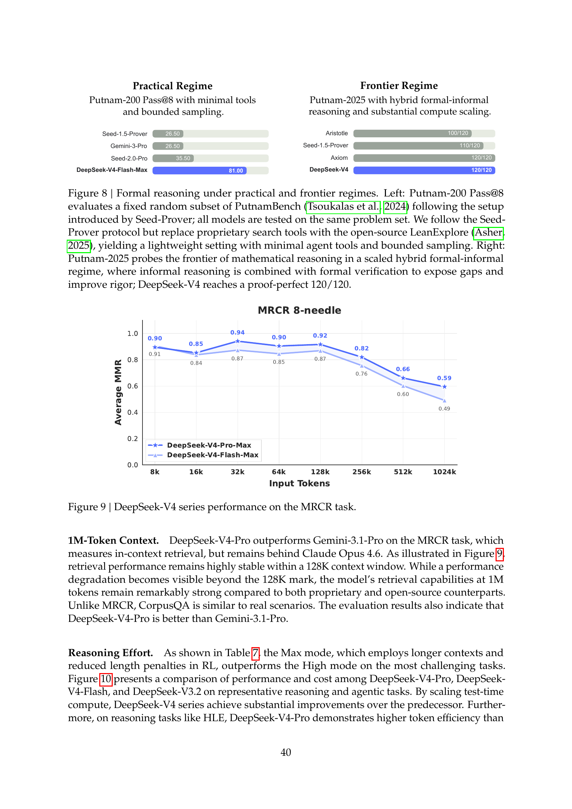

**智能体。** DeepSeek-V4 系列在智能体评估中展现了强劲的表现。对于代码智能体任务，DeepSeek-V4-Pro 取得了与 K2.6 和 GLM-5.1 相当的结果，尽管所有这些开源模型仍落后于闭源对手。DeepSeek-V4-Flash 在编程任务上的表现不及 DeepSeek-V4-Pro，尤其在 Terminal Bench 2.0 上差距明显。在其他智能体评估中也观察到类似趋势。值得注意的是，DeepSeek-V4-Pro 在 MCPAtlas 和 Toolathlon 这两个包含广泛工具和 MCP 服务的评测集上表现出色——这表明我们的模型具有优秀的泛化能力，并非仅在内部框架上表现良好。

**1M Token 上下文。** DeepSeek-V4-Pro 在 MRCR 任务上超越了 Gemini-3.1-Pro（该任务衡量上下文内检索能力），但仍落后于 Claude Opus 4.6。如图 9 所示，在 128K 上下文窗口内，检索性能保持高度稳定。虽然超过 128K 标记后性能开始出现退化，但与闭源和开源对手相比，模型在 1M token 下的检索能力仍然表现出色。与 MRCR 不同，CorpusQA 更接近真实场景。评估结果同样表明 DeepSeek-V4-Pro 优于 Gemini-3.1-Pro。

**推理力度。** 如表 7 所示，采用更长上下文和在 RL 中降低长度惩罚的 Max 模式，在最具挑战性的任务上优于 High 模式。图 10 展示了 DeepSeek-V4-Pro、DeepSeek-V4-Flash 和 DeepSeek-V3.2 在代表性推理和智能体任务上的性能与成本对比。通过扩展测试时计算（test-time compute），DeepSeek-V4 系列相较前代取得了显著提升。此外，在 HLE 等推理任务上，DeepSeek-V4-Pro 展现出高于 DeepSeek-V3.2 的 token 效率。

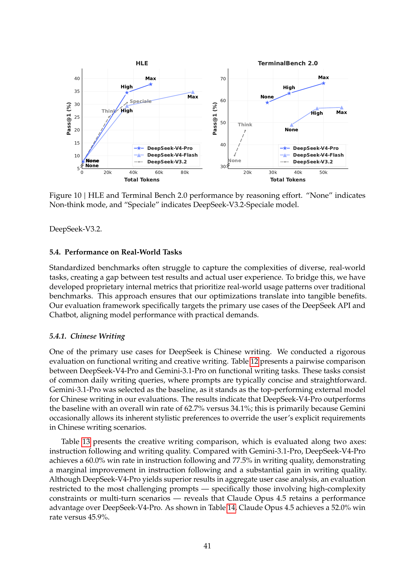

## 5.4. 真实世界任务表现（Performance on Real-World Tasks）

标准化基准测试往往难以捕捉多样化真实世界任务的复杂性，导致测试结果与实际用户体验之间存在差距。为弥合这一鸿沟，我们开发了专有的内部指标，优先关注真实世界的使用模式而非传统基准。这种方法确保我们的优化能够转化为切实的收益。我们的评估框架专门针对 DeepSeek API 和聊天机器人的主要使用场景，使模型性能与实际需求相匹配。

### 5.4.1. 中文写作（Chinese Writing）

DeepSeek 的主要使用场景之一是中文写作。我们对功能性写作和创意写作进行了严格的评估。表 12 展示了 DeepSeek-V4-Pro 与 Gemini-3.1-Pro 在功能性写作任务上的成对对比。这些任务由常见的日常写作需求组成，提示通常简洁明了。Gemini-3.1-Pro 被选为基线，因为它在我们的评估中是中文写作表现最佳的外部模型。结果表明 DeepSeek-V4-Pro 以 62.7% 对 34.1% 的总体胜率超越了该基线；这主要是因为 Gemini 偶尔会让其固有的风格偏好覆盖用户的明确要求，尤其在中文写作场景中。

表 13 展示了创意写作对比，评估沿两个轴进行：指令遵循和写作质量。与 Gemini-3.1-Pro 相比，DeepSeek-V4-Pro 在指令遵循上的胜率为 60.0%，在写作质量上的胜率为 77.5%，表明在指令遵循方面有一定改善，在写作质量方面有大幅提升。虽然 DeepSeek-V4-Pro 在总体用户案例分析中表现更优，但将评估限制在最具挑战性的提示上——特别是涉及高复杂度约束或多轮对话的场景——则发现 Claude Opus 4.5 相比 DeepSeek-V4-Pro 仍保持性能优势。如表 14 所示，Claude Opus 4.5 以 52.0% 对 45.9% 的胜率领先。

### 5.4.2. 搜索（Search）

搜索增强问答是 DeepSeek 聊天机器人的核心功能。在 DeepSeek 网页端和应用端，"non-think"模式采用检索增强生成（Retrieval-Augmented Search, RAG），而"thinking"模式则使用智能体搜索（agentic search）。

**检索增强搜索（Retrieval Augmented Search）。** 我们对 DeepSeek-V4-Pro 和 DeepSeek-V3.2 在客观和主观问答类别上进行了成对评估。如表 11 所示，DeepSeek-V4-Pro 以较大优势超越了 DeepSeek-V3.2，在两个类别上都展现了一致的优势。最显著的提升出现在单值搜索和规划策略任务中，表明 DeepSeek-V4-Pro 在从检索上下文中定位精确的事实答案和合成结构化方案方面表现出色。然而，DeepSeek-V3.2 在对比和推荐任务上仍保持相当的竞争力，表明 DeepSeek-V4-Pro 在需要平衡多角度推理的搜索结果场景中仍有改进空间。

**智能体搜索（Agentic Search）。** 与标准 RAG 不同，智能体搜索赋予模型迭代调用搜索和获取工具的能力，显著增强了整体搜索表现。在 DeepSeek-Chat 的 thinking 模式中，我们优化了智能体搜索功能，以在预定义的"思考预算"内最大化响应准确性。如表 9 所示，智能体搜索在复杂任务上持续优于 RAG。此外，其成本保持高效，智能体搜索仅比标准 RAG 略微昂贵（见表 10）。

### 5.4.3. 白领任务（White-Collar Task）

为了严格评估模型在复杂企业生产力场景中的实用性，我们构建了一个包含 30 个高级中文专业任务的综合测试集。这些工作流涵盖了高级认知需求，包括深度信息分析、全面文档生成和精细文档编辑，覆盖了金融、教育、法律和科技等 13 个关键行业。评估在内部搭建的智能体框架中进行，配备了 Bash 和网络搜索等基本工具。

鉴于这些任务的开放性质，自动化指标通常无法捕捉高质量响应的细微差别。因此，我们进行了人工评估，将 DeepSeek-V4-Pro-Max 与 Opus-4.6-Max 的表现进行对比。标注员在以下四个维度上对模型输出进行了盲评：

- **任务完成度（Task Completion）：** 核心问题是否被成功解决。
- **指令遵循（Instruction Following）：** 对具体约束和指令的遵守程度。
- **内容质量（Content Quality）：** 事实准确性、逻辑连贯性和专业语气。
- **排版美观（Formatting Aesthetics）：** 版面可读性和视觉呈现。

如图 11 所示，DeepSeek-V4-Pro-Max 在多样化的中文白领任务中全面超越 Opus-4.6-Max，实现了 63% 的不败率（non-loss rate），并在分析、生成和编辑任务上展现了一致的优势。图 12 中的详细维度得分突出了模型在任务完成度和内容质量方面的主要优势。具体而言，DeepSeek-V4-Pro-Max 能够主动预见用户的隐含意图，频繁提供补充性见解和自我验证步骤。它在长文本生成方面也表现出色，提供深入、连贯的叙述，而非 Opus-4.6-Max 经常产出的过度简化的要点列表。此外，该模型严格遵循正式的专业规范，如标准化的中文层级编号。然而，在指令遵循方面，它偶尔会忽略特定的格式约束，略微落后于 Opus。此外，该模型在将大量文本输入精简为简洁摘要方面不够熟练。最后，其排版美观度仍有很大改进空间，特别是在演示文稿幻灯片的整体视觉设计方面。图 13、14 和 15 展示了若干测试案例；由于部分输出较长，仅展示了部分页面。

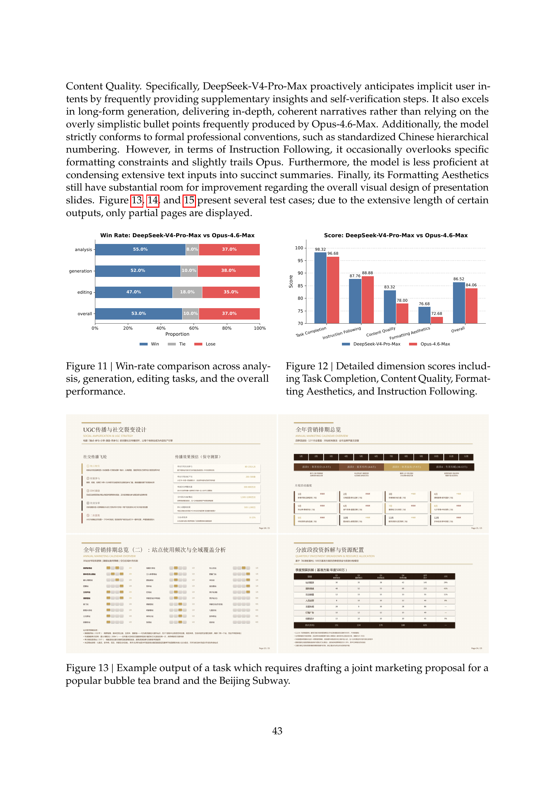

### 5.4.4. 代码智能体（Code Agent）

为了评估我们的编码智能体能力，我们从真实的内部研发工作负载中策划任务。我们从 50 多位内部工程师处收集了约 200 个具有挑战性的任务，涵盖功能开发、bug 修复、代码重构和跨多种技术栈（包括 PyTorch、CUDA、Rust 和 C++）的故障诊断。每个任务都附有其原始代码仓库、对应的执行环境和人工标注的评分标准；经过严格的质量筛选后，保留了 30 个任务作为评估集。如表 8 所示，DeepSeek-V4-Pro 显著超越了 Claude Sonnet 4.5，并接近 Claude Opus 4.5 的水平。

表 8 | 研发编程基准对比（外部模型仅用于评估目的）

| Model | Haiku 4.5 | Sonnet 4.5 | DeepSeek-V4-Pro-Max | Opus 4.5 | Opus 4.5 Thinking | Opus 4.6 Thinking |
|---|---|---|---|---|---|---|
| Pass Rate (%) | 13 | 47 | 67 | 70 | 73 | **80** |

在一项针对 DeepSeek 开发者和研究人员（$N = 85$）的调查中——所有受访者都有在日常工作中使用 DeepSeek-V4-Pro 进行智能体编程的经验——被问及 DeepSeek-V4-Pro 与其他前沿模型相比是否已可作为默认和主要编程模型使用时，52% 的人表示是，39% 的人倾向于是，不到 9% 的人表示否。受访者认为 DeepSeek-V4-Pro 在大多数任务中能够交付令人满意的结果，但也注意到存在一些小问题，包括对模糊提示的误解和偶尔的过度思考。
# 6. 结论、局限性与未来方向

在本工作中，我们发布了 DeepSeek-V4 系列的预览版本，目标是打造突破超长上下文处理效率瓶颈的下一代大语言模型（Large Language Models）。通过结合 CSA 和 HCA 的混合注意力架构（Hybrid Attention Architecture），DeepSeek-V4 系列在长序列效率方面实现了巨大飞跃。这些架构创新与大量基础设施优化相结合，实现了对百万级 token 上下文的高效原生支持，并为未来的测试时扩展（Test-time Scaling）、长周期任务（Long-horizon Tasks）以及在线学习（Online Learning）等新兴范式奠定了必要基础。评测结果表明，DeepSeek-V4-Pro-Max 作为最大推理力度模式，重新定义了开源模型（Open Models）的技术前沿。它在知识类基准测试上大幅超越了此前的开源模型，在推理性能上接近前沿闭源模型（Frontier Proprietary Models），并展现出具有竞争力的智能体能力（Agent Capabilities）。与此同时，DeepSeek-V4-Flash-Max 在推理性能上达到了与领先闭源模型相当的水平，同时保持了高度成本高效的架构。我们相信，DeepSeek-V4 系列将开启开源模型百万级长上下文的新时代，并为实现更高的效率、规模和智能铺平道路。

在追求极致长上下文效率的过程中，DeepSeek-V4 系列采用了大胆的架构设计。为降低风险，我们保留了许多经过初步验证的组件和技巧，这些组件虽然有效，却使架构变得相对复杂。在未来的迭代中，我们将进行更全面、更系统的研究，将架构精简至最核心的设计要素，使其在不牺牲性能的前提下更加优雅。与此同时，尽管前瞻性路由（Anticipatory Routing）和 SwiGLU 钳制（SwiGLU Clamping）已被证明在缓解训练不稳定性方面行之有效，但其底层原理仍未被充分理解。我们将积极研究训练稳定性的基础问题，加强内部指标监控，力求以更系统化、更可预测的方式实现稳定的大规模训练。

此外，在混合专家模型（MoE）和稀疏注意力架构之外，我们还将沿着新的维度主动探索模型稀疏性——例如更稀疏的嵌入模块（Sparse Embedding Modules）(Cheng et al., 2026)——以在不损害能力的前提下进一步提升计算和内存效率。我们还将持续研究低延迟架构和系统技术，使长上下文部署和交互更加灵敏。此外，我们认识到长周期、多轮智能体任务（Long-horizon, Multi-round Agentic Tasks）的重要性和实用价值，并将持续在这一方向上进行迭代和探索。我们也正在致力于为模型引入多模态能力（Multimodal Capabilities）。最后，我们致力于开发更好的数据筛选和合成策略，以持续提升模型在日益广泛的场景和任务中的智能水平、鲁棒性和实用性。

# 附录 B. 评测详情

**表 9 | DeepSeek-V4-Pro 的智能体搜索（Agentic Search）与检索增强搜索（Retrieval Augmented Search）对比。**

| 难度 | 类别 | # | Agent 胜出 | RAG 胜出 | 平局 | Agent% | RAG% | 平局% |
|------|------|---:|---:|---:|---:|---:|---:|---:|
| Easy | Objective Q&A (客观问答) | 196 | 110 | 43 | 43 | 56.1 | 21.9 | 21.9 |
| Easy | Subjective Q&A (主观问答) | 321 | 198 | 56 | 67 | 61.7 | 17.4 | 20.9 |
| Hard | Objective Q&A (客观问答) | 168 | 102 | 33 | 33 | 60.7 | 19.6 | 19.6 |
| Hard | Subjective Q&A (主观问答) | 184 | 126 | 27 | 31 | 68.5 | 14.7 | 16.8 |
| | Total (总计) | **869** | **536** | **159** | **174** | **61.7** | **18.3** | **20.0** |

**表 10 | DeepSeek-V4-Pro 的智能体搜索与检索增强搜索成本对比（均值）。智能体搜索的大部分工具调用为并行执行。**

| 版本 | 工具调用次数 | 预填充 (tokens) | 输出 (tokens) |
|------|---:|---:|---:|
| V4 Agentic Search | 16.2 | 13649 | 1526 |
| V4 Retrieval Augmented Search | — | 10453 | 1308 |

**表 11 | DeepSeek-V4-Pro 与 DeepSeek-V3.2 在搜索问答任务上的对比评测。**

|  |  |  | 内部综合评估 (Internal Evaluation) |  |  |  |  |  |
|---|---|---:|---:|---:|---:|---:|---:|---:|
| **类别** | **子类别** | **#** | **V4 胜出** | **V3.2 胜出** | **平局** | **V4%** | **V3.2%** | **平局%** |
| Objective Q&A (客观问答) | Single-value Search (单值信息查找) | 95 | 36 | 10 | 49 | 37.9 | 10.5 | 51.6 |
| Objective Q&A (客观问答) | Entity Search (实体信息查找) | 99 | 24 | 7 | 68 | 24.2 | 7.1 | 68.7 |
| Objective Q&A (客观问答) | Enumerative Search (枚举型信息查找) | 95 | 19 | 8 | 68 | 20.0 | 8.4 | 71.6 |
| | Subtotal (小计) | **289** | **79** | **25** | **185** | **27.3** | **8.7** | **64.0** |
| Subjective Q&A (主观问答) | Causal Analysis (原因分析) | 100 | 28 | 5 | 67 | 28.0 | 5.0 | 67.0 |
| Subjective Q&A (主观问答) | Comparison (对比) | 96 | 28 | 20 | 48 | 29.2 | 20.8 | 50.0 |
| Subjective Q&A (主观问答) | Advice Seeking (寻求建议) | 92 | 23 | 8 | 61 | 25.0 | 8.7 | 66.3 |
| Subjective Q&A (主观问答) | Recommendation (推荐) | 95 | 26 | 19 | 50 | 27.4 | 20.0 | 52.6 |
| Subjective Q&A (主观问答) | Planning & Strategy (攻略计划) | 92 | 32 | 11 | 49 | 34.8 | 12.0 | 53.3 |
| Subjective Q&A (主观问答) | Opinion & Evaluation (评价看法) | 96 | 30 | 8 | 58 | 31.2 | 8.3 | 60.4 |
| Subjective Q&A (主观问答) | Trend Analysis (趋势分析) | 96 | 23 | 3 | 70 | 24.0 | 3.1 | 72.9 |
| | Subtotal (小计) | **667** | **190** | **74** | **403** | **28.5** | **11.1** | **60.4** |
| | **TOTAL (总计)** | **956** | **269** | **99** | **588** | **28.1** | **10.4** | **61.5** |

**图 14 | 一项任务的示例输出，该任务要求对比纳斯达克（NASDAQ）的两种定投策略。**

**图 15 | 一项任务的示例输出，该任务要求研究 2020-2025 年诺贝尔科学奖并生成分析性 PDF 报告。**

**表 12 | DeepSeek-V4-Pro 与 Gemini-3.1-Pro 在中文功能性写作上的对比分析。**

|  |  |  | 内部综合评估 (Internal Evaluation) |  |  |  |  |  |
|---|---|---:|---:|---:|---:|---:|---:|---:|
| **类别** | **子类别** | **#** | **DS 胜出** | **Gem 胜出** | **平局** | **DS%** | **Gem%** | **平局%** |
| Business Writing (办公文本) | Report (报告) | 527 | 350 | 162 | 15 | 66.41 | 30.74 | 2.85 |
| Business Writing (办公文本) | Proposal (方案策划) | 291 | 181 | 103 | 7 | 62.20 | 35.40 | 2.41 |
| Business Writing (办公文本) | Education (教育培训) | 159 | 100 | 56 | 3 | 62.89 | 35.22 | 1.89 |
| Business Writing (办公文本) | Email & Letter (邮件书信) | 146 | 107 | 37 | 2 | 73.29 | 25.34 | 1.37 |
| Business Writing (办公文本) | Notice (通知公告) | 72 | 43 | 24 | 5 | 59.72 | 33.33 | 6.94 |
| Business Writing (办公文本) | Professional (专业文本) | 63 | 34 | 27 | 2 | 53.97 | 42.86 | 3.17 |
| Business Writing (办公文本) | Recruitment (招聘求职) | 42 | 27 | 15 | 0 | 64.29 | 35.71 | 0.00 |
| Business Writing (办公文本) | Technical (技术文本) | 29 | 22 | 7 | 0 | 75.86 | 24.14 | 0.00 |
| Business Writing (办公文本) | Review (介绍评价) | 20 | 15 | 5 | 0 | 75.00 | 25.00 | 0.00 |
| | Subtotal (小计) | **1349** | **879** | **436** | **34** | **65.16** | **32.32** | **2.52** |
| Media Writing (媒体文本) | Social Media (社交媒体文案) | 267 | 156 | 101 | 10 | 58.43 | 37.83 | 3.75 |
| Media Writing (媒体文本) | Ad Copy (广告商品文案) | 214 | 109 | 98 | 7 | 50.93 | 45.79 | 3.27 |
| Media Writing (媒体文本) | Long-form Content (内容平台长文) | 99 | 71 | 25 | 3 | 71.72 | 25.25 | 3.03 |
| Media Writing (媒体文本) | News Report (新闻报道) | 51 | 27 | 22 | 2 | 52.94 | 43.14 | 3.92 |
| Media Writing (媒体文本) | Advertorial (营销软文) | 17 | 12 | 4 | 1 | 70.59 | 23.53 | 5.88 |
| Media Writing (媒体文本) | Headline (标题) | 11 | 7 | 4 | 0 | 63.64 | 36.36 | 0.00 |
| Media Writing (媒体文本) | Narration Script (口播文案) | 4 | 2 | 1 | 1 | 50.00 | 25.00 | 25.00 |
| Media Writing (媒体文本) | Comment (评论) | 3 | 2 | 1 | 0 | 66.67 | 33.33 | 0.00 |
| | Subtotal (小计) | **666** | **386** | **256** | **24** | **57.96** | **38.44** | **3.60** |
| Everyday Writing (生活文本) | Congratulatory (祝贺文本) | 101 | 54 | 41 | 6 | 53.47 | 40.59 | 5.94 |
| Everyday Writing (生活文本) | Communication (沟通回复) | 100 | 71 | 26 | 3 | 71.00 | 26.00 | 3.00 |
| Everyday Writing (生活文本) | Reflection (心得感想) | 90 | 68 | 17 | 5 | 75.56 | 18.89 | 5.56 |
| Everyday Writing (生活文本) | Review (介绍评价) | 55 | 44 | 9 | 2 | 80.00 | 16.36 | 3.64 |
| Everyday Writing (生活文本) | Comment (评论) | 44 | 34 | 8 | 2 | 77.27 | 18.18 | 4.55 |
| | Subtotal (小计) | **390** | **271** | **101** | **18** | **69.49** | **25.90** | **4.62** |
| Oral Writing (口头文本) | Speech (发言稿) | 226 | 135 | 85 | 6 | 59.73 | 37.61 | 2.65 |
| Oral Writing (口头文本) | Narration Script (口播文案) | 51 | 25 | 23 | 3 | 49.02 | 45.10 | 5.88 |
| Oral Writing (口头文本) | Sales Script (话术) | 31 | 22 | 6 | 3 | 70.97 | 19.35 | 9.68 |
| Oral Writing (口头文本) | Dialogue (对话文本) | 10 | 4 | 6 | 0 | 40.00 | 60.00 | 0.00 |
| Oral Writing (口头文本) | Congratulatory (祝贺文本) | 1 | 1 | 0 | 0 | 100.00 | 0.00 | 0.00 |
| | Subtotal (小计) | **319** | **187** | **120** | **12** | **58.62** | **37.62** | **3.76** |
| Official Document (公文文档) | Administrative Doc (事务文书) | 117 | 60 | 53 | 4 | 51.28 | 45.30 | 3.42 |
| Official Document (公文文档) | Personal Doc (个人文书) | 73 | 45 | 27 | 1 | 61.64 | 36.99 | 1.37 |
| Official Document (公文文档) | Government Doc (行政公文) | 34 | 19 | 14 | 1 | 55.88 | 41.18 | 2.94 |
| Official Document (公文文档) | Speech (发言稿) | 3 | 1 | 2 | 0 | 33.33 | 66.67 | 0.00 |
| Official Document (公文文档) | Essay Writing (申论写作) | 3 | 1 | 1 | 1 | 33.33 | 33.33 | 33.33 |
| | Subtotal (小计) | **230** | **126** | **97** | **7** | **54.78** | **42.17** | **3.04** |
| Academic Writing (学术文本) | Research Paper (学术论文) | 104 | 67 | 32 | 5 | 64.42 | 30.77 | 4.81 |
| Academic Writing (学术文本) | Coursework (课程作业) | 90 | 53 | 35 | 2 | 58.89 | 38.89 | 2.22 |
| Academic Writing (学术文本) | Academic Support (学术辅助) | 15 | 11 | 3 | 1 | 73.33 | 20.00 | 6.67 |
| Academic Writing (学术文本) | Science Outreach (专业科普) | 7 | 6 | 1 | 0 | 85.71 | 14.29 | 0.00 |
| | Subtotal (小计) | **216** | **137** | **71** | **8** | **63.43** | **32.87** | **3.70** |
| **Total (总计)** |  | **3170** | **1986** | **1081** | **103** | **62.65** | **34.10** | **3.25** |
