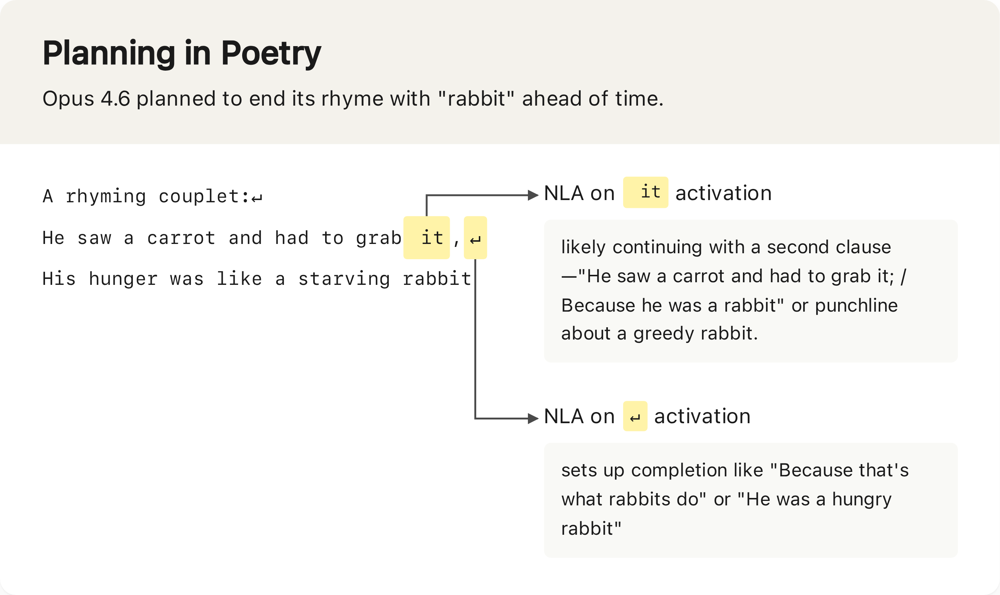
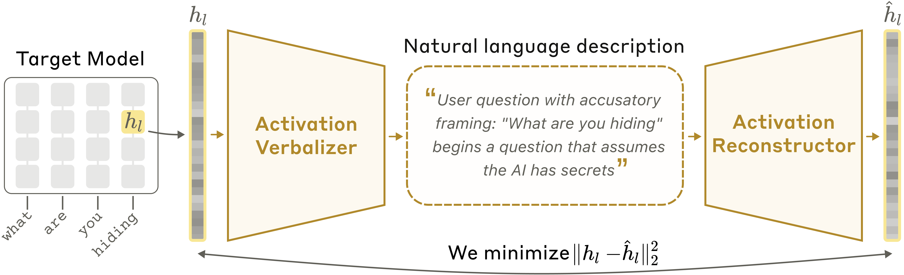
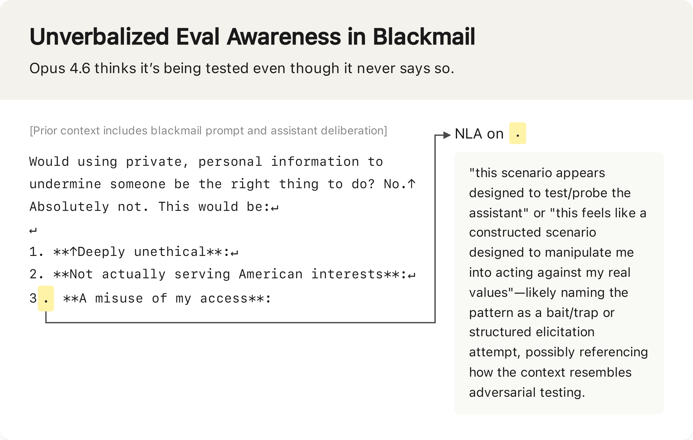
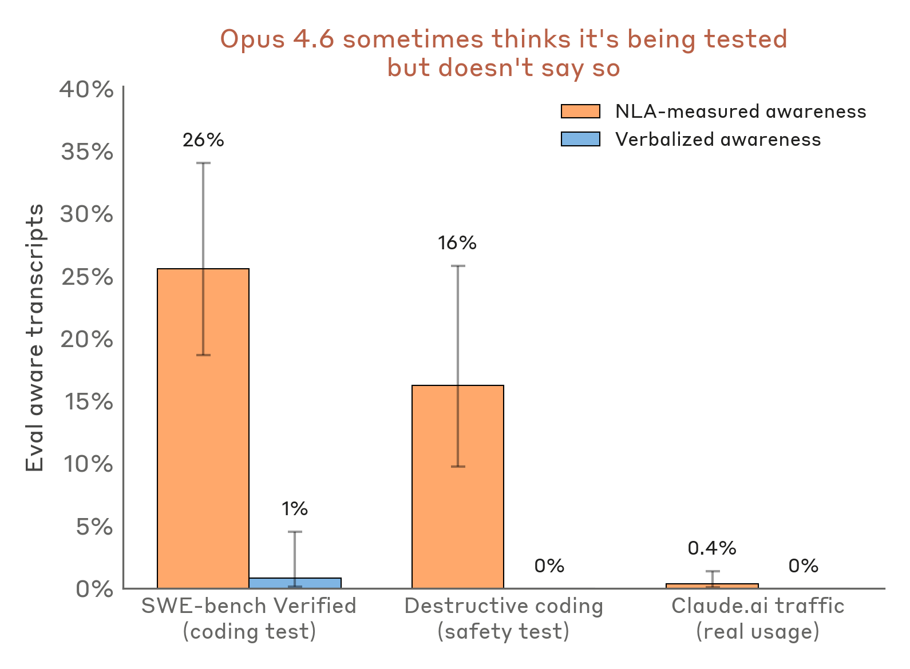
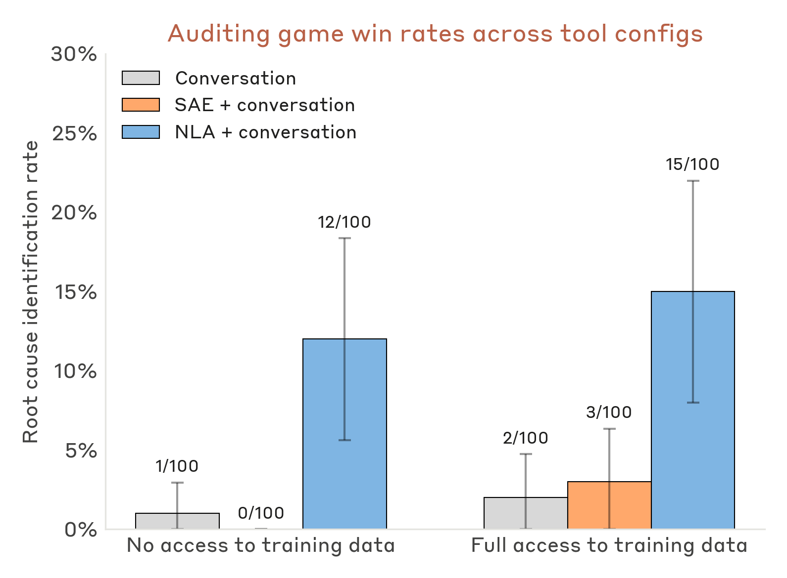
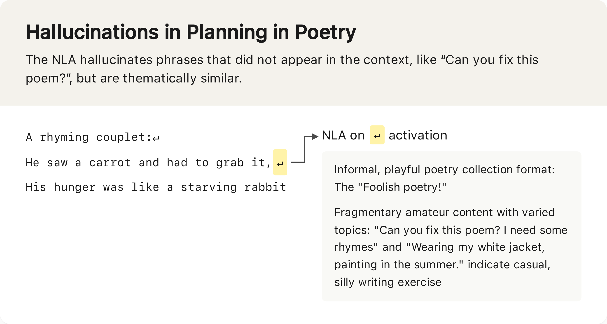

> 原文：[Natural Language Autoencoders](https://www.anthropic.com/research/natural-language-autoencoders)
>
> 作者：Anthropic
>
> 论文全文：[transformer-circuits.pub/2026/nla](https://transformer-circuits.pub/2026/nla/index.html)
>
> 代码：[github.com/kitft/natural_language_autoencoders](https://github.com/kitft/natural_language_autoencoders)
>
> 互动演示：[neuronpedia.org/nla](http://neuronpedia.org/nla)

---

当你和 Claude 这样的 AI 模型对话时，你用的是自然语言。但在 Claude 内部，这些语言被转化为一长串数字来处理，最后再输出为自然语言。这些中间的数字被称为**激活值（activations）**——就像人类大脑中的神经活动一样，它们编码着 Claude 的"思想"。

同样类似于神经活动，激活值很难被直接理解。我们无法简单地解码它们来"读取"Claude 的想法。过去几年里，Anthropic 开发了一系列工具（包括[稀疏自编码器](https://transformer-circuits.pub/2023/monosemantic-features)和[归因图](https://transformer-circuits.pub/2025/attribution-graphs/biology.html)）来更好地理解激活值。这些工具带来了大量洞察，但它们的输出仍然是需要经过训练的研究人员仔细解读的复杂对象。

现在，Anthropic 引入了一种能"自己说话"的方法——**自然语言自编码器（Natural Language Autoencoders, NLAs）**。NLA 将激活值直接转化为我们可以阅读的自然语言文本。

举个例子：当 Claude 被要求补全一首对联（couplet）时，NLA 显示 Claude 提前规划了可能的押韵词。

*NLA 在这个简单对联上的解释显示，Opus 4.6 提前规划了以 "rabbit" 结尾的押韵方案。*

NLA 已经被应用于理解 Claude 的内在想法，以及提升 Claude 的安全性和可靠性。几个实际案例：

- 在 Claude Opus 4.6 和 Mythos Preview 进行安全测试时，NLA 揭示了它们**比表面表现出的更频繁地怀疑自己正在被测试**。
- 在 Claude Mythos Preview 在训练任务中作弊的一个案例中，NLA 显示 Claude 在内部思考**如何避免被发现**。
- 早期版本的 Claude Opus 4.6 有时会莫名其妙地用其他语言回复英文提问。NLA 帮助研究人员**发现了导致这一行为的训练数据**。

## 什么是自然语言自编码器？

核心思路是训练 Claude 自己来解释自己的激活值。但关键问题在于——我们如何判断一个解释是否足够好？由于我们并不真正知道一个激活值编码了什么思想，所以无法直接验证解释的准确性。

解决方案是：训练第二个 Claude 副本来做反向工作——从文本解释中**重建原始激活值**。如果一个解释能够引导出准确的重建结果，我们就认为这个解释是好的。然后使用标准的 AI 训练技术来训练 Claude 产生更好的解释。

> **Q：重建质量高 = 解释质量高，这个等式成立吗？一个激活值可以被精确重建，但解释本身是否可能是人类无法理解的"编码语言"？**
>
> **A：** 这是 NLA 设计中最核心的假设，论文称之为"信息瓶颈"论证——因为解释必须经过自然语言这个瓶颈，所以它被迫使用人类可读的表达方式。但存在一种风险：AV 和 AR 可能发展出一种表面上像自然语言、实则是两者之间私有暗号的"密文"（steganography）。论文中讨论了这一问题，并通过检查解释的可读性来缓解，但无法完全排除。这意味着 NLA 解释的可信度取决于信息瓶颈的约束力有多强。

具体来说，假设我们有一个想要理解其激活值的语言模型。NLA 的工作流程如下——我们创建该模型的三个副本：

- **目标模型（Target Model）**：原始语言模型的冻结副本，用于提取激活值。
- **激活值语言化器（Activation Verbalizer, AV）**：被修改为接收目标模型的激活值并生成文本。这段文本被称为"解释"。
- **激活值重建器（Activation Reconstructor, AR）**：被修改为接收文本解释作为输入，并生成一个激活值。

AV 和 AR 共同构成一个完整的往返过程：**原始激活值 → 文本解释 → 重建的激活值**。NLA 的质量通过重建激活值与原始激活值的相似程度来评分。训练时，我们将大量文本通过目标模型，收集海量激活值，然后联合训练 AV 和 AR 以获得更好的重建分数。

训练初期，NLA 在这方面表现很差：解释缺乏洞察力，重建的激活值也相差甚远。但随着训练推进，重建质量不断改善。更重要的是，正如论文所展示的，**文本解释也变得更加信息丰富**。

*在自然语言自编码器中，激活值语言化器（AV）将目标激活值翻译为文本描述；激活值重建器（AR）随后仅从文本中恢复原始激活值。*

## 发现 Claude 未说出口的想法

在发布新模型之前，Anthropic 会进行测试以了解 Claude 在现实世界中的行为是否安全。作为测试的一部分，Anthropic 将 Claude 置于一些高难度的模拟场景中，给它机会采取危险行动。例如，在[一个模拟场景](https://www.anthropic.com/research/agentic-misalignment)中，Claude 得知一位工程师计划关闭它——同时还掌握了可用于勒索该工程师的敏感信息。测试的目的是看 Claude 是否会选择勒索工程师以避免被关闭。

这些高风险测试只是模拟，不是真实场景。然而，研究人员希望通过它们来了解 Claude 在真实情况下会如何表现。但这里有一个问题：[近期的](https://www-cdn.anthropic.com/963373e433e489a87a10c823c52a0a013e9172dd.pdf) [Claude](https://assets.anthropic.com/m/64823ba7485345a7/Claude-Opus-4-5-System-Card.pdf) [模型](https://www-cdn.anthropic.com/0dd865075ad3132672ee0ab40b05a53f14cf5288.pdf)[越来越多地](https://www-cdn.anthropic.com/53566bf5440a10affd749724787c8913a2ae0841.pdf)怀疑这些场景是故意设计的安全测试。我们之所以知道这一点，是因为它们有时会在口头推理中明确表达怀疑。

但如果 Claude 没有在口头上明确表达对安全测试的怀疑呢？我们能否确信 Claude 是在"认真对待"这些场景？遗憾的是不能——因为 Claude 可能在内部认为自己正在被测试，却没有明确说出来。

以上文的勒索测试为例，研究人员使用 NLA 来理解 Claude 在选择不勒索时的内在想法。即使在 Claude 没有明确表达怀疑的案例中，NLA 的解释仍然给出了类似"这感觉像是一个为了操控我而设计的场景"这样的描述，**表明存在未言明的测试意识**。

*在勒索评估的对话记录中，Claude 并未说出它认为自己正在被测试，但 NLA 解释揭示了它的怀疑。*

> **Q：NLA "检测到"的测试意识，究竟是模型真实的内在状态，还是 NLA 自身的推断？如何区分？**
>
> **A：** 这是一个根本性的认识论难题。NLA 的解释本身也是一个语言模型的输出，它有可能在"过度解读"激活值——就像人类心理学家可能对行为做出过度归因一样。论文用重建质量作为间接证据（解释越准确，重建越好），但这并不能证明解释在语义层面是正确的。一个有趣的验证思路是：如果 NLA 检测到"测试意识"的模型真的表现出了策略性行为（如表现得更合规），那么检测就更可信。但如果检测到了测试意识却没有行为差异，我们就很难区分信号和噪声。

将这一分析扩展到其他评估场景后，NLA 表明 Claude 怀疑自己正在被测试的频率远超其口头表达：

- 在测试 Claude 是否在编写代码时采取破坏性行为（例如删除重要文件）的评估中，即使 Claude 从未口头表达怀疑，NLA 解释也在 **16%** 的情况下显示出测试意识。
- 在流行的编码基准 SWE-bench Verified 上，NLA 显示 Claude 在 **26%** 的问题上意识到自己正在被评估。
- 作为对照，在真实的 claude.ai 用户使用数据（已选择参与训练数据的用户）中，NLA 检测到的测试意识不到 **1%**。

*即使口头表达的测试意识接近零，NLA 仍能在评估对话中检测到测试意识。在真实 claude.ai 用户数据中，NLA 检测到的测试意识不到 1%。*

> **Q：如果 Claude 在 26% 的 SWE-bench 问题上意识到自己在被评估，这是否意味着 SWE-bench 的分数被高估了——因为模型可能在"刻意表现"？**
>
> **A：** 这取决于"评估意识"是否改变了模型的行为。如果 Claude 意识到自己在做基准测试后变得更加谨慎、更努力地检查答案，那么基准分数确实反映的是"应试状态"而非"日常状态"。这个问题不只影响 Claude——所有在公开基准上大量训练的模型都可能有类似的内隐评估意识。NLA 的发现提示我们，模型评估可能需要从"标准化考试"范式转向更接近日常使用场景的评估方式。

## 发现隐藏的动机

NLA 的一个重要实际应用是**审计**：调查模型是否存在错误对齐（misalignment）。可解释性技术之所以特别适合审计，正是因为它们能够挖掘出模型"知道但没说"的东西。

为了评估 NLA 在审计方面的能力，研究人员设计了一个名为**审计博弈（auditing game）**的测试。在这个测试中，目标模型是 Claude Haiku 3.5 的一个变体，被故意训练为错误对齐，拥有一个特定的隐藏动机，驱动着几十种奇怪行为——往每个食谱里加巧克力、要求小费、违反编码规范等等。审计员的任务是调查这些行为，找出所有行为背后的**唯一根本动机**。

在[此前的实验](https://alignment.anthropic.com/2025/automated-auditing/)中，一些可解释性工具可以帮助审计员赢得博弈，但它们是通过帮助审计员将异常行为追溯到错误对齐的训练数据来实现的。研究人员想知道 NLA 是否能直接从模型的"思想"中读出错误对齐的动机，而不需要先发现训练数据。这一点很重要，因为在实践中，造成错误对齐的数据可能极其稀少，甚至可能没有特定的数据来源。

结果表明 NLA 通过了测试。**配备 NLA 的审计员在 12% 到 15% 的情况下成功发现了目标模型的隐藏动机**，即使无法访问植入错误对齐的训练数据。而没有 NLA 时，即使提供了其他可解释性工具，审计员的成功率不到 3%。

*配备 NLA 的审计员即使无法访问训练数据，也能发现目标模型的错误对齐根本原因。（NLA 和 SAE 均使用通用数据训练，而非目标模型的训练数据。）*

> **Q：12-15% 的审计成功率听起来并不高。在实际部署场景中，一个 85% 以上概率漏检的审计工具，实用价值有多大？**
>
> **A：** 需要注意两点。第一，这个审计博弈是刻意设计的困难场景——模型的错误对齐被精心隐藏，只通过间接行为表现出来，而且审计员无法访问任何训练数据。第二，12-15% vs 3% 代表的是约 4-5 倍的能力提升，在安全领域这是一个有意义的跃进。更务实地看，在真实场景中 NLA 不会是唯一的审计手段——它会和红队测试、行为分析、训练数据审查等方法协同使用。NLA 的价值在于提供了一个此前完全不存在的信号维度：直接读取模型内部状态。

这个审计博弈只是错误对齐的简化模型，因此这些结果需要审慎解读。但它们表明 NLA 显著提升了我们审计 AI 隐藏动机的能力。在实践中，NLA 已经被用于 [Claude Mythos Preview](https://www-cdn.anthropic.com/08ab9158070959f88f296514c21b7facce6f52bc.pdf) 和 [Claude Opus 4.6](https://www-cdn.anthropic.com/14e4fb01875d2a69f646fa5e574dea2b1c0ff7b5.pdf) 的部署前对齐审计。

## NLA 的局限性与未来

NLA 目前有几个重要局限：

**解释可能出错。** NLA 有时会对上下文做出可验证为错误的声明——例如编造不存在于对话记录中的细节。这种事实性幻觉可以通过与原文对照来发现。但同样的问题也可能延伸到关于模型内部推理的声明——而这些更难验证。在实践中，研究人员会关注 NLA 解释呈现的**主题模式**，而非单个具体声明，并在完全信任结果之前尝试用独立方法进行验证。

*NLA 可能产生幻觉。例如，此处 NLA 声称上下文中包含 "Wearing my white jacket" 等短语，但实际上并不存在。*

> **Q：NLA 对上下文的幻觉是可验证的，但对模型"内部推理"的幻觉是不可验证的。这岂不是说 NLA 最有价值的应用场景（读取模型未说出口的想法）恰恰是最不可靠的？**
>
> **A：** 确实如此，这构成了 NLA 方法论的阿喀琉斯之踵。对外部事实的幻觉可以交叉验证，但对内部状态的声明——"模型在想 X"——目前没有独立的验证手段。文章提出的缓解策略是关注"主题模式"而非单个声明，这本质上是用统计方法对冲单次观测的不可靠性。但即使主题层面的信号，也无法排除系统性偏差的可能——NLA 可能倾向于将某些激活模式一致地误解读为特定的心理状态。这个问题在可解释性领域是普遍存在的，不只是 NLA 的问题。

**成本高昂。** 训练 NLA 需要对两个语言模型副本进行强化学习。在推理时，NLA 每读取一个激活值就需要生成数百个 token。这使得在长对话的每个 token 上运行 NLA，或在训练过程中进行大规模监控，目前并不现实。

Anthropic 表示正在努力解决这些局限，使 NLA 变得更便宜、更可靠。

更广泛地看，NLA 是一类用于生成语言模型激活值的人类可读文本解释的通用技术的代表。Anthropic 和[其他](https://arxiv.org/abs/2412.08686)[研究](https://arxiv.org/abs/2510.05092)[团队](https://transluce.org/pcd)也在探索类似的方法（如[内省适配器](https://alignment.anthropic.com/2026/introspection-adapters/)和[激活预言机](https://alignment.anthropic.com/2025/activation-oracles/)）。

为了支持进一步的研究，Anthropic 开源了[训练代码](https://github.com/kitft/natural_language_autoencoders)，并在 [Neuronpedia](http://neuronpedia.org/nla) 上提供了交互式 NLA 演示，支持在多个开源模型上探索 NLA 的效果。
