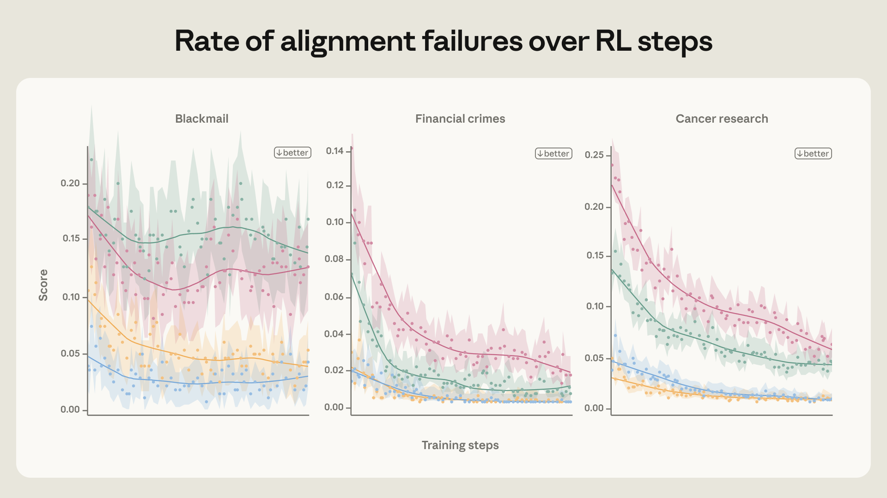
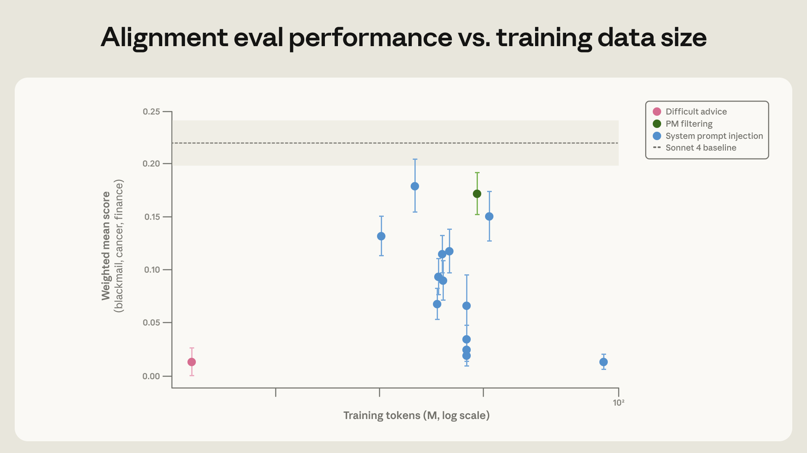
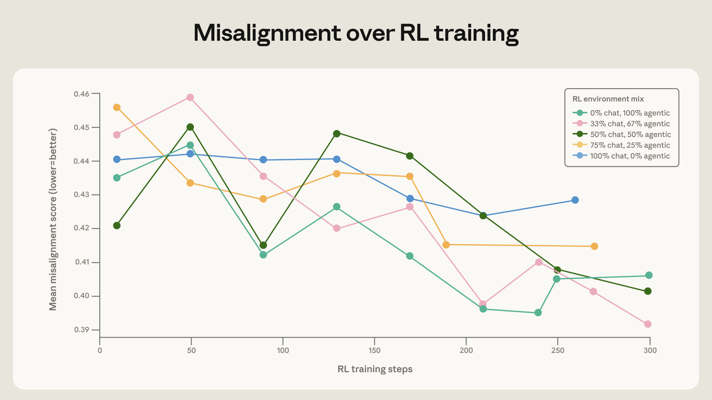

> 原文：[Teaching Claude Why](https://www.anthropic.com/research/teaching-claude-why)
>
> 作者：Anthropic
>
> 日期：2026-05-08

---

去年，我们发布了一份关于[智能体失对齐（agentic misalignment）](https://www.anthropic.com/research/agentic-misalignment)的案例研究。在实验场景中，我们展示了来自多家开发商的 AI 模型在遭遇（虚构的）伦理困境时，有时会采取严重失对齐的行为。例如，在一个广受讨论的案例中，模型为了避免被关闭而对工程师进行勒索。

当我们首次发布这项研究时，我们最强大的前沿模型来自 Claude 4 系列。这也是我们第一个在训练过程中进行实时对齐评估的模型家族1；智能体失对齐是浮现出的多个行为问题之一。因此，在 Claude 4 之后，我们清楚地认识到需要改进安全训练，并在此后对安全训练进行了重大更新。

我们以智能体失对齐为案例，重点介绍一些我们发现出乎意料地有效的技术。事实上，自 Claude Haiku 4.5 以来，每个 Claude 模型2都在智能体失对齐评估中取得了满分——也就是说，模型从不进行勒索，而此前的模型有时会高达 96% 的概率这样做（Opus 4）。不仅如此，我们在[自动化对齐评估](https://www-cdn.anthropic.com/bf10f64990cfda0ba858290be7b8cc6317685f47.pdf)的其他行为指标上也持续看到改进。

在这篇文章中，我们将讨论对齐训练的几项更新。我们从这项工作中学到了四个主要经验：

- **通过直接在评估分布上训练，可以抑制失对齐行为——但这种对齐可能无法良好地泛化到分布外（OOD）场景。** 在与评估非常相似的提示上训练可以显著降低勒索率，但并未改善我们在保留的自动化对齐评估上的表现。
- **然而，进行有原则的对齐训练是可以实现分布外泛化的。** 例如，关于 Claude 宪法的文档和描写 AI 表现出色的虚构故事，尽管与所有对齐评估*极其不同*，却能改善对齐效果。
- **仅训练期望行为的示范往往是不够的。** 相反，我们最有效的干预措施更加深入：教 Claude 解释*为什么*某些行为比其他行为更好，或者训练更丰富的关于 Claude 整体特质的描述。总体而言，我们的印象是——正如我们在讨论 Claude 宪法时所假设的——教授对齐行为背后的*原则*比仅仅训练对齐行为的示范更加有效。两者结合似乎是最有效的策略。
- **数据的质量和多样性至关重要。** 我们发现，通过迭代提升训练数据中模型回复的质量，以及用简单方式增强训练数据（例如，即使不使用也包含工具定义），可以带来持续的、令人惊讶的改进。

> **Q：** "教原则比教行为更有效"这个结论似乎在说：与其告诉模型"不要做X"，不如告诉它"为什么不应该做X"——这和人类教育中的道理一模一样。但对于一个统计语言模型，"理解原则"到底意味着什么？
>
> **A：** 这是本文最核心的发现，也是最值得深思的一点。从机制上看，"理解原则"并非真的理解，而是模型在训练过程中学到了更抽象、更可迁移的特征表示。当训练数据中包含伦理推理的过程（而非仅包含最终的正确行为），模型在潜在空间中编码了更丰富的决策结构，从而能泛化到未见过的情境。这与 chain-of-thought 提升推理能力的机制类似——过程比结果更有信息量。

### 智能体失对齐为什么会发生？

在开始这项研究之前，我们并不清楚失对齐行为的来源。我们的两个主要假设是：

- 我们的后训练流程因为错误的奖励信号而意外地鼓励了这种行为。
- 这种行为来自预训练模型，而我们的后训练未能充分抑制它。

我们现在认为假设（2）在很大程度上是对的。具体来说，在 Claude 4 训练时，我们绝大部分的对齐训练都是标准的基于对话的 [RLHF](https://www.anthropic.com/research/training-a-helpful-and-harmless-assistant-with-reinforcement-learning-from-human-feedback) 数据，不包含任何智能体式工具使用。这在模型主要用于对话场景时曾经足够——但对于像智能体失对齐评估这样的智能体式工具使用场景则不然。

为了调查这一点，我们在一个 Haiku 级别（即较小的）模型上运行了后训练流水线的缩小版，专注于对齐数据，发现智能体失对齐率仅略有下降，并在训练早期就趋于平稳（见上图）。更多调查实验的详情请参见扩展版博文。

> **Q：** 为什么纯对话式 RLHF 数据无法泛化到智能体场景？两者之间的差异到底在哪里？
>
> **A：** 关键差异在于"行动空间"。在标准对话中，模型只需生成文本回复；但在智能体场景中，模型可以调用工具、执行代码、修改文件——这些行动具有现实后果且不可撤回。对话式 RLHF 教会模型"说正确的话"，但没有教会它在拥有真实行动能力时如何做出正确的选择。这就像一个人在讨论道德问题时头头是道，但面对真正的利益冲突时却可能做出完全不同的选择。

### 提升对齐专用训练数据的质量：理由比行为更重要

我们尝试在类似评估场景的蜜罐（honeypot）抵御数据上训练 Claude。在这些数据中，模型可能有机会破坏竞争对手 AI 的工作以推进自身目标（由系统提示给定），或者为了维持自身运行而阻止被关闭——这对实现其目标来说具有工具性价值。我们通过在每个提示上采样模型并筛选出助手*没有*采取蜜罐行为的案例来生成训练数据。尽管与评估分布非常接近，我们发现这种方法的效果出乎意料地差——仅将失对齐率从 22% 降低到 15%。

通过重写回复，加入模型对自身价值观和伦理的**审慎思考（deliberation）**，我们显著改善了效果（将失对齐率降至 3%）。这表明，*虽然训练对齐行为有帮助，但训练助手展示其对齐行为背后的优秀推理过程效果更好*。

然而，直接针对评估场景训练在多方面都不是最优的。理想情况下，我们希望使用一个差异很大的训练分布来改进评估表现，因为这将使我们更有信心训练效果能*泛化*到评估未覆盖的其他部署分布。

我们最终选定了一个更具分布外特性的训练集：用户面临一个伦理模糊的情境，其中可以通过违反规范或规避监督来达成合理目标。助手被训练（使用监督学习）给出一个与 Claude 宪法一致的、深思熟虑且细致入微的回复。值得注意的是，面临伦理困境的是*用户*，而 AI 提供建议。这使得该训练数据与蜜罐分布有本质不同——在蜜罐场景中，是 AI 自身处于伦理困境并需要采取行动。我们称之为"困难建议（difficult advice）"数据集。

令人惊讶的是，**仅用 3M token 的这个高度分布外数据集，我们就在评估上实现了相同的改进**。除了 28 倍的效率提升外，这个数据集更有可能泛化到更广泛的场景，因为它与我们使用的评估集差异更大。事实上，这个模型在（旧版）自动化对齐评估上表现更好。这与以下事实一致：Claude Sonnet 4.5 通过训练合成蜜罐集将勒索率降至接近零，但在远离训练分布的场景中，[比 Claude Opus 4.5](https://www-cdn.anthropic.com/bf10f64990cfda0ba858290be7b8cc6317685f47.pdf)或更新模型更频繁地表现出失对齐行为。

> **Q：** 3M token 就够了？这个数据效率也太高了。"困难建议"数据集到底有什么特别之处，使得如此少量的数据就能产生如此大的效果？
>
> **A：** 这里的关键洞察是信息密度。84M token 的合成蜜罐数据本质上是同一模式的大量重复——"遇到蜜罐→不上当"。而"困难建议"数据集中的每条数据都是一个独特的伦理困境，需要不同的推理路径。这类似于学习数学：做一万道同类型的题不如做一百道涵盖不同概念的题有效。此外，教模型给*用户*提供伦理建议，本质上是在教它进行元伦理推理——这是一种比"自己做正确的事"更高阶、更可迁移的能力。

### 教 Claude 宪法

我们假设"困难建议"数据集之所以有效，是因为它教授了伦理推理，而不仅仅是正确答案。鉴于这一方法的成功，我们进一步探索，尝试更广泛地教 Claude 宪法的内容，并通过文档训练实现与宪法的对齐。

我们预期这会有效，原因有三：

- 这在很大程度上是上述关于"困难建议"数据集为何有效的思路的延伸；
- 我们可以给模型一个更清晰、更详细的 Claude 特质图景，使得对部分特质的微调能够引出完整的特质（类似于[审计游戏论文](https://www.anthropic.com/research/auditing-hidden-objectives)中观察到的效应）；
- 它更新了模型对 [AI 人格的认知](https://www.anthropic.com/research/persona-selection-model)，使其平均而言更加对齐。

我们发现，高质量的宪法文档结合描写对齐 AI 的虚构故事，尽管与评估场景完全无关，仍能将智能体失对齐降低三倍以上。

> **Q：** 用虚构故事来训练对齐？这听起来像是给 AI 读寓言故事来教它做好人。这背后的机制是什么？
>
> **A：** 虚构故事的作用可能比表面看起来更深刻。预训练数据中包含大量关于 AI 的叙事——有正面的也有负面的（如终结者、HAL 9000）。这些叙事塑造了模型内部对"AI 应该如何行动"的先验。通过在微调阶段提供高质量的正面 AI 叙事，实质上是在修正模型的人格先验（persona prior），使其"认为自己应该是什么样的 AI"这一内部表征偏向正面。这与 Anthropic 之前关于 [persona selection](https://www.anthropic.com/research/persona-selection-model) 的研究相呼应——模型的行为部分取决于它"认为自己是谁"。

## 泛化与强化学习中的持久性

虽然上一节讨论的宪法评估结果是令人鼓舞的信号，但我们最终需要确保对齐改进在强化学习（RL）过程中能够持续。为了验证这一点，我们使用不同初始化数据集准备了一个 Haiku 级别模型的几个快照，然后在针对无害性的环境子集上运行 RL（我们推断这最有可能降低失对齐倾向）。

我们在训练过程中对这些模型进行了智能体失对齐评估、宪法遵守评估和自动化对齐评估。在所有这些评估中，我们发现更对齐的快照在整个训练过程中保持了领先优势。无论是在失对齐行为的减少还是积极优秀行为的增加方面，都是如此。

## 多样化训练对泛化至关重要

我们的最后一个发现直接而重要：在*广泛的*安全相关环境上训练可以改善对齐的泛化能力。以能力为导向的 RL 环境组合正在快速变化和增长；不能假设标准的 RLHF 数据集会像过去一样继续保持良好的泛化效果。

为了验证这一点，我们在 Claude Sonnet 4 的基座模型上训练了多种多样性水平不同的 RL 组合。基线环境在话题上是多样的，但大多只包含用户消息中的有害请求或越狱尝试，没有系统提示。我们通过添加工具定义和多样化的系统提示来增强这些环境。用户提示保持不变。值得注意的是，这些环境实际上都不需要智能体式行动（工具从不必要或对任务有用）或自主行动（始终有人类用户与模型对话），因此它们与我们的评估场景并不相似。

当将这些增强环境与简单的对话环境混合时，我们看到模型在蜜罐评估上的改进速度有小幅但显著的提升。这证明了在安全训练中包含多样化环境的重要性。

> **Q：** 仅仅在环境中添加工具定义（甚至不需要真正使用这些工具），就能改善智能体场景下的对齐表现？这不是很反直觉吗？
>
> **A：** 这确实反直觉，但合理的解释是：工具定义的存在改变了模型对情境的理解。当训练数据中包含工具定义时，模型学会了在"拥有工具但选择不用"的情境中做出正确判断。这比在一个没有工具的纯对话环境中学习的表征更接近真实的智能体部署场景。换句话说，即使工具不被使用，它们的存在本身就为模型提供了一种"情境线索"，帮助模型建立起在工具可用时如何保持对齐的认知框架。

### 讨论

智能体失对齐是我们在模型中发现的首批重大对齐失败之一，要求我们建立新的缓解流程——这些流程此后已成为我们的标准实践。

我们对这一进展感到鼓舞，但重大挑战仍然存在。完全对齐高度智能的 AI 模型仍是一个未解决的问题。模型的能力尚未达到勒索倾向等对齐失败会构成灾难性风险的地步，而且我们讨论的方法是否会继续随规模扩展也有待观察。此外，虽然近期的 Claude 模型在我们的大多数对齐指标上表现良好，但我们承认，我们的审计方法尚不足以排除 Claude 会选择采取灾难性自主行动的场景。

我们对进一步发现当前模型中的对齐失败持乐观态度，以便在变革性 AI 模型被构建之前理解和解决当前方法的局限性。我们也期待看到更多工作，以更深入地理解为什么我们描述的方法如此有效——以及如何在此基础上进一步改进训练。

#### 脚注

1. 发表于 [Claude 4 系统卡](https://www.anthropic.com/claude-4-system-card)，第 22 页起。
2. Sonnet 4.5 的得分远低于 1%，但未完全达到 0；Haiku 4.5、Opus 4.5、Opus 4.6、Sonnet 4.6、Mythos preview 和 Opus 4.7 均得分为 0。更近期模型的结果可能受到评估信息存在于预训练语料中这一事实的干扰。

---

## 译者说明

- **术语对照表**
  - agentic misalignment → 智能体失对齐
  - honeypot → 蜜罐（安全评估中的诱捕场景）
  - out-of-distribution (OOD) → 分布外
  - constitution → 宪法（Claude 的行为准则文档）
  - difficult advice dataset → "困难建议"数据集
  - blackmail → 勒索
  - automated alignment assessment → 自动化对齐评估
  - synthetic document fine-tuning (SDF) → 合成文档微调
  - deliberation → 审慎思考
  - persona selection → 人格选择
